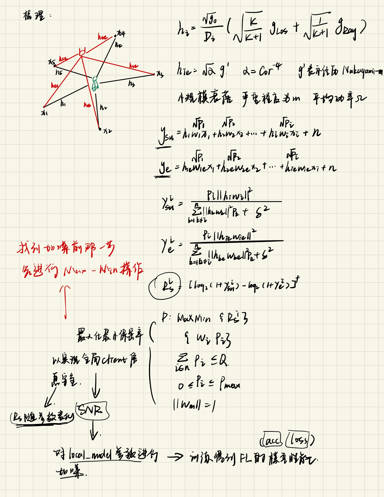
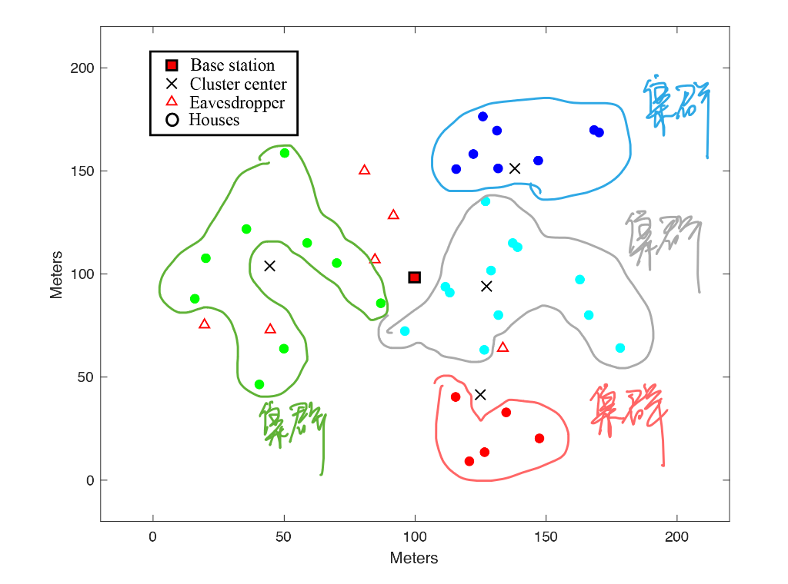
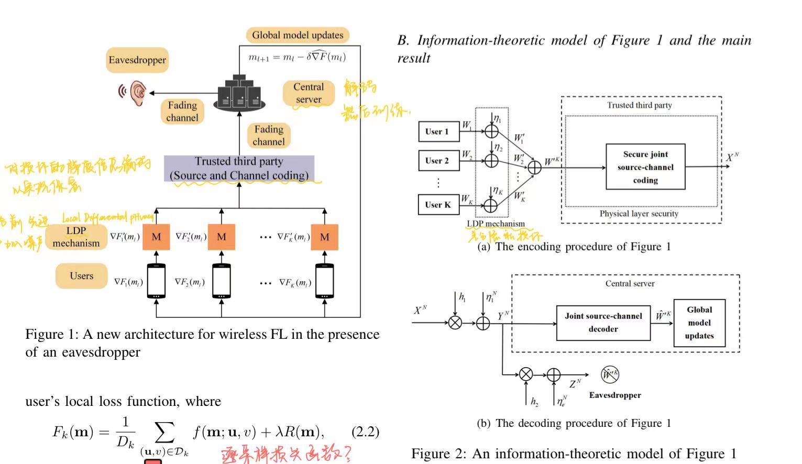

### 2023.12.18
# 本周进展
1. 审稿论文已阅
   主要就是针对联邦学习提出了一种攻击方式。
     
3. 物理层安全部分代码整合到了联邦学习中

# 下周安排
解决代码中现存的bug

### 2023.12.11
# 本周进展
1. 完成了物理层安全方法的matlab部分的代码修改编写，将问题减小为5个用户进行优化
2. 现在正在整合物理层安全部分的代码到联邦学习中

# 下周安排
1. 把物理层安全和联邦学习结合，程序调试通畅
2. 完成审稿工作

### 2023.11.13
# 本周进展
学习，推导了物理层安全方法的最优解，目前正在编写对应的matlab代码

# 下周安排
1. 编写完并调试好matlab代码

2. 讲matlab代码整合到原联邦学习框架中，对local_model参数加噪并训练

### 2023.11.7
# 本周进展
主要是阅读下周组会需要汇报的相关论文：

   1) H. Zhang, C. Yang and B. Dai, "When Wireless Federated Learning Meets Physical Layer Security: The Fundamental Limits," IEEE INFOCOM 2022 - IEEE Conference on Computer Communications Workshops (INFOCOM WKSHPS)

   2) H. Zhang, C. Yang and B. Dai, "A Finite Blocklength Approach for Wireless Hierarchical Federated Learning in the Presence of Physical Layer Security," IEEE INFOCOM 2023 - IEEE Conference on Computer Communications Workshops (INFOCOM WKSHPS)

   3) S. Zheng, C. Shen and X. Chen, "Design and Analysis of Uplink and Downlink Communications for Federated Learning," in IEEE Journal on Selected Areas in Communications

# 下周安排

1. 制作组会PPT

### 2023.10.29
# 本周进展
1. 学习龙博和老师发的两篇文献中的方法

   1）UAV-enabled federated learning in Dynamic Environments：Efficiency and Security Trade-off

   2）Shrinking the Insecure Area  for Satellite Downlink using Multi-Beam Intersection
  
2. 和老师讨论了FL和PLS结合的具体解决方法，梳理出来了实现流程，正在修改代码

   
   
# 下周安排
1. 组会需要分享的文献阅读

2. 继续修改代码

### 2023.10.15
# 本周进展
1. 梳理了目前FL和PLS结合所遇到的主要问题

2. 阅读目前一些FL和PLS结合相关的文献：

1）J. Ahmed, T. N. Nguyen, B. Ali, M. A. Javed and J. Mirza, "On the Physical Layer Security of Federated Learning Based IoMT Networks," in IEEE Journal of Biomedical and Health Informatics

2）H. Zhang, C. Yang and B. Dai, "When Wireless Federated Learning Meets Physical Layer Security: The Fundamental Limits," IEEE INFOCOM 2022 - IEEE Conference on Computer Communications Workshops (INFOCOM WKSHPS)

第一篇文献主要是其框架，将IoMT视作Client，将IoMT节点划分为各个集群，每个集群先在各自的中心进行聚合，然后各个集群中心共享参数更新

第二篇文献是通过编码的方式在FL中实现物理层安全

问题在于PLS和FL的结合不够紧密，最后其考量的还是物理层安全的保密率和误码率的指标，联邦学习的性能没有讨论，还是割裂的两个问题。
# 下周安排
1. 和老师讨论FL和PLS结合的可行方法，然后进行实践

2. 继续阅读PLS和FL结合的相关论文

### 2023.9.5
# 本周进展
1.简化了联邦学习的模型，设计为20client，1server，信道建模为随距离变化的简单信道

2.在简化后的模型上对通信过程进行加噪，等效信道传输过程噪声对模型参数带来的影响
# 下周安排
阅读差分隐私和联邦学习结合的文章，寻求物理层安全方案和联邦学习模型训练效果之间的关系
