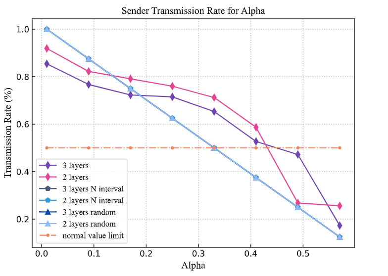

## Table of Contents

- <a href="#1"> Week 1 (2023.09.01 – 2023.09.06)
- <a href="#2"> Week 2 (2023.09.07 – 2023.09.18)
- <a href="#3"> Week 3 (2023.10.07 – 2023.10.16)
- <a href="#4"> Week 4 (2023.10.17 – 2023.10.30)
- <a href="#5"> Week 5 (2023.10.31 – 2023.11.07)
- <a href="#6"> Week 6 (2023.12.01 – 2023.12.26)

 

------

 

# <a href="#table">Week 1 (2023.09.01 – 2023.09.06)</a>

## VoI画图
效果良好，准备这周赶紧写了

## 大模型求解优化问题

把 $x_i$, $f(x_i)$, $f'(x_i)$, $f"(x_i)$, 当作token四个一组的输入到transformer中，sequence长度可以等效成迭代次数，每次大模型输出下一个 $x_{i+1}$, 然后补充 $f(x_{i+1})$, $f'(x_{i+1})$, $f"(x_{i+1})$到sequence中

 

# <a href="#table">Week 2 (2023.09.07 – 2023.09.18)</a>

 

# <a href="#table">Week 3 (2023.10.07 – 2023.10.16)</a>

## Diffusion Boost RL: A High-Performance Framework Empowered by Diffusion in Communication Network (IEEE Wireless Communications: Mobile AI-Generated Content (AIGC) in 6G Era —— 1st Dec)
#### Intro
1. 6G网路的复杂性与动态性需要更为智能的网络控制算法 and the most promising method is the reinforcement learning based algorithm
2. However, there are some inevitable challenges when applying the RL-based optimization method in the communication network
3. Fortunately, the emerging diffusion method as an artificial intelligence generation context (AIGC) technology enables researchers to rethink how to design an more effective RL-based method with less training cost.
#### Framework
1. Brief introduction of diffusion
2. framework
3. how to apply, 1) MDP prediction; 2) hard state generation; 3) imitation learning
#### Application
1. IoV
2. URLLC
3. non-cooperation gaming

## Conditional AIGC is Digital Twin (IEEE Communications Magazine: Digital Twins Meet Artificial Intelligence in 6G —— 31st Mar )
#### Intro
1. what is DT and its features
2. challenges
3. AIGC: diffusion and Nerf
####  How to Build DT based on AIGC
1. Nerf
2. Diffusion
3. framework and how to train it
#### Application
1. Monitor
2. Prediction
3. Testing

 

# <a href="#table">Week 4 (2023.10.17 – 2023.10.30)</a>

## VoI
intro、property

## DIffusion Magazine
找陶科达一起写

 

# <a href="#table">Week 5 (2023.10.31 – 2023.11.07)

## VoI论文
还差实验分析

 

# <a href="#table">Week 6 (2023.12.01 – 2023.12.26)

1. GNN+QMIX论文
2. 启发式+GD
