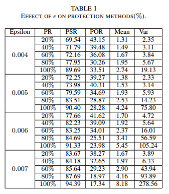
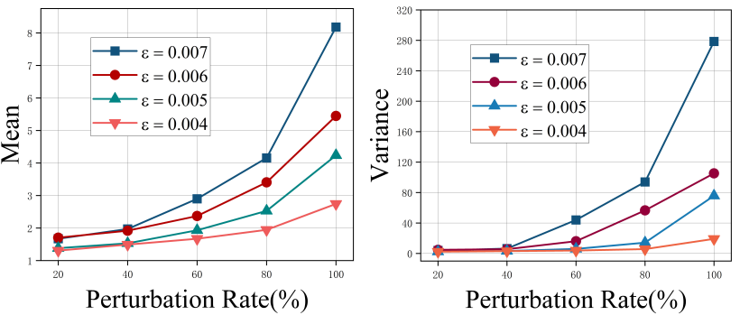
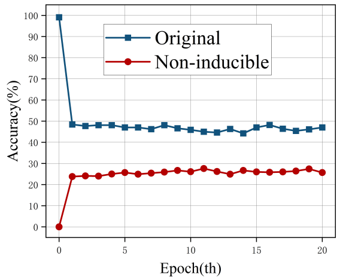

### 非诱导式指纹保护方法
1、算法实现背景
- 在上述算法1中实现对导频信号的无差别干扰，但这会导致信号的不可避免的失真，会影响正常的通信功能
- 算法2对算法1进行改进，根据导频信号中特征对分类器的影响程度对其梯度进行排序，选择其中影响力较大的几个特征因素进行扰动，既保证了扰动的成功率，也减小了信号的失真。
- 上述对信号的干扰都是使用一定的模型参数和扰动率产生的固定扰动，分类器可以通过微调以适应新的特征。为解决此类问题，提出新的算法，使用时变策略来增加输入扰动的多样性。

2、算法内容
 
 - 通过在防御器（发射器）上搭载数据库，此数据库中记录有能生成理想扰动的超参数（包括扰动预算ϵ，和扰动率r），因此防御者可基于历史的策略来初始化超参数并生成合理扰动。
 - 在算法上相比前者算法会多初始化一个计时器t和时间窗口T，在一个时间窗口T内（0<t<T）扰动是唯一的，在每一个时间窗口结束后(t>T)会重新初始化超参数以生成新的扰动

### 算法1和算法2的结果分析
1、下图中所示为在不同的扰动预算（Epsilon）和扰动率(PR)的情况下，保护成功率（PSR）、前导码的偏移率（POR）及其均值和方差的值

- PSR保护成功率即为在增加干扰后隐藏特征的比例
- POR为施加干扰后的信号与原始信号保持相同前导起始点的比例
- PR为100%时为算法1的对导频信号的无差别干扰，其他PR值得情况为算法2的结果
  

       </img>
   

   
   
2、下图为保护成功率随扰动预算Epsilon和扰动率变化的变化情况
 

 

       </img>
   

- 可以看到保护成功率随扰动预算和扰动率的增加而增加，并且在扰动率较低（20-40%）时也有较好的保护成功率
- 在完全扰动（PR = 100%）时保护成功率最高
 
3、下图为受保护信号在不同扰动率和扰动预算下的前导偏置的均值和方差

       </img>

- 前导码偏移量的方差和均值旨在评估扰动对信号前导码偏移的影响，由于WLAN数据包检测模块的容错机制，轻微的偏移并不会影响通信的质量
- 由上图可以看出，在使用算法1（PR = 100%）的情况下，均值和方差都维持在较高水平，会对通信质量造成影响，而在较低的扰动预算和扰动率下、均值和方差都维持在较低水平，对通信质量的影响较小

### 算法3 的结果分析
下图为分类器重新训练后，原始数据集与时变扰动数据集的精度比较（扰动率为20-80%，扰动预算0.004-0.007）

       </img>

- 蓝线表示为分类器对生成的时变扰动信号进行重训练后，对原始数据的分类精度
- 红线表示为分类器对生成的时变扰动进行重训练后，对时变扰动数据集的分类精度
- 可以看出，在经过扰动后的信号在分类器的重新训练下被一定量的擦除到特征，而算法3的时变扰动策略可以让分类器更难以学习到特征
- 但是，最后的结果对比超参数是在一个范围（扰动率为20-80%，扰动预算0.004-0.007）并没有给出确切的实验环境（平均化或某指定环境），且实验平台的收发设备未知
