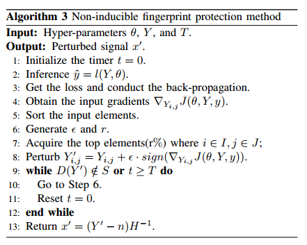

### 非诱导式指纹保护方法
1、算法目的
- 在上述算法1中实现对导频信号的无差别干扰，但这会导致信号的不可避免的失真，会影响正常的通信功能
- 算法2对算法1进行改进，根据导频信号中特征对分类器的影响程度对其梯度进行排序，选择其中影响力较大的几个特征因素进行扰动，既保证了扰动的成功率，也减小了信号的失真。
- 上述对信号的干扰都是使用一定的模型参数产生的固定扰动，分类器模型可以通过微调以适应新的特征。为解决此类问题，提出新的算法，使用时变策略来增加输入扰动的多样性。

2、算法内容
 
 - 通过在防御器（发射器）上搭载数据库，此数据库中记录有能生成理想扰动的超参数（包括扰动预算ϵ，和扰动率r），因此防御者可基于历史的策略来初始化超参数并生成合理扰动。

       </img>
   

  
 - 在算法上相比前者算法会多初始化一个计时器t和时间窗口T，在一个时间窗口T内（0<t<T）（数据包可以被接收）扰动是唯一的，在每一个时间窗口结束后(t>T)，或者是被扰动的信号无法被接收机接收，会重新初始化超参数以生成新的扰动

### 算法1和算法2的结果分析
1、下图中所示为在不同的扰动预算（Epsilon）和扰动率(PR)的情况下，保护成功率（PSR）、前导码的偏移率（POR）及其均值和方差的值

- PSR保护成功率即为在增加干扰后隐藏特征的比例
- POR为施加干扰后的信号与原始信号保持相同前导起始点的比例
- PR为100%时为算法1的对导频信号的无差别干扰，其他PR值得情况为算法2的结果
  

       </img>
   

   
   
2、下图为保护成功率随扰动预算Epsilon和扰动率变化的变化情况
 

 

       </img>
   

- 可以看到保护成功率随扰动预算和扰动率的增加而增加，并且在扰动率较低（20-40%）时也有较好的保护成功率
- 在完全扰动（PR = 100%）时保护成功率最高
 
3、下图为受保护信号在不同扰动率和扰动预算下的前导偏置的均值和方差

       </img>

- 前导码偏移量的方差和均值旨在评估扰动对信号前导码偏移的影响，由于WLAN数据包检测模块的容错机制，轻微的偏移并不会影响通信的质量
- 由上图可以看出，在使用算法1（PR = 100%）的情况下，均值和方差都维持在较高水平，会对通信质量造成一定影响，而在较低的扰动预算和扰动率下、均值和方差都维持在可接受的范围内

### 算法3 的结果分析
下图为分类器模型对时变扰动重新训练后，对原始数据集与时变扰动数据集分类精度的比较（扰动率为20-80%，扰动预算0.004-0.007）

       </img>

- 蓝线表示为分类器对生成的时变扰动信号进行重训练后，对原始数据的分类精度
- 红线表示为分类器对生成的时变扰动进行重训练后，对时变扰动数据集的分类精度
- 可以看出，在经过扰动后的信号在分类器的重新训练下被一定量的擦除到特征，而算法3的时变扰动策略可以让分类器更难以学习到特征

### 问题
- 最后的结果对比参数选择是在一个范围（扰动率为20-80%，扰动预算0.004-0.007）并没有给出确切的实验环境（平均化或某指定环境），而且训练的数据量未知，很难判定他是否是在大量实验中选取了某个很好的实验数据绘制的图，还是会出现过拟合的现象。第一个问题
- 第二个问题是算法对比的对象，第三个算法提出的目的是为了解决产生固定扰动可能会因为分类器模型的微调学习到新的特征，影响误导成功率。所以结果对比的对象应该是产生固定扰动的信号在模型重训练下的分类精度。
- 并且实验平台的收发设备的数量是未知的，如果和第一篇文章一样是5个发射机，1个接收机。那结果就非常好，就不再需要改变对比对象。
