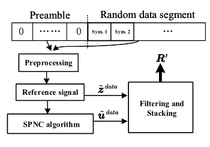
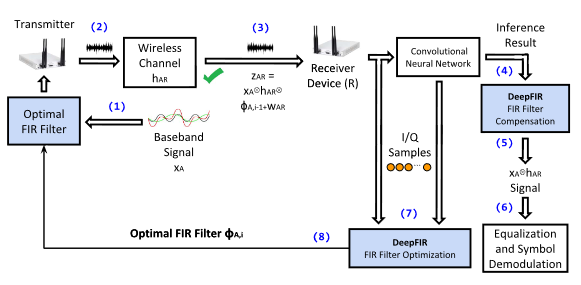

## 9.18
1、MYHT预研申请书撰写  
2、李沐AI课程学习

## 10.16  
1、把基本的网络(VGG、resnet、RNN)的一些代码学习了一下  
2、学习了transformer论文  ”Attention is all you need“，细节还得重新在看一下  
3、看了一部分RESNET的论文  ”Deep Residual Learning for Image Recognition“

## 10.30  
1、学习junqing zhang 团队的射频指纹相关的论文：  
- Shen G, Zhang J, Marshall A, et al. Radio frequency fingerprint identification for LoRa using spectrogram and CNN[C]//IEEE INFOCOM 2021-IEEE Conference on Computer Communications. IEEE, 2021: 1-10.  
- Shen G, Zhang J, Marshall A, et al. Radio frequency fingerprint identification for LoRa using deep learning[J]. IEEE Journal on Selected Areas in Communications, 2021, 39(8): 2604-2616.
- Shen G, Zhang J, Marshall A, et al. Radio frequency fingerprint identification for security in low-cost IoT devices[C]//2021 55th Asilomar Conference on Signals, Systems, and Computers. IEEE, 2021: 309-313.

2、学习AI代码

## 11.6 
1、论文 ‘Towards Scalable and Channel-Robust Radio Frequency Fingerprint Identification for LoRa’ 阅读， 代码复现。

## -12.26
1、调研小样本学习，开放集识别在射频指纹得应用、阅读了以下基本的开放集识别得相关方法和综述
- Recent Advances in Open Set Recognition: A Survey
- Toward Open Set Recognition
- Towards Open Set Deep Networks
- Adaptive Filter-Based Approach for PRY Fingerprints Extraction of Fast Ethernet Network
- Deep learning based RFF recognition with differential constellation trace figure towards closed and open set
  
2、写申请书，准备考试

## 1.15
1、 调研自适应滤波在RFFI中的应用
- 自适应滤波抽头系数作为射频指纹特征  
  Yang Y, Hu A, Xing Y, et al. A data-independent radio frequency fingerprint extraction scheme[J]. IEEE Wireless Communications Letters, 2021, 10(11): 2524-2527.  
  基于最小均方的自适应滤波和堆叠的射频指纹提取方法，通过最小化滤波后的信号和参考信号之间的距离来优化滤波器参数。每一类样本对应一组滤波器抽头系数，使用滤波器抽头系数来作为射频指纹
  

       </img>
   

- 自适应滤波器消除信道特征和噪声  
  Witham K L. Deep Convolutional Neural Network Architecture with Wireless Domain-specific FIR Layers for Modulation Classification[D]. Northeastern University, 2022.  
  提出了DeepFIR框架抵消无线深度学习中的信道作用，通过在发射机侧应用精心优化的数字有限输入响应滤波器，通过信道条件对基带波形做修改，以对抗信道影响
  

       </img>
   

  
2、 总结了一下在RFFI过程中对载波频率偏移（CFO）的弥补方法和应用。
