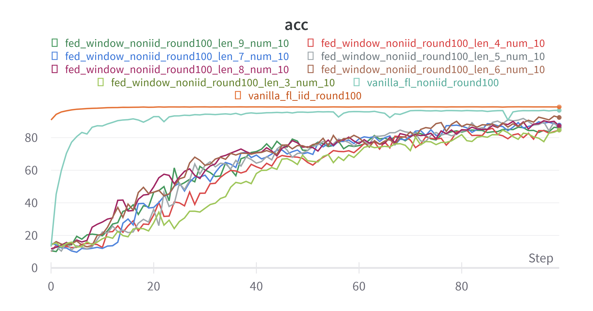

# **周报**
##### 时间：2023.11.08
### **主要工作内容和进展**
1、基于滑动窗口的联邦学习流量控制
流程如下：

最初结果图：之前的代码，和龙博讨论之后在修改了
客户端数量: 5

客户端数量：10

最新一版的代码的出图：

**后续计划**
代码和龙博讨论之后需要优化，继续优化代码，下一步考虑滑窗大小如何设置。

 

---

 

# **周报**
##### 时间：2023.10.30
### **主要工作内容和进展**
1、基于滑动窗口的联邦学习流量控制
客户端与服务器端的多进程通信（multiprocessing），训练过程会中断，可能是数据通信问题，在之前的基础上更改pytorch框架分batch喂进去，数据处理部分写完，客户类和服务器类在pytorch框架下还跑不通，在调试代码。

**后续计划**
继续调试通信过程中的代码。

 

---

 

# **周报**
##### 时间：2023.10.16
### **主要工作内容和进展**
1、基于滑动窗口的流量控制
目前已经实现客户端与服务器端的并行通信，写了滑动窗口部分的代码，并在MNIST的IID和NonIID的数据集上实验，10个客户端，窗口长度为3。
IID数据集下:（每个客户端数量一样）

NonIID:（每个客户端各拿一个数字的图片）
问题：
IID上精度比fedavg效果低一点，NonIID上不收敛，而且会出现运行过程中断的问题，还在检查代码问题
**后续计划**
继续调试滑窗部分NonIID的代码。

 

---

 

# **周报**
##### 时间：2023.09.18
### **主要工作内容和进展**
1、基于滑动窗口的流量控制
目前已经实现客户端与服务器端的通信，能实现基本的FedAvg，还在写滑动窗口部分的代码，实现滑动窗口内的被用户调度上传参数，进行聚合，定义sche_sig，被调度置1，发送给客户端，没在滑动窗口内的不被调度，置0。
FedAvg图：

2、尹老师安排写本子+做预算核算。

**后续计划**
继续写滑窗部分的代码。

 

---

 

# **周报**
##### 时间：2023.09.11
### **主要工作内容和进展**
##### 1、基于滑动窗口的流量控制
<!-- **First sliding**提出，是根据权重相似度直接按分组聚合。
Khan M I, Jafaritadi M, Alhoniemi E, et al. Adaptive weight aggregation in federated learning for brain tumor segmentation[C]//International MICCAI Brainlesion Workshop. Cham: Springer International Publishing, 2021: 455-469. -->
**问题描述：**
在传统的联邦学习过程中，在每一轮聚合过程中，流量会在用户每一轮模型上传的聚合的时候相继到达服务器，导致流量出现脉冲、不平滑，采用滑动窗口机制做流量控制，使用滑动窗口滑过用户列表（随机排序）代替随机选择合作者，以确保所有合作者的参与。

考虑有一个联邦学习服务器，下面有N个联邦学习的用户，服务器有一个用于选择用户聚合的滑动窗口，长度为L，每个用户同时开始进行本地训练（并行），每一个本地轮训练结束后检查自己是否位于滑动窗口内，如果位于滑动窗口内，则停止训练发送本地模型到服务器，服务器接收滑动窗口内用户的模型并聚合，聚合结束滑动窗口向前滑动一个用户，以此类推，直至遍历所有用户。
初始排序

滑动窗口聚合机制

**存在问题：**
1、讨论滑动窗口和流量平滑度之间的关系（优化问题）
2、开发一种优化滑动窗口大小的策略（建模）

**后续计划**
目前做了一个滑动窗口选择串行的，但是因为要涉及到计时以及流量的计算，需要并行训练，找了一个异步联邦学习的框架Async-FL，还在研究，在此框架上修改，目前还在debug，和龙博讨论后续建模。

 

---

 
