# Erasing Radio Frequency Fingerprinting via Active Adversarial Perturbation

- 基于主动对抗扰动的射频指纹消除

## 背景

1. **射频指纹**：能够通过无线电设备的模拟电路或硬件缺陷对信号发送端无线设备进行识别的一种硬件特征

   - 特点：硬件唯一性特征造成的信号特性无法从编码层面抹除（如MAC地址等可修改的ID）

2. **射频指纹识别**（利用每个硬件设备电磁指纹不同的特性）：

   - 物理层识别方案，可以通过每个设备电磁指纹不同来对克隆软ID或MAC地址的设备进行区分

   - 典型的射频指纹识别过程：信号捕获、特征挖掘、分类

     - 常见挖掘特征：频偏、瞬态模式、I-Q不平衡、功率放大器非线性 等（可以实现对同一设计、同一产品线的设备进行区分）

     - 机器学习特征挖掘方法：

       > - 对已知标签设备进行监督学习分类任务训练
       > - 对未知标签设备进行无监督学习聚类任务训练

   - 射频指纹识别的安全隐患

     > - 可以预先训练一个根据电磁指纹识别附近设备的模型，搭载在嗅探器上进行设备识别
     > - 如果模型的泛化能力强且经过大量预训练，嗅探器就可能通过射频指纹推导设备的验证性信息（用户位置、网络活动）
     > - 通过识别基站覆盖区域内的设备，定位或跟踪于该设备关联的上层应用甚至追踪终端用户，从而检测到用户行为，被恶意目的利用

3. **主动射频指纹消除**：从信号层面，通过主动向射频信号加入扰动对抗射频指纹识别

   - 目的：通过加入信号干扰，隐藏硬件缺陷，使射频指纹识别模型的推理能力失效，同时保证原有通信质量

     > 图中所示，图`(a)`表示射频指纹识别模型在没有向射频信号加入干扰的情况下的设备类别聚类图，能够在图中看出不同种类之间清晰的决策边界；图`(b)`表示向射频信号加入干扰后射频指纹识别模型的聚类结果，不同类别设备特征被打散，决策边界不能被识别，即可以隐藏设备的射频指纹特征。

   

       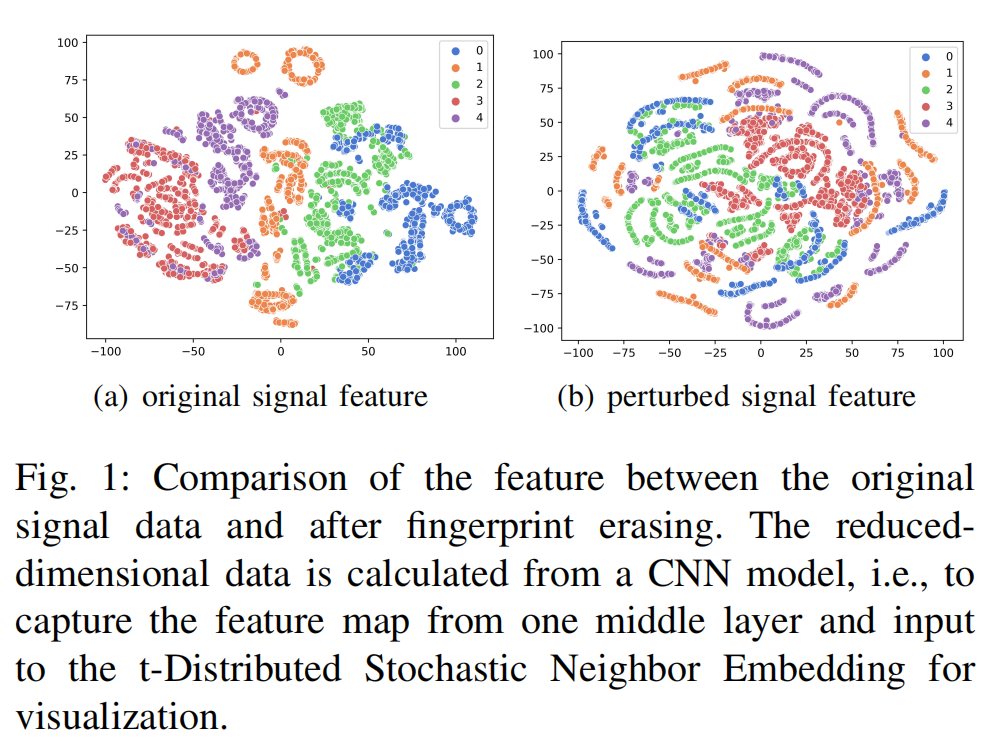
   

   
   
   - 实现主动射频指纹消除的难点：
   
     - 向信号加入的扰动应该能够将同一类设备尽可能被指纹识别模型分类为多种不同的类别，而不是重新映射到某一个或几个类
   
       （上图中任意类的细分或对调都不会真正干扰射频指纹的分类）
   
     - 扰动信号的加入不能影响正常的通信功能
   
       （加入的扰动存在功率上限，并且保证稳定的数据包传输和链路传输速率）
   
     - 为了避免加入的干扰误导信道估计函数，需要尽可能减小噪声
   
       （在扰动功率上限范围内，保证干扰指纹识别模型效果的基础上，使加入的扰动功率最小）
   
   - 本文为解决以上三个问题所做的工作：
     - 设计了一种通过加入干扰针对射频信号中的指纹进行消除的方案
     - 从理论上分析了加入的人工扰动对信道函数造成的影响，从而理论推导出了噪声功率的上限
     - 在一个实际搭建的 LTE 网络中进行了实验，证明了设计的方法能在不影响通信过程的前提下消除指纹

## 相关工作

1. **基于深度学习的射频指纹识别**

   - 主要射频指纹识别方法：

     - 基于专家特征识别（将 I/Q 数据先转换为已知特征后再使用深度学习方法）

       > - 对信号进行同步、载波频偏补偿等预处理操作
       > - 利用短时傅里叶变换、小波变换、星座图，将经过预处理的 I/Q 数据转换为时频特征图、双频特征图、星座图等特征表示
       > - 将特征表示输入模型，进行特征提取和分类识别

     - 利用 I/Q 数据样本的深度学习策略识别（直接使用 I/Q 数据）

       > 对数据进行归一化、切片后直接构建神经网络完成下游识别任务

   - 本文的射频指纹场景构建方法
     - 本文使用的数据集（导频信号 I/Q 数据）都通过采集 SDR 设备发送的一串固定已知的信号序列得到
     - 使用同一网络协议的设备用于识别的序列是相同的（本文中所有 SDR 设备都使用 LTE 网络协议）
     - 通过提取不同硬件设备发送的导频信号中产生的失真进行设备分类识别

2. **对抗攻击**

   - 目的：误导模型给出高可信度的错误输出

   - 目前对抗攻击领域的论文都能够说明：

       神经网络可以被经过设计的人工噪声误导，且产生这种噪声的开销很小

       > 常见对抗攻击算法：L-BFGS，FSGM（本文使用的算法），BIC，ILCM

   - 对抗攻击的分类：
       - 白盒攻击：已知攻击的模型结构和参数（本文关注问题）
       - 黑盒攻击：只能观测到待攻击模型的输入和决策结果，模型内部情况未知

## 系统模型

1. **4G LTE 协议**

    

        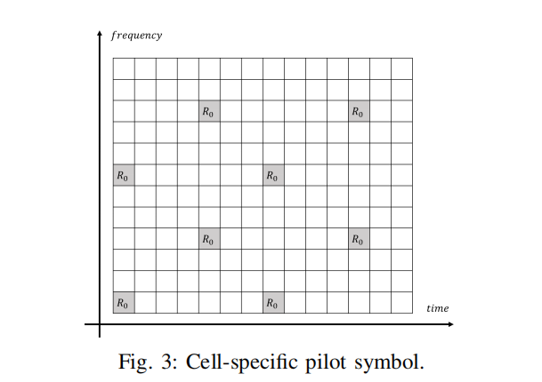
    

    - 采用 OFDM 接入，导频信号由 QPSK 调制驱动

    - 为实现 MMSE 信道估计，导频符号等距排列

    - 均匀导频符号网格条件下，在时频平面上采用菱形排列以实现最优估计

2. **导频信号（用于射频指纹识别）**

    

        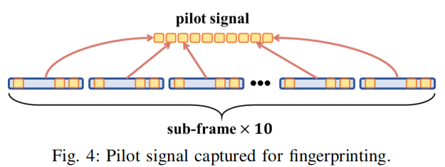
    

    - 用于估计解调信道，由协议指定插入位置
    - 所有用户已知导频信号内容

3. **射频指纹识别与主动干扰对抗的系统模型**

    

        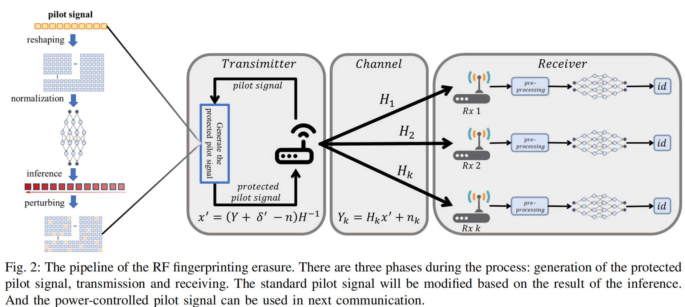
    

    **i.  指纹识别部分**

    - 考虑发射端基带信号 $s(t)$

        本地硬件将特定硬件特征嵌入到无线信号中，表示为函数 $f(\cdot)$

        实际发射的基带信号为 $x(t) = f(s(t))$，接收端接收到的信号用 $Y$ 表示
        $$
        Y = Hx + n
        $$

    - 接受信号 $Y$ 经过预处理、滤波、归一化、同步处理后，预训练好的分类器通过信号失真和先验进行决策

        $\hat{y}$ 表示分类器决策，$l$ 表示分类器，$\theta$ 为模型参数
        $$
        \hat{y} = l(Y,\theta)
        $$

    **ii.  主动对抗部分**

    - 考虑在接受信号上叠加干扰 $\delta$ 用于对抗
        $$
        Y^\prime = Y + \delta
        $$
        本文根据 FGSM (fast sign gradient method) 算法策略进行干扰生成，即
        $$
        \delta = \epsilon \cdot \mathrm{sign} \left( \nabla_YL(\theta,Y,y) \right)
        $$
        由此诱导分类器模型输出错误的决策 $\hat{y}^\prime$
        $$
        \hat{y} ^\prime = l(Y^\prime, \theta)
        $$

    - 考虑只在一定比例的导频符号上加入干扰，实现扰动稀疏化

        设扰动比为 $r$，稀疏化后的扰动为 $\delta^\prime$，$g$ 表示稀疏函数，$s$ 表示对人工干扰功率进行约束的超参数
        $$
        \delta ^\prime = g( \delta, r, s )
        $$
         由此恢复出的在发送端产生的防御指纹信号 $x^\prime$
        $$
        x^\prime = (Y + \delta^\prime - n) H ^{-1}
        $$

    **iii.  通信指标限制**

    - 使用 BLER 而非 PLR 描述信道估计后的通信质量

        > - BLER 可以描述导频信号在加入干扰后影响通信的程度
        > - 通信系统具有容错机制，因此 PLR 不增加不代表 BLER 不增加

        在干扰实现的指纹擦除性能相同时，最小化 BLER 度量

    - 干扰功率限制为 $\sigma_{\mathrm{pert}}^2 \leq s$

## 算法设计

1. **直接指纹消除 (Straightway Fingerprinting Prevention)**

   

       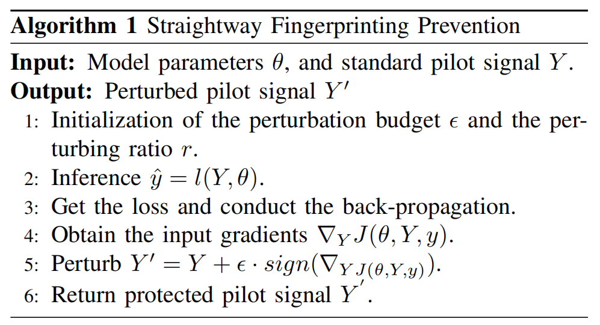
   

   - 扰动比和噪声功率人为选择，对所有导频信号符号都添加扰动
   - 损失函数计算时将推理标签设置为目标设备的数量，误导分类器做出错误决策

2. **功率控制的指纹消除 (Power-controlled Fingerprinting Prevention)**

   

       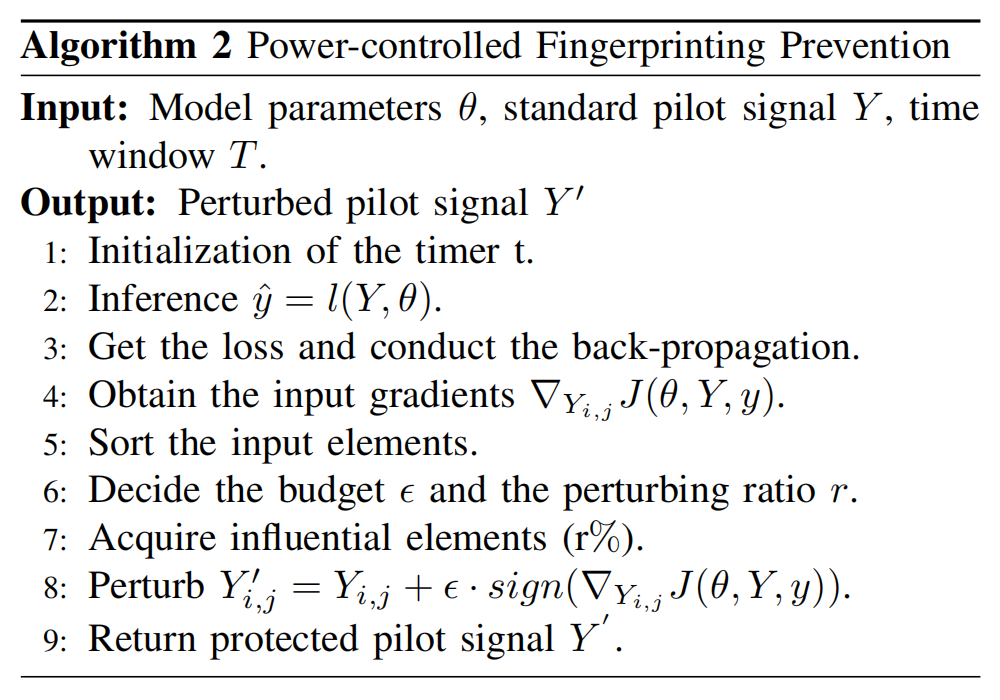
   

   - 只向影响分类模型决策的导频信号符号添加扰动，使给定噪声功率分布在影响大的符号上
   - 根据模型反向传播得到的输入梯度，对导频信号的一段连续数据样本各符号得到的梯度大小进行排序
   - 向梯度最大的前 $r\%$ 样本加入干扰

## 人工噪声功率分析

- **基于最小二乘的信道估计方案**

    假设硬件热噪声与加入的干扰均服从复高斯分布

    > $$
    > \mathbf{h} ^\mathrm{LS} = \mathbf{h} + \mathbf{w}_\mathrm{ther} + \mathbf{w}_\mathrm{pert}
    > $$
    >
    > |                             变量                             |     含义     |
    > | :----------------------------------------------------------: | :----------: |
    > |                         $\mathbf{h}$                         | 实际信道衰落 |
    > | $\mathbf{w}_\mathrm{ther} \sim \mathcal{CN}(0, \sigma_\mathrm{ther}^2 \mathbf{I})$ | 接收机热噪声 |
    > | $\mathbf{w}_\mathrm{pert} \sim \mathcal{CN}(0, \sigma_\mathrm{pert}^2 \mathbf{I})$ |   主动扰动   |
    >
    > 利用 LMMSE 对信道估计进行修正的公式如下
    > $$
    > \mathbf{h}^\mathrm{LMMSE} = \mathbf{R}_\mathbf{hh} \left( \mathbf{R}_\mathbf{hh} + \frac{\beta}{\mathrm{SNR}}\mathbf{I} \right) ^{-1} \mathbf{h}^\mathrm{LS}
    > $$
    > 其中 $\beta = \mathbb{E}[x_k]^2\mathbb{E}[1/x_k]^2$ 为与调制方式有关的常数，$\mathbf{R}_\mathbf{hh} = \mathbb{E}[\mathbf{h}\mathbf{h}^\mathrm{H}]$ 是信道自相关矩阵，可以通过信道建模或最小二乘估计得到
    >
    > > 考虑矩阵 $\mathbf{R}_\mathbf{hh} = \mathbf{U} \mathbf{\Lambda} \mathbf{U}^\mathrm{H}$ 的 SVD 分解，以此表示 LMMSE 估计得到的信道参数 $\mathbf{h}^\mathrm{LMMSE}$ 与真实信道参数 $\mathbf{h}$ 的均方误差
    > >
    > > |                             变量                             |                             含义                             |
    > > | :----------------------------------------------------------: | :----------------------------------------------------------: |
    > > |                             $P$                              |               $\mathbf{h}^\mathrm{LS}$ 的维数                |
    > > |                             $p$                              |           $\mathbf{\Lambda}$ 矩阵非零对角元素个数            |
    > > |                           $\mu_j$                            | $\mathbf{U}^\mathrm{H}\mathbf{R}_\mathbf{hh}\mathbf{U}$ 矩阵中第 $i$ 个对角元 |
    > > | $\delta_j = \frac{\lambda_j}{\lambda_j+\frac{\beta}{\mathrm{SNR}}}$ | LMMSE 滤波矩阵 $\mathbf{R}_\mathbf{hh} \left( \mathbf{R}_\mathbf{hh} + \frac{\beta}{\mathrm{SNR}}\mathbf{I} \right) ^{-1}$ 的第 $j$ 项特征值 |
    >
    > $$
    > \mathrm{MSE} = 
    > \frac1P \sum_{j=0}^{p-1} \left[ 
    > 	\mu_j (1-\delta_j)^2 
    > 	+ (\sigma_\mathrm{ther}^2 + \sigma_\mathrm{pert}^2) \delta_j
    > \right] 
    > + \frac1P \sum_{j=p}^{P-1} \mu_j
    > $$
    >
    > 向发射信号加入干扰后的 MSE 增量为
    > $$
    > \Delta_\mathrm{pert}^\mathrm{MSE} = \sigma_\mathrm{pert}^2 \cdot \frac{\sum_{j=0}^{p-1}\delta_j}P
    > $$

    - 以上的结果说明在信号中的各导频符号上加入的干扰符合加性条件

        （假设在所有导频符号上都加上干扰的噪声功率为 $\sigma_\mathrm{pert}^2$，扰动比为 $r$ 时的噪声功率为 $r\sigma_\mathrm{pert}^2$）

    - MSE 增加时，由于信道解码器有纠错能力，解调输出的信噪比高于解码器的信噪比阈值时 BLER 不变

        在给定接收方案的条件下，基带信号信噪比、解码器信噪比阈值、传输过程的信噪比损失都可以测量

        因此可以计算得出能够预留给扰动的信噪比预算，从而估测出扰动的功率上限

## 实验配置

1. **测试平台配置**

    - 发射机：1 个 USRP B210

        运行程序：经过修改的 eNB（用于基站仿真）和 EPC（用于核心网仿真）应用，用于传输带有插入导频的下行信号

    - 接收机：2 个 USRP B210，3 个 LimeSDR USB

        运行程序：经过修改的 UE 程序，收集接受的导频信号

    - 每次传输都将接收机与本次信号的发射机的 SDR 电路板分别连接到两台主机进行仿真

        主机系统：Intel i7-13700H，Ubuntu 20.04

    

        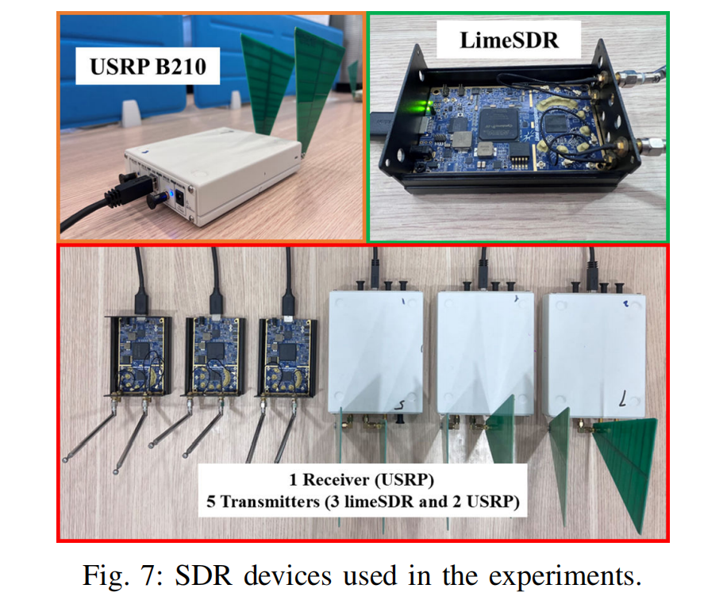
    

2. **数据集**

    实验用数据集均为 SDR 平台生成后采集的无线信号

    - 考虑硬件的环境温度、硬件间距离、待机时间等条件，收集了 10 中不同环境条件下的导频信号

    - 固定一种环境条件后，发射机将 10 个子帧的导频信号连接在一起表征设备特征

        每种环境条件下，每对收发设备收集 1000 个数据样本

        整体数据集上每台发射机分别有 10000 个数据样本

        （未提及发射机发送的具体数据包内容或格式）

    - 数据样本参与训练之前统一经过了归一化处理

3. **模型与实验**

    

        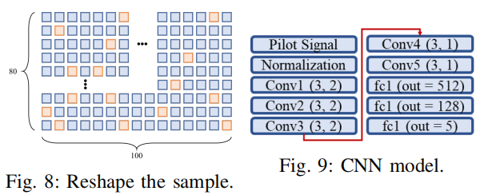
    

    - 识别模型使用 5 层 CNN，包含 ReLU 和池化
    - 信号样本维度 (4000, 2) 重组为 (80, 100)
    - 训练集大小 80%，测试集大小 20%

## 性能分析

1. **性能指标**

    - BLER：反应导频信号加入干扰后，无线通信系统性能的退化程度

    - 比特率：用于比较超参数设定不同时，受保护导频信号的性能

    - PLR：丢包率；BLER 描述信道估计质量、PLR 反映受保护信号的可用性

    - 保护成功率（PSR）：加入干扰后，分类器模型不能正确识别设备的样本比例

        （本实验中人工噪声的预算范围为 0.004\~0.04，干扰比为 0.1\~1.0）

2. **实验结果**

    - 改变扰动预算（0.004\~0.04）与扰动比（0.1\~1.0），加入干扰后的保护成功率

        > - 保护成功率随预算和扰动比增加
        > - 扰动比为 0.1 时也能够达到 97.2% 的保护成功率
        > - 扰动比越大，扰动预算的提升对保护成功率的提升效果越明显
        > - 所有扰动预算与扰动比条件下，BLER 均为 0，能够保持正常通信性能

        

            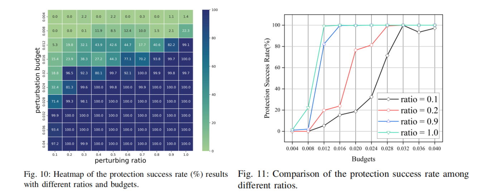
        

    - 接收端通信过程中的星座图

        

            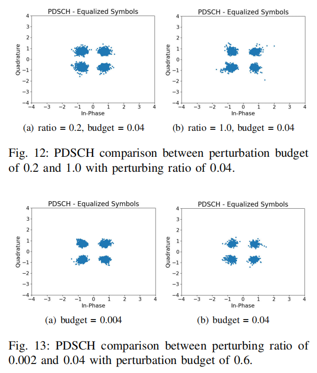
        

        > - 每种情况的星座图变化都很小，各区域分界清晰
        > - 证明导频信号同步的容忍度为预防策略提供了鲁棒性

    - 考虑使用 UDP 和 TCP 协议，比较了不同条件下的通信质量

        

            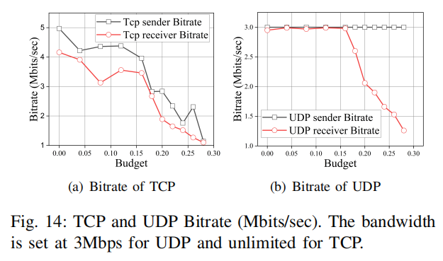
        

        > 考察不同噪声功率对通信质量的影响
        >
        > - 扰动比设置为 1.0，预算高于 0.16 时，比特率显著降低；预算小于 0.12 时，比特率较为平稳
        > - 本实验设置的最大扰动预算为 0.04，因此选取范围从比特率指标来看能够接受

        

            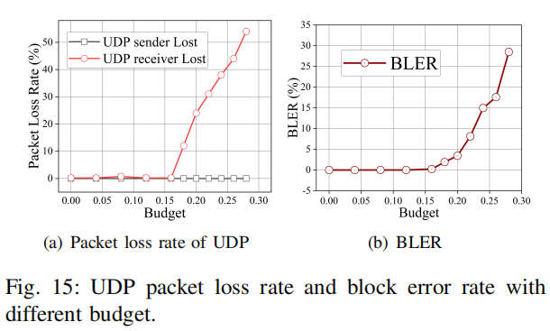
        

        > - 预算小于 0.16 时，丢包率曲线和误块率曲线都维持在 0
        > - 本实验设置的最大扰动预算为 0.04，因此选取范围从 PLR 和 BLER 指标来看能够接受

    - 消融实验

        

            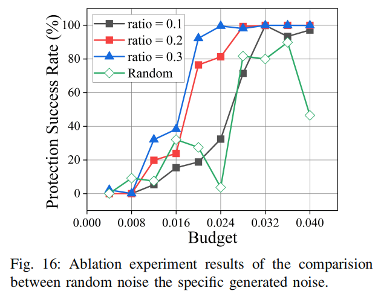
        

        - 验证生成的特定干扰在限制功率的条件下对指纹保护的性能优于随机噪声

            > - 随机噪声是在特定干扰生成的算法步骤中将正梯度改为随机梯度生成的
            > - 实验过程中，随机噪声的扰动比为 1.0

        

            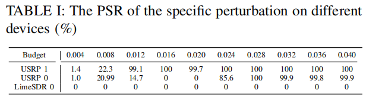
        

        - 验证相同类型器件产生的扰动具有可转移性

        > - 用 USRP 1 产生扰动，并将保护信号加载到其他设备上进行发射接收，评估 PSR
        > - 特定扰动在大多数条件下，在 USRP 0 上的表现很好，但是 Lime SDR 上不起效果
        > - 证明了同种型号硬件的射频指纹可以用近乎相同的干扰进行指纹保护
        > - 并没有对这个现象进行进一步说明

