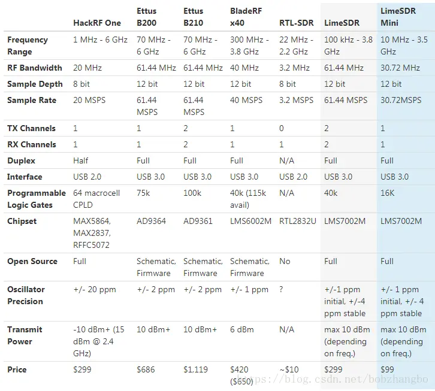
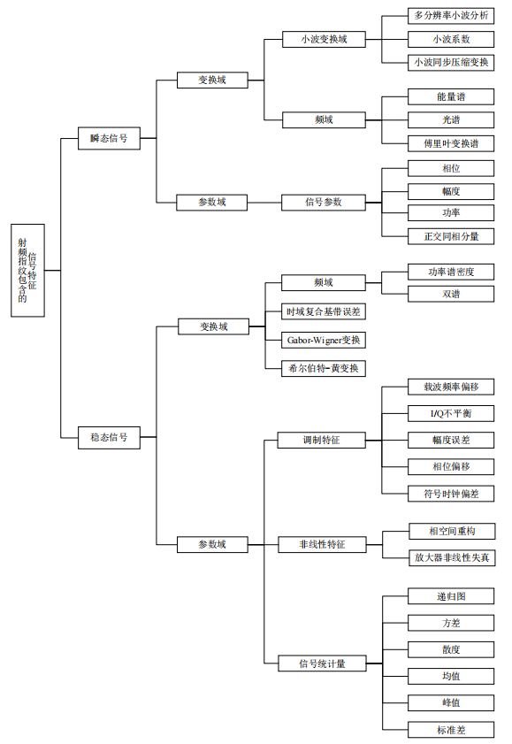
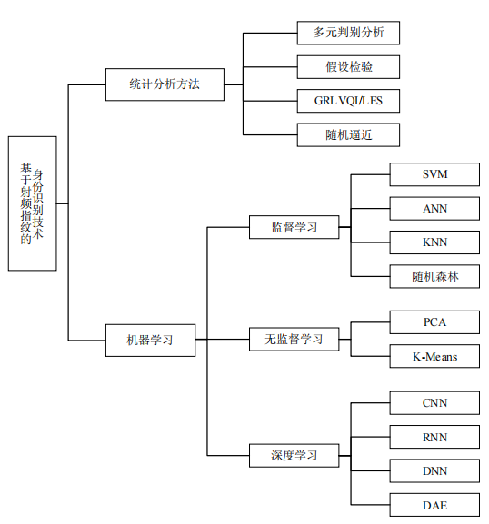
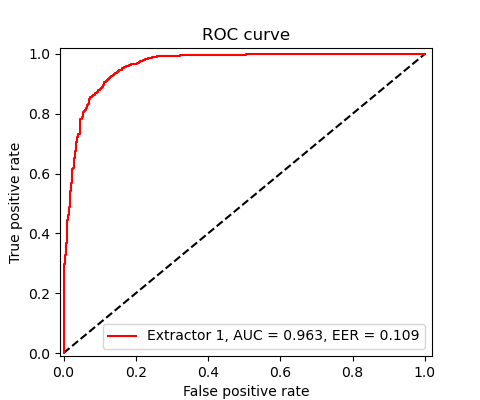
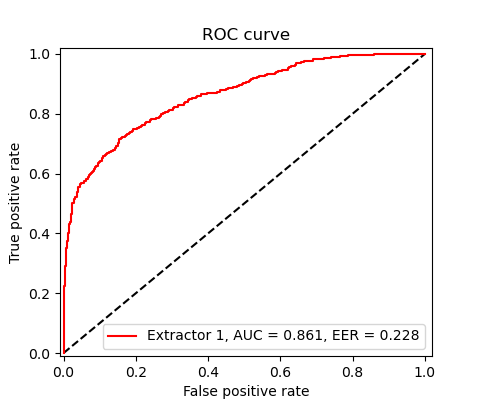
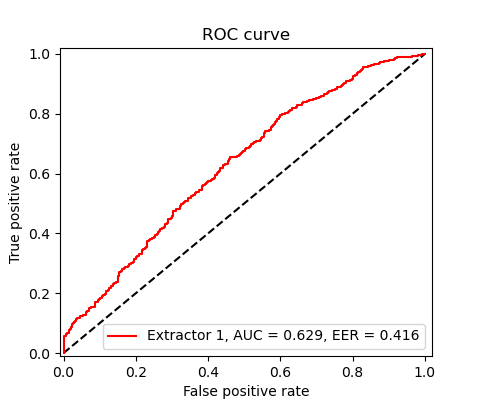

## Table of Contents

- <a href="#2">Week 2 (2023.9.4 – 2023.9.10)</a>
- <a href="#3">Week 3 (2023.9.11 – 2023.9.17)</a>
- <a href="#6">Week 6 (2023.10.9 – 2023.10.15)</a>
- <a href="#8">Week 8 (2023.10.23 – 2023.10.29)</a>
- <a href="#9">Week 9 (2023.10.30 – 2023.11.5)</a>
- <a href="#15">Week 15 (2023.12.11 – 2023.12.17)</a>
- <a href="#19">Week 19 (2024.1.8 - 2024.1.14)</a>

 

------

## <a href="#table">Week 2 (2023.9.4 – 2023.9.10)</a>

### Work

1. <a href="./Fingerprint Report/Report.pdf">射频指纹识别对抗论文汇报</a>

## <a href="#table">Week 3 (2023.9.11 – 2023.9.17)</a>

### Work

1. MYHT 预研申请书撰写
2. Google Scholar 爬虫：爬取信息无误，连续爬取存在 CAPTCHA 阻挡问题
3. 对抗攻击调研《*<a href="https://arxiv.org/abs/1810.00069" style="text-decoration: none;">Adversarial Attack and Defense: A Survey</a>*》，未整理完成

## <a href="#table">Week 6 (2023.10.9 – 2023.10.15)</a>

### Work

1. 组会汇报准备《*<a href="https://ieeexplore.ieee.org/abstract/document/9715147/">Towards Scalable and Channel-Robust Radio Frequency Fingerprint Identification for LoRa</a>*》
2. 射频指纹识别与认证任务调研 (Liverpool, Junqing Zhang 团队, 加密认证与物理层安全认证方向, 实验平台基于物联网LoRa发送设备)

    - \[1\] <a href="https://ieeexplore.ieee.org/abstract/document/9488793">G. Shen, J. Zhang, A. Marshall, L. Peng and X. Wang, "**Radio Frequency Fingerprint Identification for LoRa Using Spectrogram and CNN**," *IEEE INFOCOM 2021 - IEEE Conference on Computer Communications*, Vancouver, BC, Canada, 2021, pp. 1-10</a>
    - \[2\] <a href="https://ieeexplore.ieee.org/document/10100932">G. Shen, J. Zhang, A. Marshall, M. Valkama and J. R. Cavallaro, "**Toward Length-Versatile and Noise-Robust Radio Frequency Fingerprint Identification**," in _IEEE Transactions on Information Forensics and Security_, vol. 18, pp. 2355-2367, 2023, doi: 10.1109/TIFS.2023.3266626.</a>
    - \[3\] <a href="https://arxiv.org/abs/2207.02999">Shen, G., Zhang, J., Marshall, A., Woods, R., Cavallaro, J., & Chen, L. (2022). **Towards receiver-agnostic and collaborative radio frequency fingerprint identification**. _arXiv preprint_ arXiv:2207.02999.</a>

## <a href="#table">Week 8 (2023.10.23 – 2023.10.29)</a>

### Work

1. SDR 设备调研（USRP B210, LimeSDR, HackRF One）

   

       
   

   - 信号发射/接收（全/半双工、MIMO支持）：MCU → FPGA (Xilinx/Altera) → ADC/DAC (14/12/8-bit) → 射频前端 (Chipset)
   - 主机通信：USB接口、带宽
   - SDR 开发：GNU Radio

2. 射频指纹信号采集实验平台调研（<a href="https://wiki.gnuradio.org/index.php/Tutorials">GNU Radio Companion</a>, <a href="https://www.mathworks.com/hardware-support/usrp.html">Matlab/Simulink</a> <a href="https://www.mathworks.com/help/supportpkg/usrpradio/getting-started-with-communications-system-toolbox-support-package-for-usrp-radio.html?s_tid=CRUX_lftnav">USRP Support</a>）

3. 射频指纹研究现状整理（《<a href="https://d.wanfangdata.com.cn/thesis/ChJUaGVzaXNOZXdTMjAyMzA5MDESCUQwMjIwOTIxNRoIcWdrazQ1anc%3D">射频指纹伪装及对抗技术研究 郑雅文</a>》）

   - 射频指纹特征提取及分类

     

         
     

  
   - 射频指纹身份识别

     

         
     

  
   - 射频指纹伪装/抗伪装性能

     - 强制攻击、重放攻击
     - 补偿前端射频缺陷（射频指纹消除）
     - 生成对抗网络（同时做消除+伪装）
     - 攻击难度（瞬态信号攻击>暂态信号攻击；加入ML驱动的攻击检测网络更难攻击（多用户协作伪装））
 
4. 针对有源 RFID 已有协议的攻击方式调研（未完成，《*<a href="https://link.springer.com/chapter/10.1007/978-981-16-0980-0_49">Security Attacks on RFID and their Countermeasures</a>*》）

## <a href="#table">Week 9 (2023.10.30 – 2023.11.5)</a>

### Work

1. 《*Towards Scalable and Channel-Robust Radio Frequency Fingerprint Identification for LoRa*》复现，未完成

    

        
    

    
    

        
        
    

## <a href="#table">Week 15 (2023.12.11 – 2023.12.17)</a>

### Work

1. 开放集识别问题调研 (Open Space Risk 引入)

   - \[1\] <a href="https://ieeexplore.ieee.org/abstract/document/9040673">C. Geng, S. -J. Huang and S. Chen, "**Recent Advances in Open Set Recognition: A Survey**," in _IEEE Transactions on Pattern Analysis and Machine Intelligence_, vol. 43, no. 10, pp. 3614-3631, 1 Oct. 2021, doi: 10.1109/TPAMI.2020.2981604.</a>
   - \[2\] <a href="https://ieeexplore.ieee.org/abstract/document/6365193">W. J. Scheirer, A. de Rezende Rocha, A. Sapkota and T. E. Boult, "**Toward Open Set Recognition**," in _IEEE Transactions on Pattern Analysis and Machine Intelligence_, vol. 35, no. 7, pp. 1757-1772, July 2013, doi: 10.1109/TPAMI.2012.256.</a> (_1-vs-Set_ Machine, open space risk)
   - \[3\] <a href="https://ieeexplore.ieee.org/abstract/document/6809169">W. J. Scheirer, L. P. Jain and T. E. Boult, "**Probability Models for Open Set Recognition**," in _IEEE Transactions on Pattern Analysis and Machine Intelligence_, vol. 36, no. 11, pp. 2317-2324, 1 Nov. 2014, doi: 10.1109/TPAMI.2014.2321392.</a> (Compact Abating Probability(CAP) model)
   - \[4\] <a href="https://www.cv-foundation.org/openaccess/content_cvpr_2016/html/Bendale_Towards_Open_Set_CVPR_2016_paper.html">Abhijit Bendale, Terrance E. Boult, "**Towards Open Set Deep Networks**", Proceedings of the _IEEE Conference on Computer Vision and Pattern Recognition (CVPR)_, 2016, pp. 1563-1572.</a> (OpenMax)
   

## <a href="#table">Week 19 (2024.1.8 - 2024.1.14)</a>

### Work

1. 人机协同/微小信号 申请书/测算报告/项目清单
2. 射频指纹综述文章调研（未完成）

   - 暂态/稳态信号分析方法 （小波变换、贝叶斯阶跃变化检测）
   - 可靠性 vs 脆弱性
