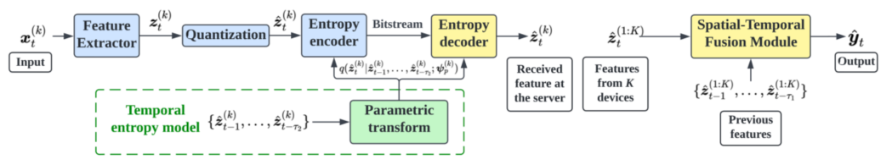
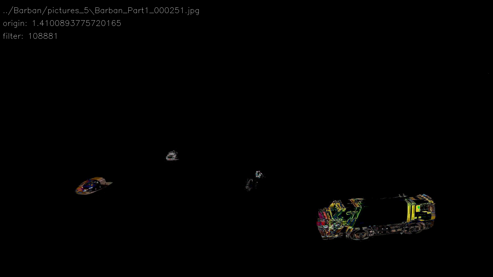

# 周报 - 20231226
## 本周工作小结

1、实验

对比算法

1️⃣ proposed SAC (dynamic)

2️⃣ SAC without cross attention (dynamic)

3️⃣ curve fit (static)

4️⃣ latency optimal (static)

2、论文撰写：完成系统以及算法部分

## 下一步工作安排

论文撰写

 

---

 

# 周报 - 20231107
## 本周工作小结

1、Shao, Jiawei, Xinjie Zhang, and Jun Zhang. **"Task-oriented communication for edge video analytics."** IEEE Transactions on Wireless Communications (2023).

tasks: a **multi-camera** pedestrian occupancy prediction task and a **multi-camera** object detection task

task-relevant feature extraction

aims at maximizing the informativeness of the extracted features, while minimizing its communication overhead

entropy temporal models    spatial temporal fusion model

to minimize the discrepancy between the variational and true distributions

distortion between the target variable and the inference output

evaluation: rate-performance tradeoff

2、Barban数据集

resolution knobs

| name | resolution | accuracy |
|:---:|:---:|:---:|
| 1080P | 1920\*1080 | 1.000 |
| 720p | 1280\*720 | 0.925 |
| 540p | 960\*540 | 0.855 |
| 480p | 854\*480 | 0.802 |
| 440p | 782\*440 | 0.735 |

deviation: cv2.absdiff() 函数

## 下一步工作安排

模型完善以及仿真

 

---

 

# 周报 - 20231030
## 本周工作小结

1、目标识别精度（detection accuracy）与视频流帧分辨率（frame resolution）、帧率（frame rate）之间的关系

 

1️⃣ 将目标识别模型的置信度（confidence）输出作为目标识别精度

（temporal dependency）

Galanopoulos, Apostolos, et al. **"AutoML for video analytics with edge computing."** IEEE INFOCOM 2021-IEEE Conference on Computer Communications. IEEE, 2021.

（nearby arms can be correlated）

Wang, Shuoyao, Suzhi Bi, and Ying-Jun Angela Zhang. **"Edge Video Analytics with Adaptive Information Gathering: A Deep Reinforcement Learning Approach."** IEEE Transactions on Wireless Communications (2023).

imperfect feedback reward function

the observations to constitute the action-observation pair

结论：

1、缺点：置信度（confidence）与精度（accuracy）虽然一致，但并不是系统最终关注的性能指标；

2、置信度在一定程度上反映识别精度，可作为观测之一输入到状态网络中去；

 

2️⃣ 离线配置（profiler）或者拟合曲线（fitted function）

优势：用于替代优化问题中的识别精度At，一般是整数规划或者混合优化问题 (例如，mixed integer non-linear programming (MINLP))，能够处理约束的变化；

劣势：视频流的识别精度随时间存在较大波动，长期统计平均并不能有效表征，对视频流数据集的要求较高，如 OB (Object-based) 的仿真帧数量仅为250帧，难以实现画面静止不再传输的类似效果。

 

3️⃣ 贴合题目“无人机基站辅助”，查找无人机视角数据集：VisDrone2019

 

4️⃣ 在考虑综合性能时，不必保证绝对的高精度值

Ming, Zhongxing, et al. **"Edge-based video surveillance with graph-assisted reinforcement learning in smart construction."** IEEE Internet of Things Journal 9.12 (2021): 9249-9265.

Wang, Shuoyao, Suzhi Bi, and Ying-Jun Angela Zhang. **"Edge Video Analytics with Adaptive Information Gathering: A Deep Reinforcement Learning Approach."** IEEE Transactions on Wireless Communications (2023).

 

5️⃣ 适应不同的带宽条件，而时延约束一般是相对稳定的

## 下一步工作安排

模型完善以及仿真

 

---

 

# 周报 - 20230918
## 本周工作小结

精度动态波动、时变的带宽与时延限制、衡量下采样与分析时间

## 下一步工作安排

 

---

 

# 周报 - 20230911
## 本周工作小结

1、信息与智能学报

主要问题：内容篇幅不够，缺少实验分析，当前模型扩展性差，可分析点较少。

1️⃣ 数据集选择上，UA-DETRAC数据集拍摄镜头晃动严重，交通环境复杂，干扰元素较多；

2️⃣ 问题本身不是真正的MDP问题，直接使用强化学习算法求解缺乏理论支撑；

3️⃣ 将图片像素直接输入状态网络，传输成本过高不能忽略，导致模型拓展性差，难以拓展多用户；

4️⃣ 场景设计较为简单，可供实验分析内容较少。

2、分析以上问题提出改进方案

1️⃣ 不必选择带标签的数据集（Youtube live），使用yolov5x模型（COCO数据集预训练）进行推理已经足够准确，可以作为label；
由于（数据集特性）每一时刻的识别精度结果存在波动，可考虑一段时间内的平均精度结果；

精确率 $Precision = \frac{TP}{TP + FP}$

召回率 $Recall = \frac{TP}{TP + FN}$

F1分数 $F_1 = 2 * \frac{Precision * Recall}{Precision + Recall}$

2️⃣ 增加零分辨率配置决策，将前后帧之间的差异、前一时刻的动作输入网络，满足MDP状态转移；

3️⃣ 不将全部画面像素帧输入网络，解决传输时间问题，可拓展多用户；

4️⃣ 在原有实验的基础上，扩充实验内容。

3、秋招

## 下一步工作安排

编写仿真环境，搭建实验

<!-- 重新选择强化学习算法，克服视频流帧识别效果上的波动性 -->

<!--  -->

 

---

 

# 周报 - 20230906
## 本周工作小结

1、撰写信息与智能学报

主要问题：内容不够，实验分析缺乏，当前模型扩展性差，可分析点较少。

1️⃣ 数据集选择上，UA-DETRAC数据集拍摄镜头晃动严重，交通环境复杂，干扰元素较多；

2️⃣ 问题本身不是真正的MDP问题，直接使用强化学习算法求解缺乏理论支撑；

3️⃣ 将图片像素直接输入状态网络，导致模型拓展性差；

4️⃣ 场景设计较为简单，可供实验分析内容较少。

2、分析以上问题进行针对改进

1️⃣ 不必选择带标签的数据集，使用yolov5x模型（COCO数据集预训练）进行推理已经足够准确，可以作为label；
由于（数据集特性）每一时刻的识别精度结果存在波动，可考虑一段时间内的平均精度结果；

2️⃣ 增加零分辨率配置决策，将前后帧之间的差异、前一时刻的动作输入网络，满足MDP状态转移；

3️⃣ 不将全部画面像素帧输入网络，解决传输时间问题，可拓展多用户；

4️⃣ 在原有实验的基础上，扩充实验内容。

3、秋招

## 下一步工作安排

编写仿真环境，搭建实验

<!-- 重新选择强化学习算法，克服视频流帧识别效果上的波动性 -->

<!--  -->

 

---

 

