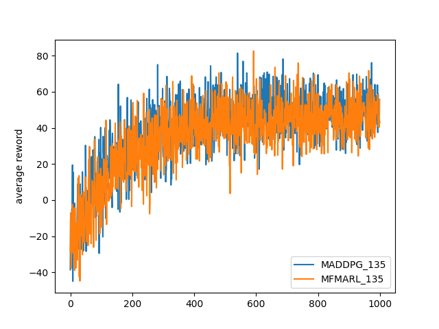
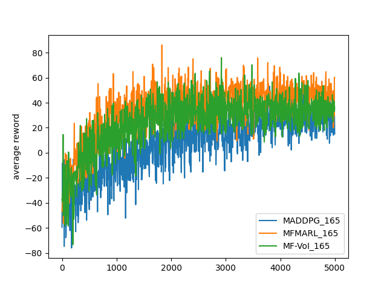

### Date: 2023/12/26

------------------------------------------------
### 本周工作

1.本周主要工作是撰写论文，已经完成了系统模型部分，目前正在完成问题分析与Nash点存在性证明部分。

具体思路如下：

此处的博弈类型属于不完全信息博弈，因此需要证明其BNE（贝叶斯纳什均衡）的存在性 。

> 注: 贝叶斯纳什均衡是不完全信息博弈中的均衡概念，其中每个玩家对其他玩家的类型（本例中是对价值 v 的估计）有一定的信念（概率分布）。玩家根据自己的类型和对其他玩家类型的信念来选择策略。一个策略组合和一组信念构成贝叶斯纳什均衡，如果给定其他玩家的策略和信念，没有玩家可以通过改变自己的策略来提高自己的期望效用。

根据Harsanyi的纳什均衡存在定理，我们知道在策略空间是有限的且玩家的效用函数是连续的，贝叶斯纳什均衡是存在的。因此，在你的竞拍模型中，如果这些条件得到满足，我们可以有理由相信至少存在一个贝叶斯纳什均衡。

主要思路： 

1.使用Harsanyi转换（有时称为Harsanyi的纳什均衡存在定理）将具有不完全信息的博弈转换为具有不完美信息的博弈。

> Harsanyi转换（有时称为Harsanyi的纳什均衡存在定理）是一种将具有不完全信息的博弈转换为具有不完美信息的博弈的方法。这个转换由经济学家和博弈论专家John C. Harsanyi提出，他因此获得了1978年的诺贝尔经济学奖。Harsanyi转换的目的是简化不完全信息博弈的分析，使之能够使用纳什均衡的概念来解决。
>
> Harsanyi转换的步骤如下：

>> 1. **类型空间**: 为每个玩家定义一个类型空间，即他们可能具有的所有类型的集合。

>> 2. **先验概率**: 指定一个先验概率分布，描述了每个玩家的类型选择的概率。

>> 3. **策略空间的扩展**: 扩展玩家的策略空间，使其包括对每个可能类型的反应。

>> 4. **信念系统**: 构建一个信念系统，即每个玩家对其他玩家类型的条件概率分布，这些信念会根据观察到的行动进行更新。

>> 5. **贝叶斯纳什均衡**: 使用这个扩展的博弈，寻找贝叶斯纳什均衡，其中每个玩家根据自己的类型和信念来选择最优策略。

2.定义效用函数

假设我们有两个买家，$A$ 和 $B$，他们的估值 $v_A$ 和 $v_B$ 分别从连续累积分布函数 $F(v_A)$ 和 $F(v_B)$ 中独立抽取。每个买家选择一个出价 $b_i(v_i)$，这是他们估值的函数。买家 $i$ 的效用函数 $U_i(b_i, b_{-i}, v_i)$，其中 $b_{-i}$ 是对手的出价，可以写为：

$$
U_i(b_i, b_{-i}, v_i) = \begin{cases}
v_i - b_i(v_i), & \text{if } b_i(v_i) > b_{-i}(v_{-i}) \\
\frac{v_i - b_i(v_i)}{2}, & \text{if } b_i(v_i) = b_{-i}(v_{-i}) \\
0, & \text{if } b_i(v_i) < b_{-i}(v_{-i})
\end{cases}
$$

3.应用不动点定理

为了证明BNE的存在性，我们需要定义一个映射 $T$，它将每个玩家的策略映射到在给定对手策略的情况下的最优响应策略。这个映射是从策略空间到自身的，我们记为 $T : S \to S$，其中 $S$ 是所有可能的策略组合构成的空间。

对于任意的策略组合 $(b_A, b_B) \in S$，我们定义映射 $T$ 使得 $T(b_A, b_B) = (b_A^*, b_B^*)$，其中 $b_i^*$ 是玩家 $i$ 在对手策略 $b_{-i}$ 下的最优响应。这个最优响应可以通过解决以下期望效用最大化问题来得到：

$$
b_i^*(v_i) = \arg\max_{b_i} \int_{v_{-i}} U_i(b_i, b_{-i}(v_{-i}), v_i) dF(v_{-i})
$$

根据Brouwer不动点定理，如果映射 $T$ 是连续的，并且策略空间 $S$ 是有界的、闭合的和凸的，那么映射 $T$ 至少有一个不动点。

### Date: 2023/12/12

------------------------------------------------
### 本周工作

1.近期根据之前重新梳理的模型修改了仿真程序，目前算法基本可以收敛。开始撰写论文的主体，目前正在进行系统模型和问题分析章节的写作。

2.针对使用排队模型分析网络中通算资源对VoI的影响，目前正在阅读一些相关论文；

### Date: 2023/11/13

------------------------------------------------
### 本周工作

## 工作内容梳理

之前的MARL解决3C资源调度工作在重新梳理后发现与原有主旨有脱离，不宜融入信息价值相关研究体系，本周重新梳理了上述工作；在原有的基础上更改了研究的侧重点，加强了该内容与原有工作的结构关联，保持了工作的连续性。

具体如下：

1.将所研究的问题重定义为：多任务系统中信息价值的去中心化评估；

2.动机：信息价值不易直接形成 one for all 的通用指标，难以应用于据有多种任务类型的通信系统的网络资源调度中。为任务设置恰当的信息价值权重可以为统合系统中所有任务的信息价值，并保证任务之间的公平性和隐私需求。

3.挑战：

> - 基于专家知识的信息价值权重设计难免有失偏颇，以此调度资源不能令所有任务发布者信服。并且任务发布者隐私难以保证。
> - 网络中任务类型经常动态变化，每次有任务发布者加入或离开网络就需要重新调整权重，在网络决策者角度人力成本难以接受。

4.解决思路：

以经济学的角度来看，不同任务见信息价值的权重确定可视为一场任务发布者之间的博弈，如若设计合理的机制（Nash定理告诉我们，任何有限非合作博弈在混合策略意义下，一定至少存在一个纳什均衡.），其最终结果大概率能达到一个所有参与者都妥协的结果。

信息价值的分布式评估问题可以定义为一个特殊无限制轮次拍卖问题，在这个拍卖过程中，信息价值与金钱之间的权重就是拍卖所使用的货币，所拍卖的物品即为网络资源的使用权力。该拍卖不设置赢家，亦或是所有人都是赢家，可以依据出价高低获得对应的部分所拍品。最终所有买家的出价即为信息价值与金钱之间的权重。其中买家需向卖家支付基于权重的税金。

多智能体强化学习算法可以为每个任务提供者提供出价策略。选择强化学习而非传统博弈算法的原因是强化学习的策略训练过程是 model free 的，这符合任务提供者之间的隐私要求，即不希望其他任务提供者了解其具体的业务细节。

### Date: 2023/11/7

------------------------------------------------
### 本周工作

## MARL解决3C资源调度工作

本周在调试剩余仿真实验的代码，预期的仿真实验：SP（Agent）加入/离开的收敛曲线； Sp任务价值分布的帕累托参数和回报关系； zipf不同参数和 MEC 收益关系图；使用不同拍卖方式获得的收益对比；

目前进度（1/4）SP（Agent）加入/离开的收敛曲线；

[sample-image](./fig/screenshot20231107.png)

[sample-image](./fig/Figure_5.pdf)

问题：SP 新增/离开的收敛速度和从新训练差不多。

### Date: 2023/10/29

------------------------------------------------
### 本周工作

## MARL解决3C资源调度工作

1）增加SP数目体现 MFMARL、MFMARL-v 的优势与MADDPG相比

[sample-image](./fig/Figure_1.pdf)

2）设置消融实验展示 MFMARL-v 对比 MFMARL

[sample-image](./fig/Figure_4.pdf)

3）改变 MEC 数目展示 NSP 的受益曲线

[sample-image](./fig/Figure_2.pdf)

4）收敛速度对比
[sample-image](./fig/Figure_33.pdf)

### Date: 2023/10/16

------------------------------------------------
### 本周工作

## TVT论文修改

目前基本修改完成。

## MARL解决3C资源调度工作

### 1.目前进展

Nsp 1个 SP3个， MEC 5 个的仿真坏境下 reword 曲线。

 ]

Nsp 1个 SP6个， MEC 5 个的仿真坏境下 reword 曲线。

 ]

### 2.后续实验

1）增加SP数目体现 MFMARL、MFMARL-v 的优势与MADDPG相比

2）设置消融实验展示 MFMARL-v 对比 MFMARL

3）改变 MEC 数目展示 NSP 的受益曲线

4）测试不同任务分布下 SP和 NSP 收益

### Date: 2023/9/10

------------------------------------------------
### 本周工作

## MARL解决3C资源调度工作

### 1.目前进展
>  针对之前出现的两个问题，即收敛性差，和 credit assigment 问题，本周对仿真代码做出如下调整：

1. 简化了部分模型，主要集中在拍卖过程由多轮拍卖调整成单轮的第二价格拍卖（Vickrey）， task 的 VoI的分布采用服从二八定律的 Pareto 分布； 归一化 SP Agent 的 动作空间成为上一时刻出价的百分比（0.5-1.5）

2. 对于 credit assignment 问题， 目前的做法是使用优势函数对各个 SP Agent 的 reward 做归一化的处理，优势函数设置成服务累计VoI的平均值，由采样获得。

目前在设置 Nsp 1个 SP3个， MEC 5 个的仿真坏境下进行 MADDPG 、MFMARL、MFMARL-v (我们提出的) 三种算法的实验。

### Date: 2023/9/5

------------------------------------------------
### 本周工作

## MARL解决3C资源调度工作

### 1.目前进展
> 仿真程序的大体框架已经编写完成，目前正在调试MARL算法，使其收敛并取得理想的效果。

### 2.目前主要问题
> - MARL算法(MARDDPG/MFMARL)难以收敛，且性能较差(对比固定策略)；
> 
> - 不同智能体之间的reword差异比较大，即存在 credit assignment 问题；

### 3.解决思路

- 针对算法难以收敛的问题，目前的想法是首先简化之前的系统模型，包括将多轮拍卖模型简化成 Vickrey auction， 将 task 的部署模式设置成3种固定策略之间的选择； 其次，是在智能体之间共享额外信息，如资源利用率；

- 针对 credit assignment 问题， 目前的正在查阅相关文献，已查阅的文献中如下, 其中均有解决此类问题的方法；

> [1] Sunehag P, Lever G, Gruslys A, et al. Value-decomposition networks for cooperative multi-agent learning[J]. arXiv preprint arXiv:1706.05296, 2017.
> 
> [2] Foerster J, Farquhar G, Afouras T, et al. Counterfactual multi-agent policy gradients[C]//Proceedings of the AAAI conference on artificial intelligence. 2018, 32(1).
> 
> [3] Iqbal S, Sha F. Actor-attention-critic for multi-agent reinforcement learning[C]//International conference on machine learning. PMLR, 2019: 2961-2970.
> 
> [4] Long Q, Zhou Z, Gupta A, et al. Evolutionary population curriculum for scaling multi-agent reinforcement learning[J]. arXiv preprint arXiv:2003.10423, 2020.
