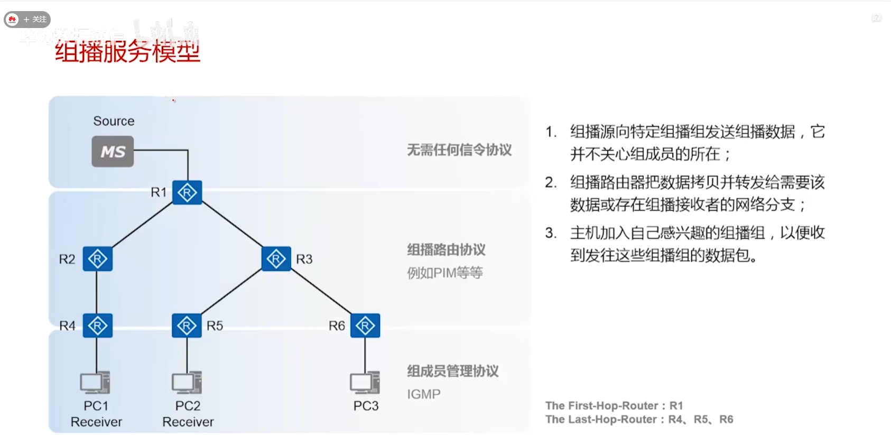
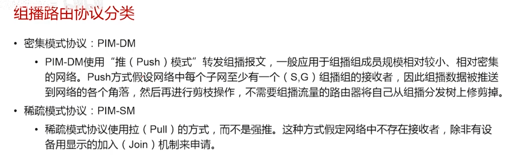
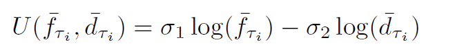
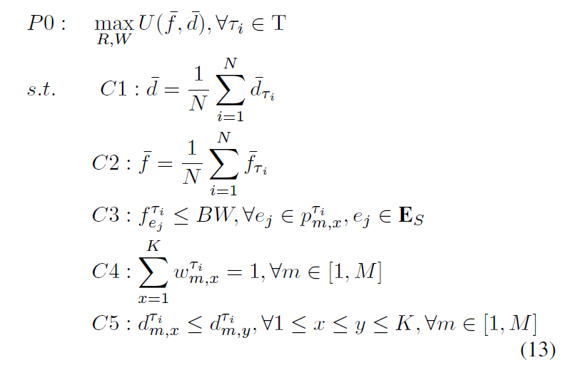
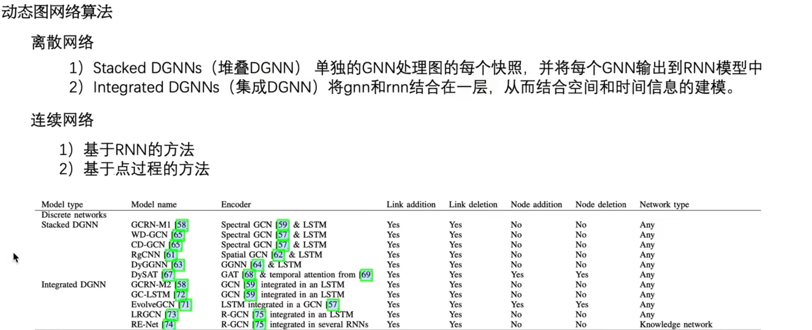

### Week 13

1. 根据上周讨论的结果，尝试了几种仿真设计和网络模型：  
（1）内置图神经网络（GAT/GCN/GEN)；   
（2）调整Actor和Critic的设计；   
（3）更改节点特征为经纬度坐标进行仿真；   

2. 阅读了文献：   
     FALCON: Towards Fast and Scalable Data Delivery for Emerging Earth Observation Constellations Mingyang（infocom 2023，Mingyang Lyu, Qian Wu, Zeqi Lai, Hewu Li, Yuanjie Li, Jun Liu）   
     Learning to schedule job-shop problems: representation and policy learning using graph neural network and reinforcement learning （International Journal of Production Research）

    

### Week 12

1. 根据周二讨论的结果，优化模型  
2. 设计初步的Caching Placement Model:  
    B5GPC预测2030年网络流量需求将在现有基础上增加5-10倍，且网络中流量有一大部分比重是asynchronously但repeatedly的。边缘缓存技术可以减轻核心网的压力，而且结合卫星网络广覆盖的特点可以进一步提高缓存效率。但是，卫星设备本身能力有限，而不同地区对内容具有不同喜好，反复的传输会导致大量的资源浪费，而卫星本身又不具备充足的存储容量。如何根据差异化的地面内容喜好，来动态调整内容缓存的placement，使得卫星网络能耗降低的同时最大化满足用户对内容的需求将是本研究需要解决的关键问题。

### Week 10

1. 调研了Multicast的基础协议  
   
  
（华为数据通信：https://www.bilibili.com/video/BV1dA411J7e4/?spm_id_from=333.880.my_history.page.click&vd_source=20e49873a42917640f16041fc568c824）  
2. 调研了移动性模型  
3. 继续进行GNN的工作  

Multicast 应用场景：  
1. 内容分发  
2. 金融服务和银行业（相比于地面网络，LEO卫星网络更安全且速度更高，而这两个因素对于金融行业至关重要！）     
3. 可能的场景：高端制造  
E2E 应用场景：  
1. 高移动性场景（高铁、广域车联网）  
2. 密集型低轨卫星星座网络  

### Week 8
1. 完成Response Lettter，并整体修改；  
2. 初步调研了GNN-based LEO satellite routing、multicast等；  

What's new:  
LEO网络特点：高动态、周期性 -> 对算法复杂度有要求，且更适用于智能算法  
GNN的优势：泛化性，且部分基于时间的GNN能抽象网络特征。  

Multicast in related work（参考自近2年二区及以上期刊）:  
| 优化目标                                                                                   | 优化变量和关注点                                       |
|----------------------------------------------------------------------------------------|------------------------------------------------|
| 控制信令开销                                                                                 | Routing（avoid link congestion）                 |
| utility                                                                                | Content caching, clustering, beamforming（分尺度）  |
| max-min fair (MMF) capacity                                                            | Subchannel, beamforming                        |
|| 特点：主要关注的网络部分为接入网络（上下行）和backhaul网络。 对于接入网络，多优化接入控制和cache placement；对于backhaul网络，多优化路由。         |                                         

**研究点：**

·	**E2E网络资源调度策略**（路由+接入控制）；  
·	**LEO网络缓存：分布式缓存策略** （GNN方面没有人做）；  
·	**CDN-LEO network**(平衡cache和transmission的关系(孙））；  
·	**更适用于GNN的场景**：大规模卫星/海量iot业务、卫星网络路由（现有研究只基于普通GNN且研究比较捞）；  
·	**关于地面网络**（同样方法可用于AI模型的按需调度场景）：一是往双碳靠拢的一个MEC场景下的VNF deployment，这里主要考虑优化虚拟功能的部署决策、虚拟功能链路由和网络节点的开关（可参考Delay-Aware Virtual Network Function Placement and Routing in Edge Clouds）；另外考虑可靠性或者隐私，这类的比较少，参考：https://ieeexplore.ieee.org/document/9435077。

### Week 7
1. 继续撰写Response Letter，完成了大部分意见的回复；  
2. 继续调试上周程序，得到了一个初步结果；  
3. 阅读文献：A GNN-enabled Multipath Routing Algorithm for Spatial-Temporal Varying LEO Satellite Networks。  
该文献主要研究了卫星网络中的多路径路由中流量分配问题，通过将问题解耦为两个问题（1）多路径路由；（2）流量工程（traffic steering)，并分别采用类似于K-means和Actor-Critic方法进行求解。GNN在其中的作用很不明确，推测作为Critic。  
  
  

### Week 6
1. 调试了gpn.py (GPN网络）中的bug；
2. 完成了train.py和环境的设置，功能的实现主要写入train.py, Step.py等文件中；  
    Step.py: Resource_Allocate, Resource_Release, step, Total_Reward  
3. 完成了南大成果认定书的一部分，并进行了整体修改；  
4. 思考并修改了部分返回的审稿意见，有几处意见需要讨论：  
 
 
· Reviewer 1: ?
· Reviewer 2: The paper's quality is good and would need minor writing improvements such as in the introduction section "Traditional, terrestrial mobile networks ..., which have enabled many a large number of applications..."  

· Reviewer 3:   
(1) However, the major drawback regards some assumptions in the System Model.  Figure 1 describe the SAGIN architecture formed by ground and aerial networks.  However, the authors dismissed the mobility of nodes, as described in the System Model section.  In such a case, quasi-stationary nodes represent a classical node routing, however with Wi-Fi links.  A question that arise is whether the proposed solution does not fit better for Wi-Fi SDN with constraints than to aerial networks.  
(2) Equation 16 consider the computational capacity of a node n Cn. In real world scenario, you can not know in advance the computational cost of a service, since it may vary due to number of request/response rate.  
(3) Similar comment to Equation 17.  

### Week 5
1. 在上周基础上学习pytorch_geometric、dgl等图神经网络需要调用的库；
2. 重新设计了GPN模块，下一步计划设置环境；  

## 调研框架及分工
现有卫星星座发展状况
目前的研究趋势  
1. 学术界（主要包含论文、白皮书）
2. 产业界（主要有NASA、3GPP两个方面） 
3. 新型概念及研究方向  

### Week 4

## 1. 阅读了两篇GNN的文献：  
[1] B. Li and Z. Zhu, “GNN-Based Hierarchical Deep Reinforcement Learning for NFV-Oriented Online Resource Orchestration in Elastic Optical DCIs,” Journal of Lightwave Technology, vol. 40, no. 4, 2022  
[2] Q. Ma, S. Ge, D. He, D. Thaker, and I. Drori, “Combinatorial Optimization by Graph Pointer Networks and Hierarchical Reinforcement Learning,” arXiv, 2019

## 2. 学习GPN-RL，目前掌握了torch的基本操作。目前读懂了train.py，正在学习GPN的构建方法  
存在问题：例程中不考虑边的features  

附GPN解决TSP问题例程：
'''
# train.py
import math
import argparse
import numpy as np
import torch
import torch.nn as nn
import torch.nn.functional as F
import torch.optim as optim
from torch.autograd import Variable
from torch.optim import lr_scheduler
import matplotlib.pyplot as plt
from tqdm import tqdm
from gpn import GPN

if __name__ == "__main__":

    # args
    parser = argparse.ArgumentParser(description="GPN with RL")
    parser.add_argument('--size', default=50, help="size of TSP")
    parser.add_argument('--epoch', default=100, help="number of epochs")
    parser.add_argument('--batch_size', default=512, help='')
    parser.add_argument('--train_size', default=2500, help='')
    parser.add_argument('--val_size', default=1000, help='')
    parser.add_argument('--lr', type=float, default=1e-3, help="learning rate")
    args = vars(parser.parse_args())

    size = int(args['size'])
    learn_rate = args['lr']    # learning rate
    B = int(args['batch_size'])    # batch_size
    B_val = int(args['val_size'])    # validation size
    steps = int(args['train_size'])    # training steps
    n_epoch = int(args['epoch'])    # epochs
    save_root ='./model/gpn_tsp'+str(size)+'.pt'
    
    print('=========================')
    print('prepare to train')
    print('=========================')
    print('Hyperparameters:')
    print('size', size)
    print('learning rate', learn_rate)
    print('batch size', B)
    print('validation size', B_val)
    print('steps', steps)
    print('epoch', n_epoch)
    print('save root:', save_root)
    print('=========================')
    
    
    model = GPN(n_feature=2, n_hidden=128).cuda()
    # load model
    # model = torch.load(save_root).cuda()
    optimizer = optim.Adam(model.parameters(), lr=learn_rate)

    lr_decay_step = 2500
    lr_decay_rate = 0.96
    opt_scheduler = lr_scheduler.MultiStepLR(optimizer, range(lr_decay_step, lr_decay_step*1000,
                                         lr_decay_step), gamma=lr_decay_rate)
    
    # validation data
    X_val = np.random.rand(B_val, size, 2)

    C = 0     # baseline
    R = 0     # reward

    # R_mean = []
    # R_std = []
    for epoch in range(n_epoch):
        for i in tqdm(range(steps)):
            optimizer.zero_grad()
        
            X = np.random.rand(B, size, 2)        
        
            X = torch.Tensor(X).cuda()
            
            mask = torch.zeros(B,size).cuda()
        
            R = 0
            logprobs = 0
            reward = 0
            
            Y = X.view(B,size,2)
            x = Y[:,0,:]
            h = None
            c = None
        
            for k in range(size):
                
                output, h, c, _ = model(x=x, X_all=X, h=h, c=c, mask=mask) 
                
                sampler = torch.distributions.Categorical(output)
                idx = sampler.sample()         # now the idx has B elements
        
                Y1 = Y[[i for i in range(B)], idx.data].clone()
                if k == 0:
                    Y_ini = Y1.clone()
                if k > 0:
                    reward = torch.norm(Y1-Y0, dim=1)
                    
                Y0 = Y1.clone()
                x = Y[[i for i in range(B)], idx.data].clone()
                
                R += reward
                    
                TINY = 1e-15
                logprobs += torch.log(output[[i for i in range(B)], idx.data]+TINY) 
                
                mask[[i for i in range(B)], idx.data] += -np.inf 

            assert i!=100 and epoch!=1

            R += torch.norm(Y1-Y_ini, dim=1)
            
            
            # self-critic base line  这是做什么的？
            mask = torch.zeros(B,size).cuda()
            
            C = 0
            baseline = 0
            
            Y = X.view(B,size,2)
            x = Y[:,0,:]
            h = None
            c = None
            
            for k in range(size):
            
                output, h, c, _ = model(x=x, X_all=X, h=h, c=c, mask=mask)
            
                # sampler = torch.distributions.Categorical(output)
                # idx = sampler.sample()         # now the idx has B elements
                idx = torch.argmax(output, dim=1)    # greedy baseline
            
                Y1 = Y[[i for i in range(B)], idx.data].clone()
                if k == 0:
                    Y_ini = Y1.clone()
                if k > 0:
                    baseline = torch.norm(Y1-Y0, dim=1)
            
                Y0 = Y1.clone()
                x = Y[[i for i in range(B)], idx.data].clone()
            
                C += baseline
                mask[[i for i in range(B)], idx.data] += -np.inf
        
            C += torch.norm(Y1-Y_ini, dim=1)
        
            gap = (R-C).mean()
            loss = ((R-C-gap)*logprobs).mean()
        
            loss.backward()
            
            max_grad_norm = 1.0
            torch.nn.utils.clip_grad_norm_(model.parameters(),
                                               max_grad_norm, norm_type=2)
            optimizer.step()
            opt_scheduler.step()

            if i % 50 == 0:
                print("epoch:{}, batch:{}/{}, reward:{}"
                    .format(epoch, i, steps, R.mean().item()))
                # R_mean.append(R.mean().item())
                # R_std.append(R.std().item())
                
                # greedy validation
                
                tour_len = 0

                X = X_val
                X = torch.Tensor(X).cuda()
                
                mask = torch.zeros(B_val,size).cuda()
                
                R = 0
                logprobs = 0
                Idx = []
                reward = 0
                
                Y = X.view(B_val, size, 2)    # to the same batch size
                x = Y[:,0,:]
                h = None
                c = None
                
                for k in range(size):
                    
                    output, h, c, hidden_u = model(x=x, X_all=X, h=h, c=c, mask=mask)
                    
                    sampler = torch.distributions.Categorical(output)
                    # idx = sampler.sample()
                    idx = torch.argmax(output, dim=1)
                    Idx.append(idx.data)
                
                    Y1 = Y[[i for i in range(B_val)], idx.data]
                    
                    if k == 0:
                        Y_ini = Y1.clone()
                    if k > 0:
                        reward = torch.norm(Y1-Y0, dim=1)
            
                    Y0 = Y1.clone()
                    x = Y[[i for i in range(B_val)], idx.data]
                    
                    R += reward
                    
                    mask[[i for i in range(B_val)], idx.data] += -np.inf
            
                R += torch.norm(Y1-Y_ini, dim=1)
                tour_len += R.mean().item()
                print('validation tour length:', tour_len)

        print('save model to: ', save_root)
        torch.save(model, save_root)
'''

'''
#gpn.py
import math
import numpy as np
import torch
import torch.nn as nn
import torch.nn.functional as F
import torch.optim as optim

class Attention(nn.Module):
    def __init__(self, n_hidden):
        super(Attention, self).__init__()
        self.size = 0
        self.batch_size = 0
        self.dim = n_hidden
        
        v  = torch.FloatTensor(n_hidden).cuda()
        self.v  = nn.Parameter(v)
        self.v.data.uniform_(-1/math.sqrt(n_hidden), 1/math.sqrt(n_hidden))
        
        # parameters for pointer attention
        self.Wref = nn.Linear(n_hidden, n_hidden)
        self.Wq = nn.Linear(n_hidden, n_hidden)
    
    
    def forward(self, q, ref):       # query and reference
        self.batch_size = q.size(0)
        self.size = int(ref.size(0) / self.batch_size)
        q = self.Wq(q)     # (B, dim)
        ref = self.Wref(ref)
        ref = ref.view(self.batch_size, self.size, self.dim)  # (B, size, dim)
        
        q_ex = q.unsqueeze(1).repeat(1, self.size, 1) # (B, size, dim)
        # v_view: (B, dim, 1)
        v_view = self.v.unsqueeze(0).expand(self.batch_size, self.dim).unsqueeze(2)
        
        # (B, size, dim) * (B, dim, 1)
        u = torch.bmm(torch.tanh(q_ex + ref), v_view).squeeze(2)
        
        return u, ref

class LSTM(nn.Module):
    def __init__(self, n_hidden):
        super(LSTM, self).__init__()
        
        # parameters for input gate
        self.Wxi = nn.Linear(n_hidden, n_hidden)    # W(xt)
        self.Whi = nn.Linear(n_hidden, n_hidden)    # W(ht)
        self.wci = nn.Linear(n_hidden, n_hidden)    # w(ct)
        
        # parameters for forget gate
        self.Wxf = nn.Linear(n_hidden, n_hidden)    # W(xt)
        self.Whf = nn.Linear(n_hidden, n_hidden)    # W(ht)
        self.wcf = nn.Linear(n_hidden, n_hidden)    # w(ct)
        
        # parameters for cell gate
        self.Wxc = nn.Linear(n_hidden, n_hidden)    # W(xt)
        self.Whc = nn.Linear(n_hidden, n_hidden)    # W(ht)
        
        # parameters for forget gate
        self.Wxo = nn.Linear(n_hidden, n_hidden)    # W(xt)
        self.Who = nn.Linear(n_hidden, n_hidden)    # W(ht)
        self.wco = nn.Linear(n_hidden, n_hidden)    # w(ct)
    
    
    def forward(self, x, h, c):       # query and reference
        
        # input gate
        i = torch.sigmoid(self.Wxi(x) + self.Whi(h) + self.wci(c))
        # forget gate
        f = torch.sigmoid(self.Wxf(x) + self.Whf(h) + self.wcf(c))
        # cell gate
        c = f * c + i * torch.tanh(self.Wxc(x) + self.Whc(h))
        # output gate
        o = torch.sigmoid(self.Wxo(x) + self.Who(h) + self.wco(c))
        
        h = o * torch.tanh(c)
        
        return h, c

class GPN(torch.nn.Module):
    
    def __init__(self, n_feature, n_hidden):
        super(GPN, self).__init__()
        self.city_size = 0
        self.batch_size = 0
        self.dim = n_hidden
        
        # lstm for first turn
        self.lstm0 = nn.LSTM(n_hidden, n_hidden)
        
        # pointer layer
        self.pointer = Attention(n_hidden)
        
        # lstm encoder
        self.encoder = LSTM(n_hidden)
        
        # trainable first hidden input
        h0 = torch.FloatTensor(n_hidden).cuda()
        c0 = torch.FloatTensor(n_hidden).cuda()
        
        # trainable latent variable coefficient
        alpha = torch.ones(1).cuda()
        
        self.h0 = nn.Parameter(h0)
        self.c0 = nn.Parameter(c0)
        
        self.alpha = nn.Parameter(alpha)
        self.h0.data.uniform_(-1/math.sqrt(n_hidden), 1/math.sqrt(n_hidden))
        self.c0.data.uniform_(-1/math.sqrt(n_hidden), 1/math.sqrt(n_hidden))
        
        r1 = torch.ones(1).cuda()
        r2 = torch.ones(1).cuda()
        r3 = torch.ones(1).cuda()
        self.r1 = nn.Parameter(r1)
        self.r2 = nn.Parameter(r2)
        self.r3 = nn.Parameter(r3)
        
        # embedding --?
        self.embedding_x = nn.Linear(n_feature, n_hidden)
        self.embedding_all = nn.Linear(n_feature, n_hidden)
        
        
        # weights for GNN
        self.W1 = nn.Linear(n_hidden, n_hidden)
        self.W2 = nn.Linear(n_hidden, n_hidden)
        self.W3 = nn.Linear(n_hidden, n_hidden)
        
        # aggregation function for GNN
        self.agg_1 = nn.Linear(n_hidden, n_hidden)
        self.agg_2 = nn.Linear(n_hidden, n_hidden)
        self.agg_3 = nn.Linear(n_hidden, n_hidden)
    
    
    def forward(self, x, X_all, mask, h=None, c=None, latent=None):
        '''
        Inputs (B: batch size, size: city size, dim: hidden dimension)
        
        x: current city coordinate (B, 2)
        X_all: all cities' cooridnates (B, size, 2)
        mask: mask visited cities
        h: hidden variable (B, dim)
        c: cell gate (B, dim)
        latent: latent pointer vector from previous layer (B, size, dim)
        
        Outputs
        
        softmax: probability distribution of next city (B, size)
        h: hidden variable (B, dim)
        c: cell gate (B, dim)
        latent_u: latent pointer vector for next layer
        '''
        
        self.batch_size = X_all.size(0)
        self.city_size = X_all.size(1)
        
        
        # =============================
        # vector context
        # =============================
        
        # x_expand = x.unsqueeze(1).repeat(1, self.city_size, 1)   # (B, size)
        # X_all = X_all - x_expand
        
        # the weights share across all the cities
        x = self.embedding_x(x)
        context = self.embedding_all(X_all)
        
        # =============================
        # process hidden variable
        # =============================
        
        first_turn = False
        if h is None or c is None:
            first_turn = True
        
        if first_turn:
            # (dim) -> (B, dim)
            
            h0 = self.h0.unsqueeze(0).expand(self.batch_size, self.dim)
            c0 = self.c0.unsqueeze(0).expand(self.batch_size, self.dim)

            h0 = h0.unsqueeze(0).contiguous()
            c0 = c0.unsqueeze(0).contiguous()
            
            input_context = context.permute(1,0,2).contiguous()
            _, (h_enc, c_enc) = self.lstm0(input_context, (h0, c0))
            
            # let h0, c0 be the hidden variable of first turn
            h = h_enc.squeeze(0)
            c = c_enc.squeeze(0)
        
        
        # =============================
        # graph neural network encoder
        # =============================
        
        # (B, size, dim)
        context = self.gnn_model(X_all, edge_index, edge_attr)
        # context = context.view(-1, self.dim)
        
        # context = self.r1 * self.W1(context)\
        #     + (1-self.r1) * F.relu(self.agg_1(context))

        # context = self.r2 * self.W2(context)\
        #     + (1-self.r2) * F.relu(self.agg_2(context))
        
        # context = self.r3 * self.W3(context)\
        #     + (1-self.r3) * F.relu(self.agg_3(context))
        context = torch.multiply(A, context)
        h_gnn, c_gnn = self.lstm_encoder(context, h_gnn, c_gnn)
        context = torch.multiply(A, h_gnn)
        h_gnn, c_gnn = self.lstm_encoder(context, h_gnn, c_gnn)
        context=h_gnn

        # LSTM encoder
        h, c = self.encoder(x, h, c)
        
        # query vector
        q = h
        
        # pointer
        u, _ = self.pointer(q, context)
        
        latent_u = u.clone()
        
        u = 10 * torch.tanh(u) + mask # 避免梯度爆炸或者梯度消失
        
        if latent is not None:
            u += self.alpha * latent
    
        return F.softmax(u, dim=1), h, c, latent_u

'''
## 3. 完成了pytorch中LEO网络拓扑数据的导入模块；

下周计划：
    掌握二维edge特征导入方法，写出初步仿真

### Week 3

## 1. 进一步修改了p会论文中的细节错误，主要范围涉及公式部分；
## 2. 将全文中不通顺的地方进行修正并进一步润色；
## 3. 学习图神经网络的基础知识：
  学习了GNN的基础知识和运行流程；
  正在学习GCN和GAN的算法和代码部分；
  浏览了GNN的一些综述。
  
### 文献目录：

[1] Y. Han, G. Huang, S. Song, L. Yang, H. Wang, and Y. Wang, “Depth-Adaptive Dynamic Neural Networks: A Survey,” IEEE Transactions on Pattern Analysis and Machine Intelligence, vol. 44, no. 11, 2022  
[2] J. Yao et al., “Edge-Cloud Polarization and Collaboration: A Comprehensive Survey for AI,” IEEE Transactions on Knowledge and Data Engineering, vol. 14, no. 8, 2022  
[3] Z. Wu, S. Pan, F. Chen, G. Long, C. Zhang, and P. S. Yu, “A Comprehensive Survey on Graph Neural Networks,” IEEE Transactions on Neural Networks and Learning Systems, vol. 32, no. 1, 2021  
[4] W. Peng, T. Varanka, A. Mostafa, H. Shi, and G. Zhao, “Hyperbolic Deep Neural Networks: A Survey,” IEEE Transactions on Pattern Analysis and Machine Intelligence, vol. 44, no. 12, 2022  
[5] X. Guo and L. Zhao, “A Systematic Survey on Deep Generative Models for Graph Generation,” IEEE Transactions on Pattern Analysis and Machine Intelligence, 2022  
[6] J. Skarding, B. Gabrys, and K. Musial, “Foundations and Modeling of Dynamic Networks Using Dynamic Graph Neural Networks: A Survey,” IEEE Access, vol. 9, 2021 

## 4. 准备组会PPT。
## 5. 思考下一步的扩展
考虑基于SP-GAT-RL的算法框架，进一步实现在动态LEO卫星网络中SFC的编排。  
目标：  
1. 算法可迁移，能够在动态卫星网络场景下，快速推理SFC的编排策略；  
2. 能够在现有算法基础上，再次提升fairness和service acceptance；  
3. 在部署SFC的同时，考虑其在网络的停留时间，利用时空图的优势，适应规律性的卫星网络轨道周期。（？）  

### Week 2

修改了上周撰写的会议论文中的abstract、introduction和system model部分。目前正在对abstract和introduction部分进行进一步改进。

### Week 1

完成了SFC在动态卫星网络中的问题建模、算法设计、仿真，并撰写会议论文一篇。目前待尹老师修正。

### Link

[西安电子科技大学泛在网络与智能计算研究组](https://unic.xidian.edu.cn/)

