### 2023.3.22
# 本周进展
## 1.窃听场景建模
在原有的OTFS调制代码基础上，增加窃听信道，窃听信道参数暂时设置和主信道参数获取方式一致，其中每个信道参数还是随机产生。
```
eve_chan_coef = sqrt(pow_prof).*(sqrt(1/2)*(randn(1,eve_taps)+1i*randn(1,eve_taps)));     %信道系数
```
窃听信道和主信道都是多径传输，因此通过for循环得到最后的接收信号。窃听信道处撰写的函数只需要返回SNR以计算保密率
```
function rge = OTFS_output_eve(N,M,eve_taps,eve_delay_taps,eve_Doppler_taps,eve_chan_coef,sigma_2,s)
L = max(eve_delay_taps);          %通过确定时延判断需要加入的循环前缀编码长度来消除ISI
s = [s(N*M-L+1:N*M);s];       %引入循环前缀编码，将发射信号的后缀复制到前面               
eve_chan = 0;          %考虑到多径传输，将有效信息初始化
for itao = 1:eve_taps
    eve_chan = eve_chan+eve_chan_coef(itao)*circshift([s.*exp(1j*2*pi/M *(-L:-L+length(s)-1)*eve_Doppler_taps(itao)/N).';zeros(eve_delay_taps(end),1)],eve_delay_taps(itao));   %多个信道有效信息之和
end
noise = sqrt(sigma_2/2)*(randn(size(eve_chan)) + 1i*randn(size(eve_chan)));
rge = (eve_chan'*eve_chan)/(noise'*noise);   %窃听信道SNR
end
```
由于窃听信道参数和主信道没有太大区别，并且信道增益都是随机生成，因此最后保密速率大于0合格的比例占50%。

接下来考虑将主信道和窃听信道都改用莱斯信道模型.莱斯信道模型参考了尹老师的论文：DT-Assisted Multi-point Symbiotic Security in Space-air-ground Integrated Networks


其中的莱斯因子定义为直达信号与散射信号功率的比值，目前的想法是能否通过差异化主信道和窃听信道的莱斯因子来凸显其信道的差异性进而用安全编码实现安全传输。
## 2.毕设文献翻译工作
翻译的文献是Interference Cancellation and Iterative Detection for Orthogonal Time Frequency Space Modulation。目前完成了该论文中综述和对OTFS调制原理解释部分的翻译。

接下来要学习该论文中接收机部分中的消息传递算法的原理，同时完成剩下部分的文献翻译工作。

# 下周安排
## 1.将信道模型改为莱斯信道模型，查阅安全编码方式
## 2.学习消息传递算法，完成毕设参考文献翻译。

### 2023.3.29
# 本周进展
## 1.对OTFS技术原理进行整理：
OTFS调制过程可以分为发射机，信道传输，接收机三大部分。

### 1）基础

首先介绍基础的框架，其将时频域的时间轴和频率轴分别以单位T和单位Δf进行采样划分为网格；将延迟多普勒域的延迟轴和多普勒域轴分别以单位 $1/(MΔf)$ 和 $1/(NT)$ 为单位进行采样划分网格：


时频域和延迟-多普勒域之间的转换通过SFFT和ISFFT来实现。SFFT和ISFFT具体在发射机和接收机中阐述。

### 2）发射机部分

发射机部分是逆辛有限傅里叶变换（ISFFT）和海森堡变换（Heisenberg transform）的组合。

-ISFFT公式：


公式中xp[k,l]中的k和l代表了时延多普勒域网格中的横纵坐标，而Xp[n,m]代表了n和m代表了时频域网格中的横纵坐标。SFFT完成了从延迟多普勒域到时频域的转换。

-Heisenberg transform：


海森堡变换将时频域上的二维信号映射到传输波形s(t)。

### 3）信道部分
信道传输部分需要了解信道系数的是如何来的。信道传输实际上也被视为一个海森堡变换：

-信道系数：


信道系数实际上也是有时频域和延迟多普勒域两种表示。在延迟多普勒域中可以理解为，复基带多普勒变化脉冲响应ℎ𝑐 (𝜏,𝑣)代表具有延迟𝜏和多普勒频移v的信道对脉冲的响应。
这个地方也体现了时频域和延迟多普勒域的相互转换。

-信道传输：


这个地方信道传输公式也是海森堡变换，因此此处和发射机的海森堡变换级联可以使用海森堡变换的扭曲卷积性质。

### 4）接收机部分
接收机部分是魏格纳变换（Wigner transform）和辛有限傅里叶变换（SFFT）的组合。

-Wigner transform


魏格纳变换将接收信号r(t)映射回调制符号Y[n,m]

-SFFT transform

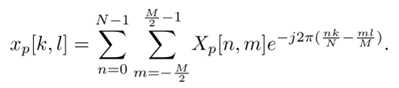

SFFT将时频域的调制符号Xp[n,m]转换至延迟多普勒域中的xp[k,l],完成了时频域到延迟多普勒域的转换。

## 2.完成了毕设外文参考文献的翻译，根据本校老师的意见对开题报告进行了修改。

## 3.6G容量与覆盖双提升需求下的6G网络能效提升思路——许晓东（会议纪要）
许晓东教授从三个方面展开了容量与覆盖双提升需求下的6G网络能效提升思路
1. 6G场景和指标体系

   许晓东教授在这部分分享了6G场景和指标体系后主要提出了3个问题：
   
   1）为什么通信系统有容量限制，但是每代网络都还要提高十倍容量？
   
   2）终端和网络的关系？
   
   3）如何落实蜂窝这种形式？
   
2. 覆盖，容量，能量的关系

   许晓东教授简要讲述了三者之间的关系，相互限制。分享了6G覆盖常见的场景，6G速率的要求，覆盖存在的问题。
   
3. 如何在覆盖和容量限制下提高能效

   1）通信+计算的问题。如何将算力真正运用到实际中以降低网络能效。
   
   2）地面+卫星做全域覆盖。卫星空口受限制，考虑如何尽可能覆盖并降低由于加入卫星通信网络所带来的能量消耗。
   
   3）高铁+RIS。用RIS提高高铁的覆盖性能，提升其网络性能。
   
   4）网络如何支撑无蜂窝，支持更灵活的网络部署？考虑改变RAN侧的架构，以更灵活地去部署。重新设计网络结构，将算力融入进来，无线接入处设计更加灵活。

# 下周安排
## 1.学习MP算法
## 2.撰写阶段性报告
## 3.将OTFS技术PPT制作完成

### 2023.4.5
# 本周进展
## 理想波形下的OTFS

时频域分析完成了学习，根据论文基本推导出了此部分有关于多普勒间干扰的重点部分。

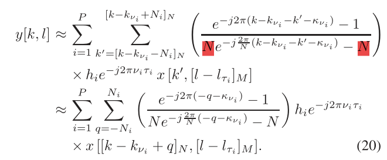

从推导结果知晓了OTFS调制过程中的多普勒间干扰产生的原因。

## 矩形波形下的OTFS

时频域分析基础部分已经看懂，但ICI和ISI分析部分推导还有挺大的问题，需要继续学习。

下周在本周基础上尽快开始MP算法的推导。

### 2023.4.12
# 本周进展
## 1. 学习了MP算法，完成了论文所给出的MP算法迭代过程的推导

其迭代过程可以大致概括如下：

1）输入接收信号y和信道矩阵H，初始化其pmf，pcd(0)=1/Q;

接收符号和输入符号的关系可以表示如下：

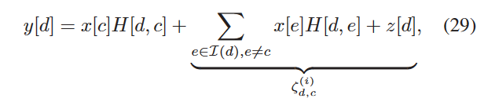

其中y称为观测节点，x称为变量节点。干扰项其实是将除了真正的输入符号x[c]，其他的x[e]和噪声的组合。

2) 利用接收信号y和信道矩阵H去计算干扰项的均值和方差

干扰项的均值和方差可以通过以下公式得到：

均值：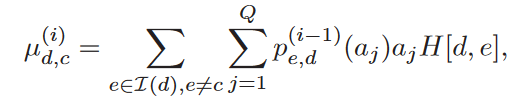

方差：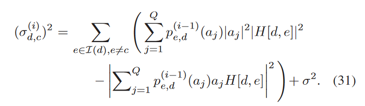

3）利用干扰项的均值和方差可以更新pcd(i)；

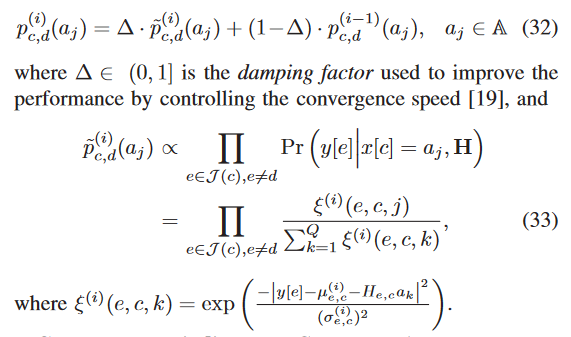

4）此处更新的pcd要先用于收敛指标去判决此次迭代是否得到了更好的结果，通俗点理解就是有更多的x[c]使得pcd接近1

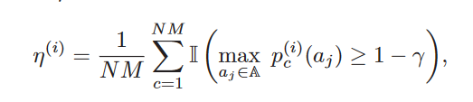

而最后是否退出迭代也由这个收敛指标决定

-η=1，所有符号都能准确地对上，完全收敛；

-η<η*-e, 继续迭代反而使得收敛情况降低，停止迭代；

-设定的迭代次数完成，停止迭代。

## 2. MP算法程序已经看懂，存在少部分代码要再详细对照理解

## 3. 检测方法部分的调研

由于MP算法最后检测出来的误码率性能不是特别好，所以找了一些比较相关的论文，后续安全部分内容完成后可以参考。

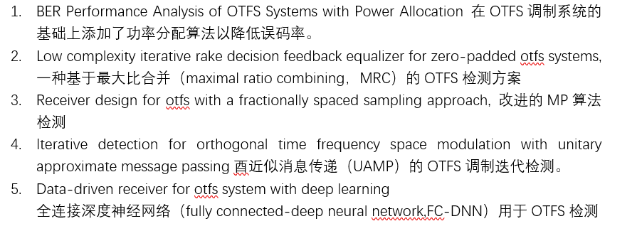

# 下周安排
## 调研OTFS系统中的安全编码方法

### 2023.4.5
# 本周进展
## 调研NASA，3GPP和SpaceX与空天地网络相关的研究
## 1.	NASA部分
   NASA近五年比较看重近地轨道的商业性开发。美国提出了商业低地球轨道目的地项目，其目的是确保人类在低地球轨道上的持续存在。目的地的概念包括：1）将废弃的上层转化为可居住的空间；2）充气模块；3）传统建造但是现代化的新模块；4） 重新使用国际空间站组件；5） 使用网关计划的copi。其实质是想建立强大的商业载人航天经济，开发新市场。目的地项目被期待从以下几个途径开发新市场：
  
  1）	住宿，游客或外国/美国政府的睡眠站、厕所、厨房等；
  
  2）	研发，为客户设备提供设施，空间或电力/公用设施，以及可能的商业机组人员进行实验的时间；

  3）	在太空制造的独特材料或者产品，如在太空制造光纤到地面售卖、在太空制造的在轨使用物品；

  4）	纪录片、电影、体育赛事等娱乐活动；

  5）	赞助和广告；
  
  6）	往返近地轨道的人员和货物运输；
  
  7）	大型结构和卫星组件。
  
  商业低地球轨道也能显著降低在低地球轨道的研究和技术开发成本。目前美国正以两种方式支持商业LEO目的地的开发：使用国际空间站和直接前往商业LEO目的地。NASA开放了许多资源给私营部门以进行研发，并且和私营企业一起投资开发商业目的地。NASA希望通过这种方式将工业界从需要依赖NASA进入太空转变为在国际空间站使用寿命结束后有能力向NASA提供近地轨道执行任务所需的途径。
  
  在2020-2023年NASA技术报告中，文章[1]和LEO卫星较相关。文章介绍了用于支持5个6U立方体卫星组成的任务集的网络架构，通过全面的S波段和通信链路分析，讨论了SDR的性能测试。S波段为2-4GHz频段。主要用于气象雷达、船用雷达以及卫星通信。NASA将S频段用于航天飞机和国际太空站与地面的卫星中继服务。S频段可用带宽较窄，地面终端天线的指向性较差，因此S频段卫星通信的轨位和带宽资源有限，根据ITU先占先用的协调惯例，新入行者几乎无可用相关频率资源。其中多立方体卫星（Cubesat）指的是微小卫星，其体积用单位U衡量，1U代表10cm×10cm×10cm。但是在这个文章中的5个卫星的功能基本上是用于测量一些物理量用于研究。
  
  从调研中发现，在2020-2023年的技术报告中NASA对于低地球轨道偏向商业化和测试任务的研究。
  
  [1] E. Abele et al., "S-band Network Analysis and Strategies for LEO Multi-CubeSat Science Missions," 2022 IEEE Aerospace Conference (AERO), Big Sky, MT, USA, 2022, pp. 1-10, doi: 10.1109/AERO53065.2022.9843539.
  
## 2.	3GPP部分
### 2.1	R18中卫星和5G网络的结合
#### 2.1.1 卫星和5G融合的网管要求
SA5在进行融合网络架构下网管方面的研究中提出如下2种网管架构

卫星作为3GPP RAN的网管架构：
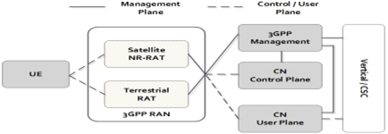

卫星作为Non-3GPP RAN的网管架构：
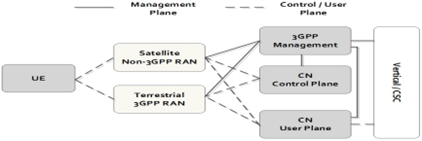

在融合架构下，SA5还提出了三种场景：1. 融合架构下的切片管理；2. 融合架构下的卫星管理；3. 融合架构下网络指标监测

#### 2.1.2	5G架构与卫星组件的集成
5G架构和卫星组件集成存在以下两个问题：

1）	非连续卫星覆盖的移动性管理增强（最小化无覆盖时间，最小化功耗）

2）	非连续覆盖的UE的节能增强（根据UE覆盖信息决策以加强省电机制）

关键技术：

1）	非移动覆盖下的移动性管理及节能，

从网络为中心：网络获取UE无法连接时间段；以终端为中心：UE获取卫星覆盖数据以确定UE无法连接时间段，向卫星发送UE无法连接时间段。两种方式最后都根据UE无法连接时间段设置NAS&节能参数。

2）	对目标RAT/PLMN过载影响

### 2.2	R19对卫星网络的新规划 
#### 2.2.1	R19中对卫星新能力的探索重点
1）	支持对时延不敏感业务的间歇/临时卫星连接

卫星覆盖范围内直接为UE提供通信服务，无需同时连接到地面网络。

2）	GNSS 独立操作

无GNSS接收器或或无法访问GNSS服务时向 UE 提供卫星访问。

3）	同一卫星覆盖下的 UE 之间的通信

分析潜在的网络功能要求，例如关于时延的需求，可以考虑UPF等核心网上星的部署方案和场景。

#### 2.2.2	R19卫星网络新场景
1）	5G-A星上计算场景

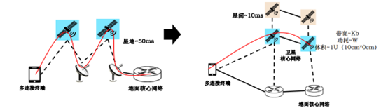

核心网上星能减少星地传输时延，实现天基网络自运营，满足全球覆盖业务的连续性。

2）	卫星为UE提供多样化服务

卫星通信如何支持不同垂直行业使用的不同种类终端，以及不同类型服务

3）	基于卫星临时本地网络组网

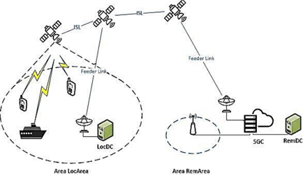

基于卫星接入的5G网络需要支持快速高效的通信路径规划以及资源利用，以减少卫星接入带来的通信时延，临时本地组网能够保障数据传输可靠性。

## 3.	SpaceX部分
目前星间通信方式：许多在轨的卫星主要通过射频电磁波进行通信，并且大多数卫星之间不直接通信，需要通过地面站将数据中继到另一颗卫星。但许多公司正在寻求光通信来传输数据。光通信有许多优势，其能提供更高的数据吞吐率，它的另一个优势是光束较窄，拦截会更复杂，有利于信息安全。最后，信号源的不连贯性可以防止同一区域中的各种通信系统互相干扰，这对于巨型星座非常重要。在2022年5月19日，两颗卫星使用太空激光通信在大约60英里（100公里）的距离内交换了超过200GB数据。

星地通信方式主要为射频通信。光学地面站也同样在研究中，但是卫星到地面站的过程中，光信号会受到很多因素的影响。例如云和雾会阻挡光信号，大气层会扭曲光波，导致其强度波动。

文章[1]提供了四个最大的LEO巨型星座的最新比较，即Telesat、OneWeb、SpaceX和Amazon的吞吐量估计。

文章[2]从系统设计的角度研究了面向6G的卫星地面综合网络。关于如何将卫星网络与地面网络集成的问题，文章从服务级别、网络协议级别和空中接口级别三个不同的层面讨论了未来集成卫星地面网络的潜在集成架构。

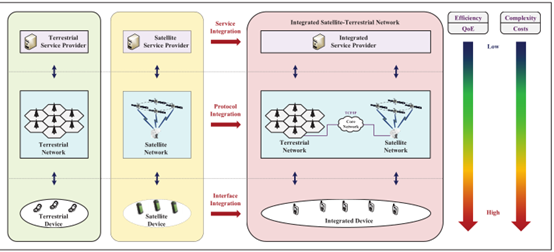

服务级别上集成卫星网络和地面网络。第二个层次是网络协议集成。通过采用统一的TCP/IP协议或其他协议，地面网络和卫星网络可以在网络协议层面进行集成。基于统一的网络协议，两个网络可以在地面连接并共享一个核心网络基础设施。最深层次是空中接口的集成。文章提出地面网络和卫星网络可以通过采用统一的空中接口在空中接口级别进行集成。然后，统一的终端设备可以使用相同的物理层协议无缝接入卫星网络或陆地蜂窝网络。

[1] N. Pachler, I. del Portillo, E. F. Crawley and B. G. Cameron, "An Updated Comparison of Four Low Earth Orbit Satellite Constellation Systems to Provide Global Broadband," 2021 IEEE International Conference on Communications Workshops (ICC Workshops), Montreal, QC, Canada, 2021, pp. 1-7, doi: 10.1109/ICCWorkshops50388.2021.9473799.

[2] X. Zhu and C. Jiang, "Creating Efficient Integrated Satellite-Terrestrial Networks in the 6G Era," in IEEE Wireless Communications, vol. 29, no. 4, pp. 154-160, August 2022, doi: 10.1109/MWC.011.2100643.

### 2023.4.26
# 本周进展
## 1.毕设加密部分完成

主要参考了论文：

J. Chen, X. Lu, W. Li, Y. Huang, Y. Tang and Y. Ma, "A Physical Encryption Scheme for OTFS System," 2022 IEEE 22nd International Conference on Communication Technology (ICCT), Nanjing, China, 2022, pp. 921-926, doi: 10.1109/ICCT56141.2022.10073312.

这篇论文提取了信道响应强度作为密钥来源。将信道响应强度作为混沌发生器的初始值生成密钥从而使星座旋转，达到加密的目的。

在毕设中参考其思路，提取当前时频域中的信道响应强度，将其转换为延迟-多普勒域中，然后将所提取到的信道响应强度的值作为密钥直接去加密生成延迟-多普勒域中的发送信息这一步骤。

在代码中用qammod函数生成了延迟-多普勒域中发射符号。在qammod函数前，将信道响应强度作为密钥相乘，可以起到改变相位的作用。

如果考虑密钥统一的问题，还是会存在泄露的问题。


## 2.阅读论文

P. Zhang, N. Chen, S. Shen, S. Yu, N. Kumar and C. -H. Hsu, "AI-Enabled Space-Air-Ground Integrated Networks: Management and Optimization," in IEEE Network, doi: 10.1109/MNET.131.2200477.

# 下周安排
## 看网课；根据联邦学习实战的书籍学习联邦学习


