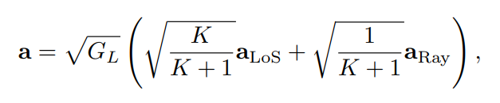
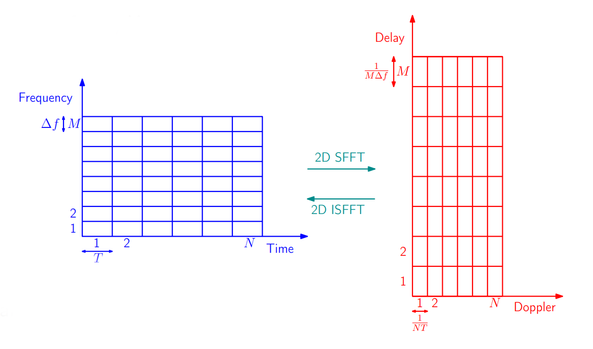
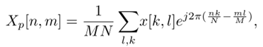
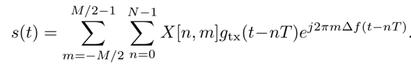
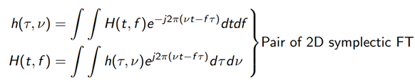
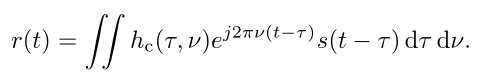
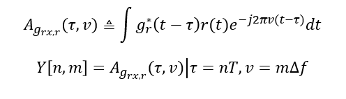

### 2023.3.22
# 本周进展
## 1.窃听场景建模
在原有的OTFS调制代码基础上，增加窃听信道，窃听信道参数暂时设置和主信道参数获取方式一致，其中每个信道参数还是随机产生。
```
eve_chan_coef = sqrt(pow_prof).*(sqrt(1/2)*(randn(1,eve_taps)+1i*randn(1,eve_taps)));     %信道系数
```
窃听信道和主信道都是多径传输，因此通过for循环得到最后的接收信号。窃听信道处撰写的函数只需要返回SNR以计算保密率
```
function rge = OTFS_output_eve(N,M,eve_taps,eve_delay_taps,eve_Doppler_taps,eve_chan_coef,sigma_2,s)
L = max(eve_delay_taps);          %通过确定时延判断需要加入的循环前缀编码长度来消除ISI
s = [s(N*M-L+1:N*M);s];       %引入循环前缀编码，将发射信号的后缀复制到前面               
eve_chan = 0;          %考虑到多径传输，将有效信息初始化
for itao = 1:eve_taps
    eve_chan = eve_chan+eve_chan_coef(itao)*circshift([s.*exp(1j*2*pi/M *(-L:-L+length(s)-1)*eve_Doppler_taps(itao)/N).';zeros(eve_delay_taps(end),1)],eve_delay_taps(itao));   %多个信道有效信息之和
end
noise = sqrt(sigma_2/2)*(randn(size(eve_chan)) + 1i*randn(size(eve_chan)));
rge = (eve_chan'*eve_chan)/(noise'*noise);   %窃听信道SNR
end
```
由于窃听信道参数和主信道没有太大区别，并且信道增益都是随机生成，因此最后保密速率大于0合格的比例占50%。

接下来考虑将主信道和窃听信道都改用莱斯信道模型.莱斯信道模型参考了尹老师的论文：DT-Assisted Multi-point Symbiotic Security in Space-air-ground Integrated Networks



其中的莱斯因子定义为直达信号与散射信号功率的比值，目前的想法是能否通过差异化主信道和窃听信道的莱斯因子来凸显其信道的差异性进而用安全编码实现安全传输。
## 2.毕设文献翻译工作
翻译的文献是Interference Cancellation and Iterative Detection for Orthogonal Time Frequency Space Modulation。目前完成了该论文中综述和对OTFS调制原理解释部分的翻译。

接下来要学习该论文中接收机部分中的消息传递算法的原理，同时完成剩下部分的文献翻译工作。

# 下周安排
## 1.将信道模型改为莱斯信道模型，查阅安全编码方式
## 2.学习消息传递算法，完成毕设参考文献翻译。

### 2023.3.29
# 本周进展
## 1.对OTFS技术原理进行整理：
OTFS调制过程可以分为发射机，信道传输，接收机三大部分。

### 1）基础

首先介绍基础的框架，其将时频域的时间轴和频率轴分别以单位T和单位Δf进行采样划分为网格；将延迟多普勒域的延迟轴和多普勒域轴分别以单位 $1/(MΔf)$ 和 $1/(NT)$ 为单位进行采样划分网格：



时频域和延迟-多普勒域之间的转换通过SFFT和ISFFT来实现。SFFT和ISFFT具体在发射机和接收机中阐述。

### 2）发射机部分

发射机部分是逆辛有限傅里叶变换（ISFFT）和海森堡变换（Heisenberg transform）的组合。

-ISFFT公式：



公式中xp[k,l]中的k和l代表了时延多普勒域网格中的横纵坐标，而Xp[n,m]代表了n和m代表了时频域网格中的横纵坐标。SFFT完成了从延迟多普勒域到时频域的转换。

-Heisenberg transform：



海森堡变换将时频域上的二维信号映射到传输波形s(t)。

### 3）信道部分
信道传输部分需要了解信道系数的是如何来的。信道传输实际上也被视为一个海森堡变换：

-信道系数：



信道系数实际上也是有时频域和延迟多普勒域两种表示。在延迟多普勒域中可以理解为，复基带多普勒变化脉冲响应ℎ𝑐 (𝜏,𝑣)代表具有延迟𝜏和多普勒频移v的信道对脉冲的响应。
这个地方也体现了时频域和延迟多普勒域的相互转换。

-信道传输：



这个地方信道传输公式也是海森堡变换，因此此处和发射机的海森堡变换级联可以使用海森堡变换的扭曲卷积性质。

### 4）接收机部分
接收机部分是魏格纳变换（Wigner transform）和辛有限傅里叶变换（SFFT）的组合。

-Wigner transform



魏格纳变换将接收信号r(t)映射回调制符号Y[n,m]

-SFFT transform


SFFT将时频域的调制符号Xp[n,m]转换至延迟多普勒域中的xp[k,l],完成了时频域到延迟多普勒域的转换。

## 2.完成了毕设外文参考文献的翻译，根据本校老师的意见对开题报告进行了修改。

# 下周安排
## 1.学习MP算法
## 2.撰写阶段性报告
## 3.将OTFS技术PPT制作完成
