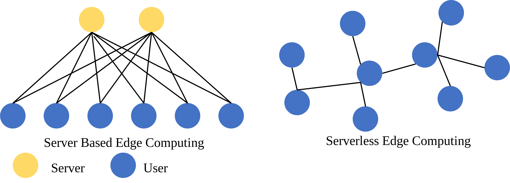

# Week 1

## 修改pimrc论文

# Week 2

## Server-Free Edge Computing 
### 1.0——全局时延最优

传统的Edge Computing (EC)多为server-user架构，user处有一个或多个task要处理，server提供算力为多个用户提供服务。

本文拟研究ServerLess EC (SLEC)问题，即总共有N个用户，每个用户 $i$ 都有一定的算力 $f_i$，并有一个大小为 $d_i$ 的任务需要处理。这样假设邻居用户算力十分充沛。一个节点可以将其任务全部传递给该邻居用户处理，并利用自己空闲的算力处理他自己的其他邻居节点的任务，从而实现全局任务的快速处理。

1. 由于通信距离的限制，每个用户都只能和其距离小于 $r$ 的用户直接通信。
2. 用户间信息传输速率与用户间的距离 $l$ 成平方反比，通信时延为 $T_{tra}=\frac{d}{\log_2 (1+\frac{s}{l^2})}$，其中$s$为单位距离信噪比，可以认为是一个常数。
3. 每个任务的处理时延为任务大小除以计算资源大小 $T_{com}=\frac{d}{f}$。
4. 用户可以将自己的任务按任意比例分成任意多份，并传递给不同的直接相连的用户或在自己本地处理该任务。
5. 用户 $i$ 可以选择利用 $f_{i,i}$ 的计算资源，来处理 $d_{i,i}$ 比例的自身任务，并将 $1-d_{i,i}$比例的任务传递给其他用户去处理，以及拿出 $f_{i}-f_{i,i}$ 比例的计算资源来处理其他用户传递过来的任务。这样其本地计算自身没有传递出去的任务的时延为 $\frac{d_{i,i}}{f_{i,i}}$。
   
这样所有用户的计算时延为

$\min_{\mathbf{f,d}}\sum_{i=1}^{N}\sum_{j\in\mathcal{N}(i)\bigcup\{i\}}\frac{d_{i,j}}{\log_2 (1+\frac{s}{l_{i,j}^2})}+\frac{d_{i,j}}{f_{i,j}}$

$s.t. \sum_{j\in\mathcal{N}(i)\bigcup\{i\}}d_{i,j}=d_{i}\qquad \forall i \in\{1,\cdots N\}$

$\sum_{j\in\mathcal{N}(i)\bigcup\{i\}}f_{i,j}\leq f_{i}\qquad \forall i \in\{1,\cdots N\}$

$d_{i,j}\geq 0$

$f_{i,j}\geq 0$

其中 $l_{i,j}$ 为节点 $i$ 与节点 $j$ 之间的距离，我们定义 $\frac{d_{i,i}}{\log_2 (1+\frac{s}{l_{i,i}^2})}$ 为 0。

### 2.0——全局花销最优

1. 由于通信距离的限制，每个用户都只能和其距离小于 $r$ 的用户直接通信。
2. 用户间信息传输速率与用户间的距离 $l$ 成平方反比，通信时延为 $T_{tra}=\frac{d}{\log_2 (1+\frac{s}{l^2})}$，其中$s$为单位距离信噪比，可以认为是一个常数。
3. 每个任务的处理时延为任务大小除以计算资源大小 $T_{com}=\frac{d}{f}$。
4. 用户可以将自己的任务按任意比例分成任意多份，并传递给不同的直接相连的用户或在自己本地处理该任务。
5. 由于不同用户的计算资源大小$f_i$不一样，因此不同用户的单位计算成本 $c_i$ 也不一样。
6. 用户 $i$ 可以选择利用 $x_{f,i}^{i}$ 比例的计算资源，来处理 $x_{d,i}^{i}$ 比例的自身任务，并将 $1-x_{d,i}^{i}$ 比例的任务传递给其他用户去处理，以及拿出 $1-x_{f,i}^{i}$ 比例的计算资源来处理其他用户传递过来的任务。这样其本地计算自身没有传递出去的任务的时延为 $\frac{d_ix_{d,i}^{i}}{x_{f,i}^{i}f_i}$。
7. 如果用户把自身任务传递给其他用户去处理，其需要支付一定价格去购买
8. 用户自己执行自己任务的所付出的代价为 $c_i\frac{d_ix_{d,i}^{i}}{x_{f,i}^{i}f_i}$ 。
9. 我们定义用户 $i$ 将自身任务传递给用户 $j$ 的传输时延成本为 $c^{t}\frac{d_ix_{d,j}^{i}}{\log_2\left(1+\frac{s}{l_{i,j}^2}\right)}$ ，其中 $x_{d,j}^{i}$ 为将任务 $i$ 传递给用户$j$的比例，$l_{i,j}$为用户$i$ 与用户$j$之间的距离。
10. 对于用户 $i$ ，如果其将 $f_i(1-x_{f,i}^{i})$ 的计算资源拿去给其邻居节点接外包赚差价。如果其所有邻居购买的计算资源之和不大于$ f_i(1-x_{f,i}^{i})$ ，那么按其所出价格分配计算资源。如果所有邻居购买的计算资源大于 $f_i(1-x_{f,i}^{i})$ ，那么依据其所出价格，按比例分配计算资源。例如共有 $N$ 个用户购买其资源，如果购买总量不大于 $c_if_i(1-x_{f,i}^{i})$ ，则用户$k$购得的来自用户 $i$ 的计算资源为 $\frac{p_k}{c_i}$ 。那么用户$k$总计付出的成本为$p_k \frac{p_k}{c_i}\frac{d_kx_{d,i}^{k}}{x_{f,i}^{k}f_i}$，其中 $p_{k,i}$ 为用户 $k$ 为购买用户 $i$ 的单位计算资源付出钱。
11. 如果出资总价高于 $c_if_i(1-x_{f,i}^{i})$ ，那么每个用户 $k$ 得到的资源为 $\frac{p_{k,i}}{\sum_{o=1}^{N}p_{o,i}}f_i(1-x_{f,i}^{i})$ 。

## VoI

对于hole不发生变化的训练，sender和controller的state都只有当前人物的位置，区别在于sender的action是传与不传，controller的action是控制运动方向。两个agent的reward都是一样的，即距离+不掉进去。

### 1.0 版本
1. sender如果在初始时刻需要将state传送给controller，以开始游戏
2. 如果sender传输当前的state，那么sender要至少间隔N个step才能再次传输
3. controller获知sender传输的state也有N个step的时延，controller在接受到sender发送的state后，可以调整运动方向，也可以不调整。无论运动方向是否调整，直到下一次controller决策前，人物向都沿着controller决策后的方向一直运动。
4. controller预先训练好，sender基于训练好的controller决定传与不传。
   

### 1.2 版本
1. sender与controller同时初始化，sender基于controller会怎么传决定怎么控制，controller根据sender会怎么控制来决定传不传。（我估计得类似交替迭代更新的方式，比如先更新sender一段时间，再更新controller一段时间。或者参考GAN是怎么联合train出来的）

### 2.0 完整版
1. controller需要去应对多种冰窟窿的分布，因此对于sender而言state应该是包括了当前人物位置与其观测到的冰窟窿的位置。
2. 这时sender应该传递一个矩阵，矩阵中置1的元素表示当前人物的位置，置2的表示冰窟窿的位置，3表示目标点，0表示普通节点，4表示unknown。
3. sender如果传全部的数据，需要等N个step后才能再传，controller也同样要等N个step后才能得知消息。但是如果sender只传人物周围半径为r的数据，那么只需要等$\alpha$N个step后就能再传，controller也同样只要等$\alpha$N个step后就能得知消息。
4. 这样sender相当于做一个pomdp

# Week 3
## 撰写DTRL Magazine
## 视频传输问题
### 问题定义
定义$x_{i}^{j}$为从节点$i$流向节点$j$的视频流速率，$\mathcal{E}$为网络中所有边的集合，$\mathcal{V}$为网络中所有节点的集合，其中$\mathcal{V}_s$和$\mathcal{V}_d$分别表示网络中视频源节点和视频目的节点的集合。规定$e_{i}^{j}$为网络节点$i,j$之间已知的最大容量，$r_j$为目的节点$j$对清晰度的要求，$hop(i,j)$为节点$i$与节点$j$之间的最小路径跳数，$h_{max}$为已知的最大跳数值。
具体优化问题如下：
$$min_{\bold{x}} \sum_{(i,j)\in\mathcal{E}}x_{i}^{j}\qquad (1)\\
s.t.\qquad \max_{i} x_{i}^{j}\geq \max_{k}x_{j}^{k}\qquad \forall j \in \mathcal{V}\wedge\forall i\in \mathcal{N}(j)\wedge\forall k\in \mathcal{N}(j)\qquad (1a)\\ 
\max_{i} x_{i}^{j} \geq r_{j},\qquad \forall j \in \mathcal{V}_{d} \qquad (1b)\\
\max_{j} x_{i}^{j}\geq \max_{j} r_{j}, \qquad i \in \mathcal{V}_{s}\qquad (1c)\\
x_{i}^{j}\leq e_{i}^{j},\qquad \forall (i,j)\in \mathcal{E}\qquad(1d)\\
hop(i,j)\leq h_{max},\qquad  \forall i \in \mathcal{V}_s\wedge\forall j \in \mathcal{V}_d\qquad (1e) 
$$

约束(1a)保证了对于任意节点$j$其流入的视频清晰度不能高于其流出的视频清晰度。
约束(1b)保证了目的节点的流入视频清晰度，需要满足其清晰度需求。
约束(1c)保证了源节点流出的最大视频清晰度，要大于所有用户中最大的清晰度需求。
约束(1d)保证了节点$i$与节点$j$之间的可传输的视频流清晰度不能大于链路的最大传输容量。
约束(1e)保证了用户节点和源节点之间的最短路径的跳数不能超过$h_{max}$，也就是所有数据必须要在$h_{max}$内传输到目的节点。

### 问题求解
已用动态规划解决
