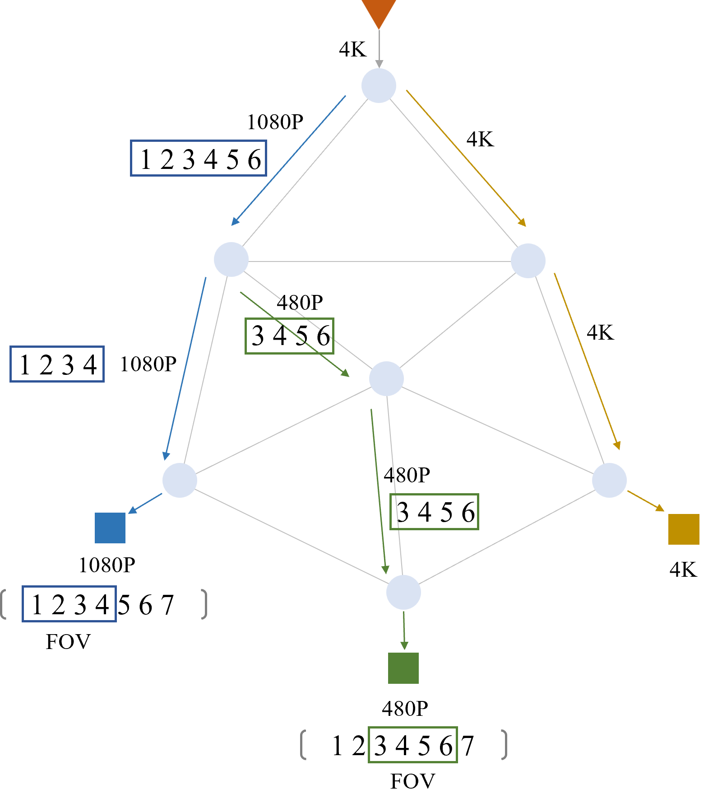

# TMC revision

修改论文，完成resposne letter

---

# TMC revision

## Propagation Flow

## Overlapping Layer

# AdvSL: Adversarial Knowledge Fusion for Split Learning with Non-IID Features

完成论文所有的实验、数据处理、绘图等工作。

---

# Response Letter

1. 撰写TMC response letter

# AdvSL: Adversarial Knowledge Fusion for Split Learning with Non-IID Features

1. 添加FedGKT [1] 作为新的对比算法
2. 添加了新的数据集：domain-net

[1]. He, C., Annavaram, M., & Avestimehr, S. (2020). Group knowledge transfer: Federated learning of large cnns at the edge. Advances in Neural Information Processing Systems, 33, 14068-14080.

---

# TMC review comments

## 隐私

>1. My main concern with RingSFL is the threat of model inversion attacks. Section 3.6.1 was a good addition to discuss the threat of gradient-based reconstruction attacks. However, if an adversary has some model access, either white-box or black-box, then there is a threat that the feature maps shared during forward propagation could be used to reconstruct the original data [1]. This would especially be a threat when a client's propagation length is 1, meaning an adversary may only need to learn a linear mapping to reconstruct the original data.  I am curious about the authors thoughts on these kinds of attacks, and would encourage them to at least add a subsection to discuss this topic. Under what conditions would RingSFL be vulnerable to such attacks? If the authors feel RingSFL can defend against such attacks under certain circumstances, then it would be nice to have a plot similar to Figure 5 or even experiments such as those shown in Figure 16 showing the success or failure of model inversion attacks.  (reviewer1-1)
>
>2. Privacy for sharing features among clients: Although RingSL has better privacy against the server by sending the blended models, it requires sharing the features to the adjacent clients, which can also cause privacy issues. The authors may need to discuss about this.  (reviewer2-5)
>
>3. Does a ring structure leads to exposure of client identities (as clients communicate with each other directly).  (reviewer3-1)

Reviewers认为Client之间的D2D通信可能会造成隐私泄露[1]，因此还需要再添加一个小节单独讨论D2D通信的隐私泄露问题。
这一小节的内容主要为：讨论在采用[1]中的攻击方法时，在哪些条件下RingSFL是不能防住的，在哪些条件下RingSFL是能防住的，并在实验小节添加补充实验。

[1] He, Zecheng, Tianwei Zhang, and Ruby B. Lee. "Model inversion attacks against collaborative inference." Proceedings of the 35th Annual Computer Security Applications Conference. 2019.

---

>4. **Could distributing training process based on available lead to privacy problems for machine configuration? (e.g., say that the client is aware of model architecture, but not parameters, could still infer the amount of resources that the remaining clients have based on the propagation length assigned to itself).**  (reviewer3-2)

Reviewer认为分配的传播长度也可能造成隐私泄露。(通过自己的传播长度可以反推出剩下其他client的计算资源总和大小)

---

>5. **The claim that the eavesdropper does not know the propagation lengths seems strong. If the eavesdropper can access gradients, would it not be able to intercept messages from the server and learn the propagation length for each client?** (reviewer1-4)
>
>6. **Could a client with significant amount of resources be able to infer propagation length of all other clients** (reviewer3-6)

在讨论RingSFL隐私性能的时候，我们假设各个client对其他client的传播长度是不知道的，而reviewers认为这个假设太强了，eavesdropper可以拦截server的消息，或通过其他一些手段来推断其他用户的传播长度。

## Overlapping Layer小节

>1. Section 3.5 is a bit confusing to read when comparing with Figure 4. The text states that an overlapping layer is defined as a layer where multiple clients contribute gradients. However, the figure shows an overlapping layer only being present at one client. Do you say a client is contributing gradients to the layer if that client is the one that calculated the loss and started backpropagation? Or am I misunderstanding?  (reviewer1-2)
>
>2. Fig. 4: Related to the comment above, if I understood the algorithm correctly the example of Fig. 4 has significant errors. In Fig. 4, although the number of (input & output & hidden layers) are 3, the number of fully connected layer is 2. Hence, the case with L_0=1 and L_1=2 doesn’t make sense because the workload should be defined as the number of fully connected layers, which determines the amount of workload. In Fig. 4, the data of client 0 skips the first fully connected layer and directly becomes the input of the second fully connected layer, which doesn’t make sense if the input layer size and the hidden layer size is different. Similarly, the data of client 1 skips the second fully connected layer. Moreover, the concept of “overlapping layer” should also be the “overlapping fully connected layer” (in case of MLP, and “overlapping convolutional layer” in case of CNNs) instead of “overlapping hidden layer”. The authors should make all these points clearer and better describe the overall algorithm with more efforts.  (reviewer2-2)

overlapping layer小节的图画的不够清晰明了。
对这一小节的图进行重画，并结合图重新解释overlapping layer的概念。

---

>3. **Overlapping layers — Is it an explicit choice that different components of the network converges differently? I understand the learning rate could be adaptive when overlapping layers occur, but is there a more balanced approach so that the model has the same performance as the non-distributed one.**  (reviewer3-5)

文章中，我们对学习率按层进行了调整，overlapping layer的学习率会大一些。reviewer想知道是否有更平衡的方法使得模型能达到与非分布式模型（集中式？）相同的性能。

## 训练过程

>1. Multiple mini-batch: In federated learning, multiple mini-batch updates are performed before sending the updated model to the server to handle the communication bottleneck. However, in this scheme, to perform another mini-batch update, the full communication round among clients are required for the forward/backward propagation process. (reviewer2-6)

文章中描述训练过程的部分可能让人参数误解，需要进行修改。

---

>2. **Finally, I am not very convinced with the ring-shaped architecture itself for handling the straggler issue. For example, when a specific client becomes outage due to the battery issue as described in the introduction, it results in significant bottleneck since every forward/backward signals cannot pass that client. In contrast, in conventional FL with a single server, it is acceptable to have some stragglers in each round because one can ignore them.** (reviewer2-7)
>
>3. **How does RingSFL handles failure of client? Does the model get distributed?** (reviewer3-4)

reviewers认为RingSFL无法应对client掉线的问题。

## Related Work

>1. The author listed a series of related works from different perspective and then say that RingSFL improves on existing techniques. Could you discuss deeper into how does the approach compare to existing techniques? I noticed that there are “Benefits and limitations” subsections, are these intended for this purpose? If they are then the authors could point out specific design decisions that corresponds to the differences.  (reviewer3-3)

需要与现有研究做更详细的比较，对参考文献部分进行修改。

## 词汇

>1. **The term split: I am also not sure if the term “split” is appropriately used in many sentences (e.g., By properly splitting the model and allocating it to heterogeneous clients), because all clients have the full model during training, not the split model; each client has different number of propagation layers, but eventually, most of the clients would update the whole model by repeating forward/backward process using data of all clients in the system.**  (reviewer2-4)

reviewer认为split这个词汇用的不好，因为系统中的模型并没有被真正的分割开。

## 格式与绘图

>1. In Equation 7, since U is a set, it would make more sense to use |U| to denote the cardinality of the set, the norm notation is a bit confusing. (reviewer1-3)
>
>2. Table 3: it would be nice for the reader if the best accuracy for each model and data distribution was in bold.  (reviewer1-5)
>
>3. Figures 7, 9, and 10: there appears to be a plotting error, some lines from the box extend out to the left.  (reviewer1-6)

进行相应修改

---

>4. Figure describing the overall algorithm: First of all, a detailed figure showing forward/backward propagation process of RingSL is necessary. Without this, a reader has to understand the detailed algorithm with only equations, which is very complicated. Authors may consider the case with 3 users and provide details on the forward/backward propagation process. This figure may also help the readers to better understand why there are overlapping updates for each layer. (reviewer2-1)
>
>5. Fig. 1: Fig. 1 is also somewhat confusing. What does the colored hidden layers mean in Fig. 1? If these represent the propagation length, it doesn’t make sense since the sum of the portion of responsible layers should become 1, which is not the case in Fig. 1.  (reviewer2-3)

对图一进行重画，需要更加明确的体现训练过程。

---

# Knowledge Fusion 代码

完成了 Attention-based Knowledge Fusion for Decentralized Federated Distillation 的验证[代码](https://gitee.com/sjinglong/dfd)，实现的 Knowledge Fusion 的方式包括：

- 只进行本地训练，不蒸馏
- 直接对Soft Label进行平均
- 根据数据集分布对Soft Label进行加权平均
- 在蒸馏的过程中，将各个邻居节点的权重作为模型参数的一部分进行训练，对Soft Label进行动态加权平均
- 采用基于attention的权重对Soft Label进行加权平均

## 部分初步结果

### 只进行本地训练

|Node0|Node1|Node2|Node3|Node4|Average|
|:---:|:---:|:---:|:---:|:---:|:---:|
|0.3795|0.3825|0.3875|0.4005|0.4055|0.3911|

### 各个节点先将Local Model利用本地数据集训练至收敛，随后进行蒸馏

#### 直接对Soft Label进行平均

|Node0|Node1|Node2|Node3|Node4|Average|
|:---:|:---:|:---:|:---:|:---:|:---:|
|0.4705|0.4435|0.4405|0.443|0.449|0.4493|

#### 根据数据集分布对Soft Label进行加权平均

|Node0|Node1|Node2|Node3|Node4|Average|
|:---:|:---:|:---:|:---:|:---:|:---:|
|0.4695|0.4245|0.4535|0.443|0.449|0.4479|

#### 将权重作为模型参数进行训练

|Node0|Node1|Node2|Node3|Node4|Average|
|:---:|:---:|:---:|:---:|:---:|:---:|
|0.468|0.4415|0.4735|0.453|0.4655|0.4603|

#### 基于attention的权重

|Node0|Node1|Node2|Node3|Node4|Average|
|:---:|:---:|:---:|:---:|:---:|:---:|
|0.407|0.3775|0.3895|0.405|0.4145|0.3987|

---

# 语义通信中用户侧定制化decoder设计

在基于深度学习的语义通信系统中，常用到基于transformer的en-decoder架构。用encoder实现源数据的语义信息提取，用decoder对语义信息进行恢复。
然而这样一套系统能够work-well，常常需要decoder具有充足的先验知识，能够对网络中传输的各种各样的数据进行理解。
但是网络中的数据复杂多样，想要设计训练一个“全知型”的decoder，必然会很困难。而即使是做出来了，也必然会有庞大的模型参数体量及推理时延，不适合部署于移动设备，也不适合像通信这类时延敏感性应用。
因此根据每一个用户的历史通信数据、(CSI)等，为每一个用户训练一个定制化的decoder是必然趋势。

考虑到训练需要用到用户的历史通信数据、(CSI)等敏感信息，因此我们采用联邦学习范式，将模型的训练任务放在用户侧。
训练时，用户将decoder根据自己最新的数据进行微调或迁移（或其他个性化的手段），而encoder始终保持不变。
local training结束后，被调度到的用户做一次aggregation。

# Attention-based Knowledge Fusion for Decentralized Federated Distillation.

在知识蒸馏中，通常认为Teacher Model比Student Model具有更多的知识。然而在去中心化的设定下，各个节点的地位相等，所训练的模型及所使用的数据集有大有小，各个节点的数据集分布也不相同。导致有时邻居节点的local model对于某一类别的知识可能不如自己的model，这时就不适合将其作为自己teacher model。

例如图中Node2、Node3的数据集比较小，对于类别2的数据含量也比较少。因此其local model对于类别2的数据的分类能力比较弱，强行进行蒸馏的话反而会误导Node1的local model。因此在进行蒸馏时，需要对多个teacher的软标签进行鉴别。

我们第一种直接的方法是对来自多个teacher的软标签进行加权平均，根据各个teacher的数据集分布确定软标签的权重。这种方法可以作为一个baseline，但是它存在两方面的问题：
1. 仅根据数据集分布可能并不能反映出teacher model的知识。因为来自邻居节点的teacher model在训练时还会从它自己的邻居那里蒸馏不属于自己的知识。
2. 这种方法无法考虑到不同节点间模型的异构问题。

因此，我们第二种方法考虑在蒸馏时对软标签的聚合加入注意力机制，将attention value作为各个软标签聚合的权重，使得模型能够在蒸馏时自己学出来各个权重值。具体来说：
1. Node1为其每个邻居节点训练软标签的V矩阵，为自己训练Q矩阵。
2. 将teacher与student输出的logits分别与各自的V、Q矩阵相乘得到v、q向量。
3. q向量与各个v向量做点积，得出attention value。
4. 以attention value为权重得出MutualSoftLabel。
5. 将自己模型输出的logits与MutualSoftLabel计算KD_loss。
6. 将自己模型输出的logits与Label计算正常的Classify_loss。
7. 将两个loss加权求和，并进行反向传播。

# Decentralized Federated Learning under Unreliable Communication Environment

# On-demand VR Video Streaming

