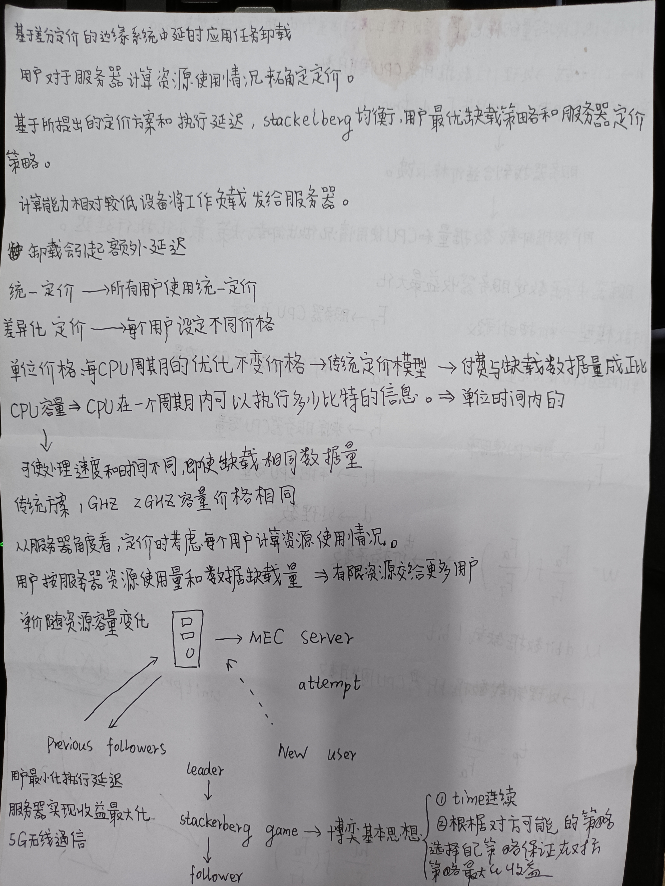

# **周报-Week06 07**
##### 时间：2023.04.19——2023.05.03

### **一、主要工作内容和进展**

##### 1、调研FL与Wi-Fi相结合   （关于Network4AI的研究）
文章来源：**"Federated learning over WiFi: Should we use TCP or UDP?"** 

目前，客户端和服务器之间的通信主要基于TCP协议，本文探讨了使用UDP协议进行客户端和服务器之间的通信。开发了基于UDP的算法，用于基于梯度聚合的联邦学习和基于模型聚合的联邦学习。提出了在UDP协议的数据包丢失的情况下构造模型更新的方法。并且在WiFi上进行了实验，并观察到基于UDP的协议可以比基于TCP的协议更快地收敛，特别是在比较差的网络中。

背景：
客户端和服务器之间的通信是通过传输控制协议（TCP）协议建立的。在大多数TCP实现中，数据包丢失后连续重传之间的时间间隔呈指数级增加。因此，如果传输的数据量很大，TCP在较差的网络条件下需要花费大量时间进行通信，开发一种基于用户数据报协议（UDP）的联邦学习通信方案。该方案是为了缓解联邦学习中的通信瓶颈问题。很多方法用于缓解分布式训练中的瓶颈问题，如梯度的量化和梯度的稀疏化，本地更新和数据压缩。本文考虑传输过程中的一种方法。

TCP和UDP的比较：

- TCP代表传输控制协议，UDP代表用户数据报协议。TCP是面向连接的协议，而UDP是面向数据报的协议。在TCP中，通信设备应在传输数据之前建立连接，并在传输数据之后关闭连接。在UDP中，没有打开连接、维护连接和终止连接的开销。然而，TCP是可靠的，因为它保证了数据传输到目的路由器，而UDP无法保证数据传输到目标路由器。TCP提供了广泛的错误检查机制、流量控制和数据确认。流控制是一种确保大量数据包不会同时发送到接收器的机制。UDP只有使用校验和的基本错误检查机制。TCP对数据进行排序，这意味着数据包按顺序到达接收器。在UDP中，不能保证这样的排序。UDP比TCP更快、更简单、更高效。

- TCP和UDP之间的主要区别之一是处理数据包丢失的方式。TCP不断地重新传输丢失的数据包，直到成功，而在UDP中，没有丢失数据包的重新传输。在数据包丢失后，TCP将等待至少200ms后再重新传输。

算法：
提出了用于基于梯度聚合的联邦学习的算法FedGradUDP和用于基于模型聚合的联邦教育的算法FedAvgUDP.

- FedGradUDP Algorithm：

- FedAvgUDP Algorithm

通过在MNIST数据集上训练深度卷积神经网络来实证评估FedGradUDP的性能，并通过在CIFAR10数据集上训练VGG16深度卷积神经网络（Krizhevsky 2012）来实证评价FedAvgUDP的性能。

FedGradUDP算法：随时间变化的性能
与使用TCP进行训练相比，FedGradUDP进行训练所花费的时间要少得多。使用UDP时性能的波动可以用训练过程中由于数据包丢失而引入的差异来解释

FedAvgUDP算法：随时间变化的性能
FedGradUDP的性能优于使用TCP的训练。使用FedAvgUDP，训练收敛并表现更好。

想法：在本篇文章的背景下，结合龙博之前的idea做FL在WiFi下的不可靠通信问题，探索具体实现过程
结合一篇文章
Ye H, Liang L, Li G Y. Decentralized federated learning with unreliable communications[J]. IEEE Journal of Selected Topics in Signal Processing, 2022, 16(3): 487-500.

##### 2、初步调研WiFi6/7
看白皮书和一些基础知识，下周做具体调研

 

---

 

# **周报-Week05**
##### 时间：2023.04.13——2023.04.18

### **一、主要工作内容和进展**

##### 1、调研FL在物理层设计中的应用

下图为基于FL的物理层设计应用，如符号检测、信道估计和波束成形，在边缘设备上计算的学习模型参数通过BS发送到PS进行模型聚合。
.jpg)
**符号检测**：
符号检测：接收信号  ------>  发射信号

通过ML的方法进行符号检测提供了一种端到端学习方案，这样在无线信道影响下接收的符号通过ANN被映射到清晰的符号。使用ML进行符号检测的主要优点是提供了一个数据驱动的映射来建模信道特征，这可能无法通过基于模型的技术精确处理。此外，端到端学习使模型能够准确地检测符号，而不需要信道估计阶段，因为它直接输入接收到的损坏符号。

基于FL的接收机(FedRec)用于下行衰落信道中的符号检测。具体来说，考虑了基于梯度的联邦体系结构，收集的梯度信息发送到PS。这种方法的主要优点是减少了通信开销。但是，该研究采用了非常浅的MLP结构，只有一个隐藏层，只有48个可学习参数，这使得学习性能强烈依赖于输入输出数据空间，为了泛化，需要更广泛和更深入的模型架构。

**信道估计**：
信道估计：导频信号  ------>  信道矩阵

第一阶段收集训练数据，获得接收到的导频信号(输入)和信道矩阵(输出)，其中使用基于模型的方法，如近似线性最小均方误差(A-LMMSE)估计来获得标签。第二阶段用户通过FL协同训练模型，计算模型参数，并与PS交换。第三阶段是预测阶段，在这个阶段，训练的模型对每个用户都是可用的,用户将接收到的导频输入它，以预测相应的下行信道。

这种方法的一个主要优点是每个用户都可以访问经过训练的模型来执行信道估计。但是，它涉及到一个训练数据生成阶段，在这个阶段中，训练数据集的标签(通道矩阵)应该通过另一种基于模型的技术来获得。

**波束成形**：
波束成形：导频/信道矩阵  ------> 波束成形权重（回归） /波束成形指数（分类）

[5G中波束赋形介绍](https://mp.weixin.qq.com/s/eOb0XqvnIdW9JsOJrGC-3g)

- 波束成形在大规模MIMO中应用

针对下行场景，提出基于FL的混合波束成形，用户计算模型参数并将梯度信息发送给基站。训练分类的CNN模型，使每个类在方位角平面上指定一个可能的用户方向，并将模拟波束形成器构造为与这些用户方向对应的转向向量。因此，CNN的输出是波束形成指数。CNN的输入可以是信道矩阵，也可以是接收到的导频信号，这些导频信号被用作信道估计的输入。这两种输入之间的主要权衡在于信道矩阵提供更多的特征，而导频信号更容易收集。

- IRS辅助大规模MIMO中的波束成形

与传统大规模MIMO相比，IRS的使用提高了远端用户接收信号的能量，扩大了信号的覆盖范围。

IRS辅助大规模MIMO涉及多条通信链路，包括BS-USER(直连)链路和BS- IRS -USER(级联)链路。IRS辅助场景包括主动(BS)和被动(IRS)波束形成，以便从BS接收到的信号可以反射给用户。

此外，波束成形器的优化是基于信道链路的，这使得IRS辅助的情况非常具有挑战性，因此提出了几种方法来克服这些困难。

论文提出用于IRS辅助场景的基于FL的波束形成器设计，其中采用FedAvg方法训练具有模型传输的回归MLP。在FedAvg中，在边缘设备上计算的模型参数对一定次数的迭代求平均。然后将它们发送到PS，在PS中进行全局聚合，从而提高了收敛速度。然而，在现实场景中，毫米波信道由于环境变化而非常动态，具有非常短的信道相干间隔。因此，训练模型的性能不能反映这种irs辅助场景下的真实传播环境。

下表总结了基于FL的技术的优点和缺点:

.jpg)

参考文献：
[1] [Elbir A M, Papazafeiropoulos A K, Chatzinotas S. Federated learning for physical layer design[J]. IEEE Communications Magazine, 2021, 59(11): 81-87.](https://ieeexplore.ieee.org/abstract/document/9665441)

[2] [Cui Y, Guo J, Li X, et al. Federated edge learning for the wireless physical layer: Opportunities and challenges[J]. China Communications, 2022, 19(8): 15-30.](https://ieeexplore.ieee.org/abstract/document/9861221)

[3] [Mashhadi M B, Shlezinger N, Eldar Y C, et al. Fedrec: Federated learning of universal receivers over fading channels[C]//2021 IEEE Statistical Signal Processing Workshop (SSP). IEEE, 2021: 576-580.](https://ieeexplore.ieee.org/abstract/document/9513736)

[4] [Elbir A M, Coleri S. Federated learning for channel estimation in conventional and RIS-assisted massive MIMO[J]. IEEE Transactions on Wireless Communications, 2021, 21(6): 4255-4268.](https://ieeexplore.ieee.org/abstract/document/9625822)

 

---

 

# **周报-Week04**
##### 时间：2023.04.06——2023.04.12

### **一、主要工作内容和进展**

##### 1、调研Stackelberg博弈在FL激励机制（INCENTIVE MECHANISM）设计中的应用
文章来源：
[Khan L U, Pandey S R, Tran N H, et al. Federated learning for edge networks: Resource optimization and incentive mechanism[J]. IEEE Communications Magazine, 2020, 58(10): 88-93.](https://ieeexplore.ieee.org/abstract/document/9247530)

[Tu X, Zhu K, Luong N C, et al. Incentive mechanisms for federated learning: From economic and game theoretic perspective[J]. IEEE Transactions on Cognitive Communications and Networking, 2022.](https://ieeexplore.ieee.org/document/9780573)

目前，通过Stackelberg博弈在全局服务器和参与联邦学习的设备之间建立基于激励的交互模型，以激励设备参与联邦学习过程，Stackelberg博弈被用于最大化模型拥有者和数据拥有者的效用函数。

如：基于Stackelberg博弈的激励机制在FL系统中，模型拥有者雇佣数据拥有者进行模型训练，模型拥有者可以先设定奖励，然后数据拥有者决定其参与程度。采用Stackelberg博弈来刺激模型拥有者和数据拥有者共同参与FL系统。

表格是stackelberg博弈在fl激励机制设计中的应用，目标主要是提高通信效率，提高leader的global model准确性，提高followers的收入

### **二、下周工作计划**

继续看论文，调研方向

 

---

 

# **周报-Week03**
##### 时间：2023.03.30——2023.04.05

### **一、主要工作内容和进展**
1、参考文章推导博弈论公式，建立模型 

学习三种动态价格方案

Baek B, Lee J, Peng Y, et al. Three dynamic pricing schemes for resource allocation of edge computing for IoT environment[J]. IEEE Internet of Things Journal, 2020, 7(5): 4292-4303.
https://ieeexplore.ieee.org/abstract/document/8959172

2、做6G ppt

3、找近三年分布式论文

### **二、下周工作计划**

继续看博弈论的内容，解优化问题

 

---

 

# **周报-Week02**
##### 时间：2023.03.23——2023.03.29

##### 1、《CoopFL: Accelerating federated learning with DNN partitioning and offloading in heterogeneous edge computing》
文章来源：
Wang Z, Xu H, Xu Y, et al. CoopFL: Accelerating federated learning with DNN partitioning and offloading in heterogeneous edge computing[J]. Computer Networks, 2023, 220: 109490.

**本文可参考的点：**

##### 2、《无线分布式学习系统的模型优化与资源管理》
文章来源：刘胜利. 无线分布式学习系统的模型优化与资源管理[D].浙江大学,2022.
这是一篇浙江大学的博士论文，比较具有参考价值。

**本文可参考的点：**
**去中心化无线分布式系统链路选择与资源优化** 

**（1）模型：( 学习模型  +  通信模型 )**

学习模型：去中心化学习模型
通信模型：D2D通信

基于以下分析，建立最小化总训练开销的数学优化问题。
- 单次训练时延分析：本地模型计算和模型传输。max（comp+comm）

- 单次能耗分析：本地模型计算和模型传输。
- 收敛速率分析：若D2D网络需要最多𝑆次训练才收敛到正确率需求𝜀，则该收敛步数的上界𝑆可以表示为：

为提高去中心化无线分布式学习系统的通信效率和能量效率，应该通过联合优化链路选择、模型汇聚权重、算力分配以及无线资源分配，最小化总训练开销。数学上可以建模为：

把上述问题分为三个子问题：
算力和无线资源分配优化、模型汇聚权重优化以及链路选择优化.

给定链路选择方案和功率分配时，分别求解本地算力和带宽分配优化，汇聚权重优化问题。

**（2）链路选择**
链路选择是为了平衡收敛速率和单次训练开销对模型训练性能的影响。当被激活的D2D链路数量增加时，系统需要更少的步数收敛到给定的正确率。相反，单次训练开销随着激活链路数量的增加而增大。
全连通网络不一定是系统最优的。也就是说，在基于D2D的去中心化无线分布式学习系统中，存在最优的链路选择，使得模型训练的开销最小。

### **二、下周工作计划**

找一下FL和MEC联合参考文献，继续讨论idea

 

---

 

# **周报-Week01**
##### 时间：2023.03.16——2023.03.22
### **一、主要工作内容和进展**

##### 1、《EFFICIENT SPLIT-MIX FEDERATED LEARNING FOR ON-DEMAND AND IN-SITU CUSTOMIZATION》论文阅读

文章来源：Hong J, Wang H, Wang Z, et al. Efficient split-mix federated learning for on-demand and in-situ customization\[J]. arXiv preprint arXiv:2203.09747, 2022.

该论文已被 **ICLR2022** 接收。

**本文可参考的点：** （也是标题中所阐述的）
**按需**：**on-mand**
**现场定制**：**in-situ customization**

本文中提出了一种新的Split-Mix FL策略，一旦训练完成，就提供了模型大小和鲁棒性的现场定制（in-situ customization）。通过学习一组不同大小和鲁棒性级别的基本子网络来实现定制，然后根据推理需求按需聚合这些子网络。这种混合策略在通信、存储和推理方面实现了高效率的定制。实验结果表明，我们的方法比现有的异构架构FL方法提供了更好的现场定制。

本文参考了第一个允许现场模型大小切换的异构宽度解决方案(HeteroFL)的工作（**发表在ICLR2021**）。然而，由于本地设备预算限制，导致大型模型训练不足，因为在这个里面训练的是大模型。

提出的Split-Mix框架提供了宽度的现场定制和对抗性鲁棒性，以解决异质性和动态问题，从而实现有效的训练和推理。如图，可以使用每层1/4通道(或宽度)的子网作为模型宽度定制的基本模型。为简单起见，我们将其表示为×0.25 net，而一个×1 net可以分为4个×0.25基本模型。

**讨论**：和龙博讨论之后感觉在这个基础上改可能比较不太好实现，后续再讨论看看有没有能创新的点。

##### 2、《无线分布式学习系统的模型优化与资源管理》

文章来源：刘胜利. 无线分布式学习系统的模型优化与资源管理[D].浙江大学,2022.
这是一篇浙江大学的博士论文，2022年12月的，比较具有参考价值。

**本文可参考的点：**
全篇介绍了近年来在单层无线分布式学习系统、多层无线分布式学习系统以及去中心化无线分布式学习系统等三个场景下的相关工作。
**（1）单层无线分布式学习系统**
分布式训练机制主要有以下方案，以及其解决的问题和举例如下：
其中包括了一个**空中计算**的一些问题。（之前龙博给过这个idea）

**（2）去中心化无线分布式系统** 
1、网络拓扑结构影响分析
2、D2D链路选择

去中心化分布式学习系统中链路选择与资源优化本章内介绍了去中心化分布式学习的系统模型，包括学习模型和通信模型，给出了单次训练时延、能耗以及收敛速率分析，并定义了总训练开销，建立了最小化训练开销的系统优化问题。在给定的链路选择方案基础上，设计了本地算力分配、无线资源分配以及汇聚权重优化算法。

### **二、下周工作计划**
继续阅读这篇博士论文，还有一些章节的idea可以参考，和师兄讨论方向。

