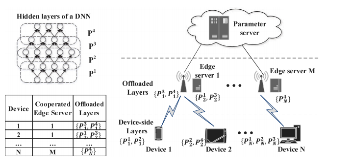
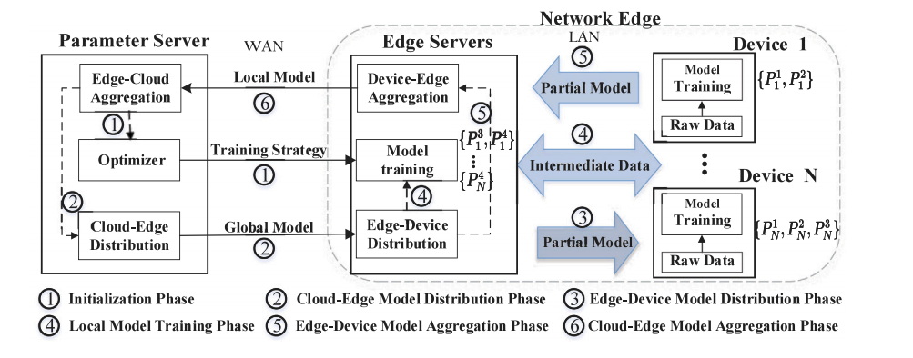
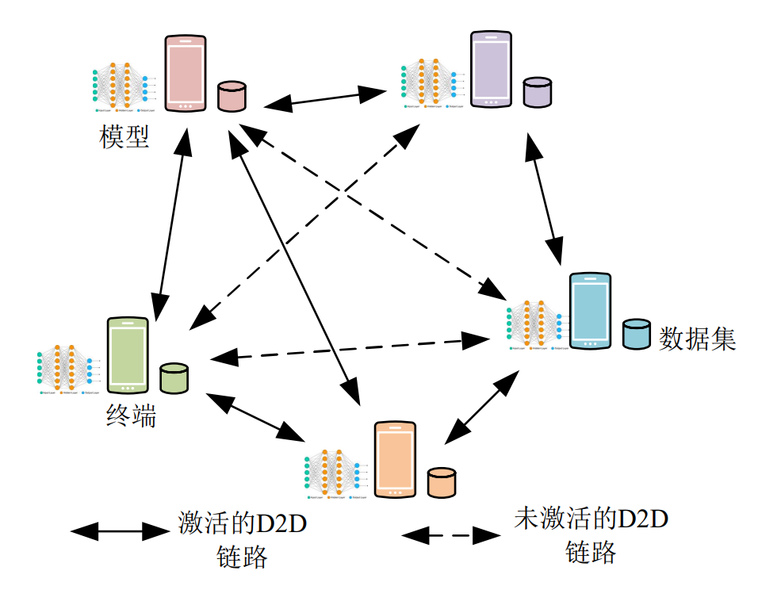
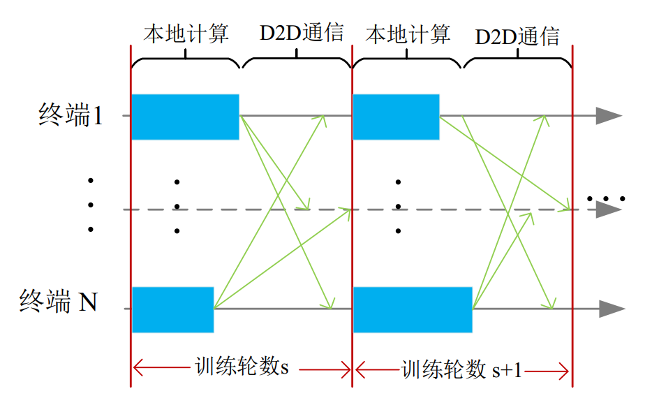
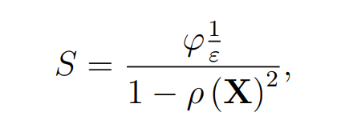
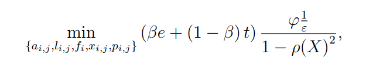

# **周报-Week02**
##### 时间：2023.03.23——2023.03.29

##### 1、《CoopFL: Accelerating federated learning with DNN partitioning and offloading in heterogeneous edge computing》
文章来源：
Wang Z, Xu H, Xu Y, et al. CoopFL: Accelerating federated learning with DNN partitioning and offloading in heterogeneous edge computing[J]. Computer Networks, 2023, 220: 109490.

**本文可参考的点：**

##### 2、《无线分布式学习系统的模型优化与资源管理》
文章来源：刘胜利. 无线分布式学习系统的模型优化与资源管理[D].浙江大学,2022.
这是一篇浙江大学的博士论文，比较具有参考价值。

**本文可参考的点：**
**去中心化无线分布式系统链路选择与资源优化** 

**（1）模型：( 学习模型  +  通信模型 )**

学习模型：去中心化学习模型
通信模型：D2D通信

基于以下分析，建立最小化总训练开销的数学优化问题。
- 单次训练时延分析：本地模型计算和模型传输。max（comp+comm）

- 单次能耗分析：本地模型计算和模型传输。
- 收敛速率分析：若D2D网络需要最多𝑆次训练才收敛到正确率需求𝜀，则该收敛步数的上界𝑆可以表示为：

为提高去中心化无线分布式学习系统的通信效率和能量效率，应该通过联合优化链路选择、模型汇聚权重、算力分配以及无线资源分配，最小化总训练开销。数学上可以建模为：

把上述问题分为三个子问题：
算力和无线资源分配优化、模型汇聚权重优化以及链路选择优化.

给定链路选择方案和功率分配时，分别求解本地算力和带宽分配优化，汇聚权重优化问题。

**（2）链路选择**
链路选择是为了平衡收敛速率和单次训练开销对模型训练性能的影响。当被激活的D2D链路数量增加时，系统需要更少的步数收敛到给定的正确率。相反，单次训练开销随着激活链路数量的增加而增大。
全连通网络不一定是系统最优的。也就是说，在基于D2D的去中心化无线分布式学习系统中，存在最优的链路选择，使得模型训练的开销最小。

### **二、下周工作计划**

找一下FL和MEC联合参考文献，继续讨论idea
