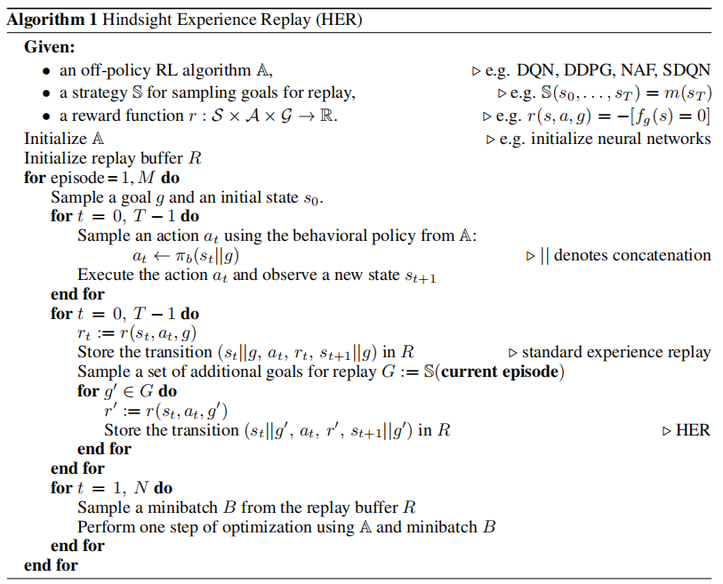
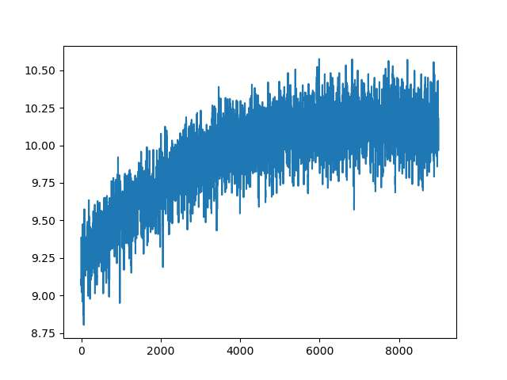
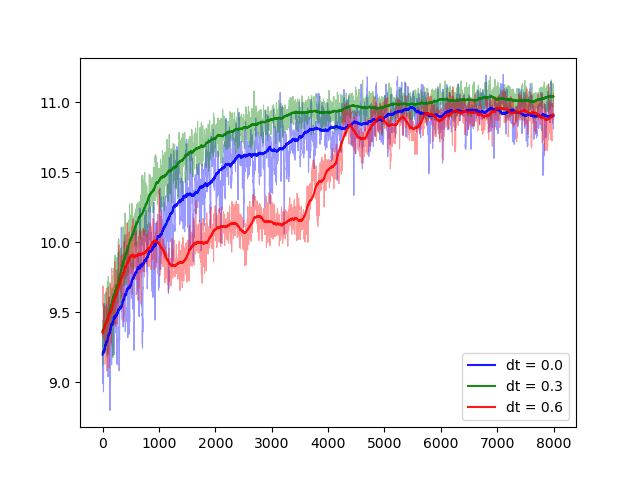
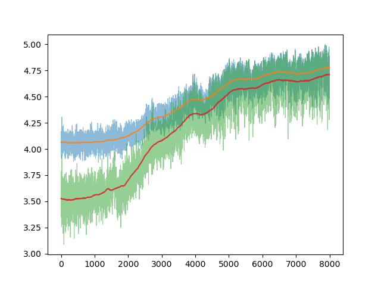
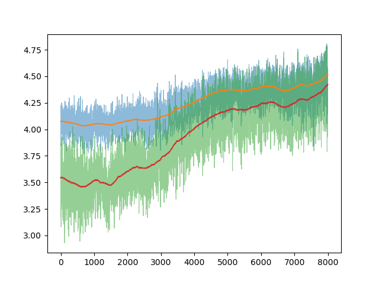
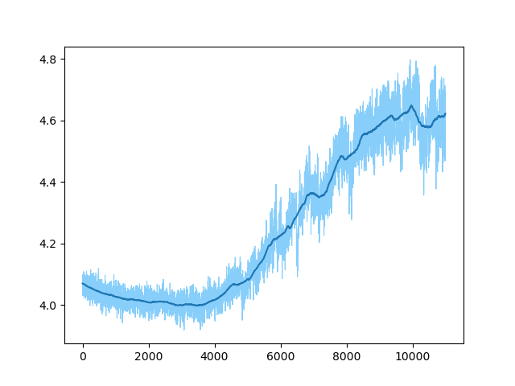
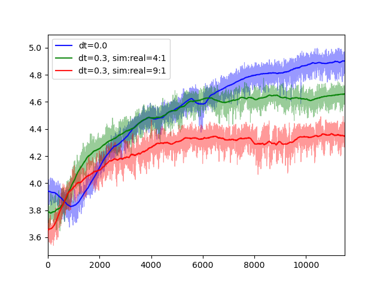
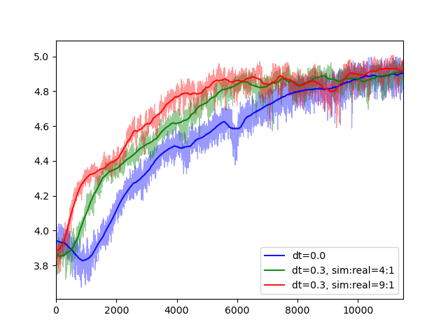

<p id="table"></p>

## Table of Contents

- <a href="#1">Week 1 (2023.3.16 – 2023.3.22)</a>
- <a href="#2">Week 2 (2023.3.23 – 2023.3.29)</a>
- <a href="#3">Week 3 (2023.3.30 – 2023.4.5)</a>
- <a href="#4">Week 4 (2023.4.6 – 2023.4.12)</a>

<br/>

------

<br/>

<p id="1"></p>

## <a href="#table">Week 1 (2023.3.16 – 2023.3.22)</a>

### Work

1. Actor-Critic 算法与 HER 经验回放寄存类编写，具体算法流程如下：

    <div align="center">
        
    </div>

    在以上算法流程中将 off-policy RL 算法用 actor-critic 进行了 HER 寄存器的替代实现。

2. 查阅参考文献 [*Sim and Real: Better Together*](https://arxiv.org/abs/2110.00445) 中并行训练逻辑的[代码实现](https://github.com/sdicastro/SimAndRealBetterTogether/tree/main/mpi_utils)（基于 MPI 并行计算库的实现），并参考[文档](https://materials.jeremybejarano.com/MPIwithPython/index.html)使用 MPI 接口进行了基本的进程数据通信功能测试，主要实现同步数据传输与基本计算功能，下周将对并行梯度下降进行实现。

### Plan

1. 实现基于多经验回放寄存器的 DQN/A2C 算法实现，并先对纯模拟环境进行训练代码运行

2. 实现基于 MPI 的并行梯度下降方法


<br/>

<p id="2"></p>

## <a href="#table">Week 2 (2023.3.23 – 2023.3.29)</a>

### Work

1. 收看全球 6G 技术大会

    - 2023-3-22

        > **论坛 B：天地融合智能组网技术**
        >
        > 陈山枝 —— 6G 及星地融合移动通信发展趋势
        >
        > - 6G 时代的数字孪生、虚拟世界、元宇宙、数字中国，以及未来的数字地球，都需要实现全域覆盖
        >
        > - 6G 两个标志：1) 星地融合		2) 用户为中心
        >
        > - 卫星高速移动带来的问题：
        >
        >     1）传播距离、时延对于信号波形、传输的影响 —— 如何信道建模、链路和系统评估方案、链路预算；
        >
        >     2）网络架构从平面架构到三维立体架构的重新设计 —— 考虑立体的、弹性的可存扩网络，包括引入 AI 模型解决；
        >
        >     3）高低轨卫星之间的干扰问题 —— 频率复用、物理层的关键技术和高层的关键技术

    - 2023-3-23

        > **论坛 C：双碳下的6G网络覆盖**
        >
        > 牛志升 —— 基于超蜂窝架构的柔性覆盖
        >
        > - 6G 低能耗需求与当前支持网络流量 KPI 增长百倍的技术之间存在矛盾，需要提出新的发展模式
        >
        > - 移动通信必须要改变 “按照最坏情况来设计网络覆盖” 的模式，降低整体能耗而非只提高能量效率
        >
        > - 6G 移动基站与边缘服务器的大量部署带来的能耗问题需要提出权衡策略，其中包括：
        >
        >     1）需要将基站的功率消耗设计为按业务动态变化的方式，如何降低功耗或关闭部分基站的同时保证保证全域覆盖；
        >
        >     2）如何定义业务变化；
        >
        >     3）如何保证服务质量
        >
        > - 超蜂窝网架构 —— 实现控制覆盖和业务覆盖分离，以业务覆盖控制降低能耗

    - 2023-3-24

        > **论坛 F：6G通感算架构及关键技术**
        >
        > 欧阳晔 —— 算力内生的通算一体化网络
        >
        > - 通算一体 “算力内生网络” 六大关键技术：通算一体的虚拟化、MEC 边缘卸载、网络无损、算法体系算力内生联邦学习、网络数字孪生面向算力内生网络的实现
        > - 追求设备运营商与网络 “空闲算力” 最大化利用的平衡

2. 高德/百度地图 API 调用研究，基于此实现南北校区间定时请求最短驾车时间

    - 正在针对高德地图 API 定时不精准问题和早晚高峰期路线规划不更改的问题进行资料查阅与问题定位，目前针对所有策略不同的网络请求均尝试过，开放 API 目前普遍存在该问题。

3. 毕设论文的算法实现工作：

    - 完成了 DQN 算法的所有实现编写

    - 对强化学习的状态/动作空间、环境定义、回放寄存进行了代码重构，完成了学习方法类、环境类与寄存器类的解耦；添加了空间的属性动态注册方法（[Github 仓库：UAV_RL](https://github.com/ccdf846153/UAV_RL)）

        > 【代码结构】
        >
        > ```
        > ./
        > │  train.py			    // UAVAgent
        > │  user_loc.npy
        > ├--modules
        > │  │  Net.py			    // Net(nn.Module)
        > │  └--RL.py			    // ReinforcementLearning @abstractclass, DQN
        > ├--utils
        > │  │  buffer.py	                    // ReplayBuffer
        > │  │  env.py			    // UAVEnvironment
        > │  │  env_args.py		    // arg_parse
        > │  │  env_core.py		    // Env @abstractclass
        > │  └--space.py		   	    // Space @abstractclass, ActionSpace, StateSpace
        > └--train_result
        >     │  DQN_model_parameters__2023-03-29_19-48-20.pth
        >     │  rate_list__2023-03-29_19-48-20.npy
        >     └--reward_list__2023-03-29_19-48-20.npy
        > ```
        >
        > 【智能体定义】
        >
        > ``` python
        > class UAVAgent:
        >     def __init__(
        >         self, 
        >         env_list: List[UAVEnvironment],
        >         algorithm: str = 'DQN',
        >         interact_distrib: List[float] = [0.1, 0.9],
        >         sample_distrib: List[float] = [0.5, 0.5]
        >     ):
        >         __slots__ = [
        >             'env_list', 'state_space', 'action_space',
        >             'model', 'interact_distrib', 'sample_distrib',
        >             'num_envs', 'algorithm'
        >         ]
        > ```
        >
        > 【DQN 定义】
        >
        > ``` python
        > self.model: ReinforcementLearning = eval(algorithm)(
        >     state_space = self.state_space,
        >     action_space = self.action_space,
        >     eval_net = Net(
        >         len(self.state_space),
        >         len(self.action_space)
        >     ),
        >     target_net = Net(
        >         len(self.state_space),
        >         len(self.action_space)
        >     ),
        >     gamma = 0.9,
        >     loss_function = nn.MSELoss(),
        >     optim_info = {
        >         'net': 'eval_net',
        >         'type': 'Adam',
        >         'lr': LR
        >     },
        >     buffer_info = {
        >         'type': 'ReplayBuffer',
        >         'capacity': MEMORY_CAPACITY(2000),
        >         'num': len(self.env_list)
        >     }
        > ```

    - 目前正在运行针对一个模拟环境、一个真实环境时，基于分离经验回放寄存器的 DQN 算法

### Plan

1. 针对毕设算法运行结果进行超参数调整与性能分析；改变抽样分布与环境选择分布后进行算法性能对比


<br/>

<p id="3"></p>

## <a href="#table">Week 3 (2023.3.30 – 2023.4.5)</a>

### Work

1. 毕设论文的模型超参数调整工作与性能分析

    - DQN 模型性能曲线

        针对一个真实环境，地图大小 50×50，20 个用户，2 架无人机场景进行调试，结果图如下所示

        <div align="center">
            
        </div>

    - DQN 模型性能问题分析

        1）收敛期望

        - 最终收敛期望与最优解存在差距，针对 UAV 在某些角落出生点时的情况未找到全局最优解
        - 由于在设置 task 要求时，并没有将 UAV 速度作为智能体决策的变量考虑，因此虽然无人机状态空间设定时坐标连续，但是最终能否摆脱全局最优也会受到 UAV 出生点影响。UAV 出生点确定了 UAV 上下左右移动构成的状态网格，因此如果状态网络中不存在离次优点近的网格，UAV 的确能够以更高概率摆脱局部最优，但是也可能只在全局最优点附近运动，无法精确到达全局最优点 

        2）收敛速度

        - DQN 算法本身从每一个 episode 中由于 UAV 起始点变化而突然上升的 loss 中学习。该算法在该环境下作为 baseline，在 episode 达到 5000 以后收敛。收敛速度本身可以基于 sim 环境数量变化而进行改进，但是改进空间可能不大。需要根据多个环境的结果对比分析

        3）曲线方差

        - 曲线方差大，并且曲线在最终震荡上升过程中方差没有明显减小的迹象，可能在开始 2000 ~ 4000 episode 时已经有某些出生点学到了次优策略，并且没有机会在经验回放时采样到足够多的探索步骤，导致在 episode 上升时学习率与探索率减小，逐渐收敛到了次优解
        - task 定义中，设置了 UAV 步长不可调整。实际场景下 UAV 的运动速度可以改变，夹角选择更多。让智能体自行选择 UAV 速度，并在学习开始阶段鼓励智能体以较大速度遍历环境状态可能是一种让 UAV 摆脱局部最优的方法

    - 解决思路

        - 增加 UCB 机制，对长时间没有进行尝试或探索的 action 通过人为提升 Q 值进行选取

        - 实现一个连续动作版本的环境，并进行仿真，观察能否消除最优解附近点不能收敛到最优的问题
        - 在前期探索阶段通过 reward 人为提高 UAV 速度，并在之后根据学习率和探索率的降低速度逐渐减小该 reward，以鼓励 UAV 摆脱局部最优解

### Plan

1. 对以上提到的解决思路进行逐步实现，并观察模型效果提升

<br/>

<p id="4"></p>

## <a href="#table">Week 4 (2023.4.6 – 2023.4.12)</a>

### Work

1. 毕设论文的模型超参数调整工作与性能分析

    - 简单任务上的 DQN 模型性能修正

        在上周模型基础上做了修正，对地图大小 50×50，20 个用户，2 架无人机场景进行调试，分别做了 1 次真实环境、3 次 DT 噪声方差为 0.3、3 次 DT 方差为 0.6 的曲线性能对比（加入噪声时环境配置为一个真实环境 + 一个虚拟环境），效果如下图所示

        <div align="center">
            
        </div>

        问题如下：

        - DT 噪声为 0.6 的曲线性能在中途收敛到次优解，关注是否为模型参数导致的训练异常，能否进行修正
        - 对以上曲线进行至少五次平均，并且对曲线进行解释（结果预测：绿色 (0.3) > 红色 (0.6) > 蓝色 (0.0)）

    - 复杂任务上的 DQN 调参分析

        基于简单任务的模型参数做比例放缩，对一个真实环境，地图大小 100×100，40 个用户，4 架无人机场景进行调试，结果性能不稳定。不同情况的训练曲线对比如下

        <div align="center" style="width: 65em; height: 22em; overflow: hidden; display: flex; ">
            
            
        </div>

        问题如下：

        - reward 在上升过程中和实际速率的 gap 太大。reward 曲线本身的收敛问题较小，反映到速率上有较大偏差，且 reward 曲线开始上升的起始点一直提前于速率曲线，猜测为 reward 设置不合理导致的学习 task 设置偏差。考虑在复杂环境下 UCB 方法是否能够继续使用，并改为只对无法进行的 action 转换为无人机停止动作的 mask 操作，不将出界问题反应在 reward 上。
        - 前期探索时间较长，一度考虑是 RL 本身的训练轮数不能太少的原因，后续还需要考虑在 2000 轮学习后适当调低学习率与探索率使模型尽可能先转移到较好的状态。
        - 昨天在更改过程中将学习率调为阶梯式下降而非指数型下降，观察到学习率过大导致的性能曲线震荡情况，需要在之后的改进中加以避免
    
    - 临时的改进
        <div align="center">
            
        </div>
        
        - 该图将之前的纵坐标延伸到了 11000 轮，曲线能够见到收敛的趋势，但是不确定这个改动在加入 DT 噪声后是否依旧可行。
        - 一些参数：
            - batch_size=512, memory_capacity=10000
            - learning_rate = pow(episode \* 0.1 + 1, -0.5) \* 0.0016 + 0.0001
            - EPSILON = min(1 - 0.997 \* exp((-0.0004)\*episode), 0.99)
        

2. 对论文所使用的系统模型和数字孪生模型描述做了初步整理

### Plan

1. 继续改进算法

    - 下周改进效果较差：不考虑全局最优方案、人造环境尝试优化曲线、尝试采用简易环境的曲线（性能提升不明显的概率较大）
    - 下周改进效果达到预期：开始对性能曲线做最终处理（平滑、平均）
2. 开始撰写毕设论文初稿，准备五月初盲审

<br/>

<p id="5"></p>

## <a href="#table">Week 5 (2023.4.13 – 2023.4.18)</a>

### Work

1. 毕设论文的模型性能分析

    - 复杂任务的模型性能对比

        对地图大小 100×100，40 个用户，4 架无人机场景进行调试，分别做了 5 次真实环境、10 次 DT 噪声方差为 0.3 的曲线性能对比（其中分别设定虚拟与物理环境的采样速率比为 4:1 和 9:1），效果如下图所示

        <div align="center" style="width: 65em; height: 22em; overflow: hidden; display: flex; ">
            
            
        </div>

        问题如下：

        - 采样速率 9:1 的曲线理论上在前期能够积累更多的探索数据，所以应该能够达到更好的训练效果，但是在实际训练过程中模型倾向于学习到了带噪声环境的规律，从而在物理环境中体现为收敛到了较差的局部最优解。之后尝试在虚拟环境中速率达到某一阈值后将虚拟环境撤除，改用物理环境进行训练，并作为之后所有实验训练效果对比的前提。
        - 收敛速度方面没有问题，需要继续考虑 DT 噪声为 0.6 时的情形

    - 拟增加的对比图

        - 相同噪声大小条件下，以训练的实际轮数作为参照对比的条件下模型的收敛曲线
            - 要求：物理环境收敛最快、采样速率大的虚拟环境收敛越快（但是现实中的模型收敛结果不如物理环境）
        - 相同噪声大小、不同采样速率条件下，以现实中经历的训练时间作为参照的模型收敛曲线对比
            - 要求：采样速率最大的虚拟环境收敛最快、物理环境收敛速度会相对较慢
        - 不同噪声大小、相同采样速率条件下，以现实中经历的训练时间作为参照的模型收敛曲线对比
            - 要求：物理环境收敛最慢但效果最好、噪声越大收敛效果越差但模型收敛速度越快

2. 完成了论文真实-虚拟环境混合方法部分与问题定义部分的大致内容。

### Plan

1. 根据拟增加的对比图进行试验，并作为论文仿真结果的最终对比图。
2. 继续完成论文撰写工作（盲审日期为 5.8）
