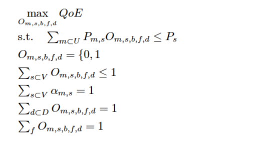
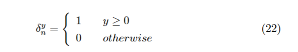
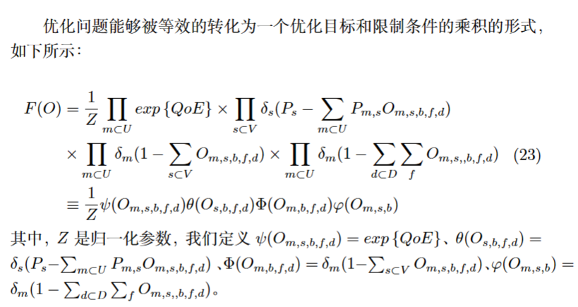
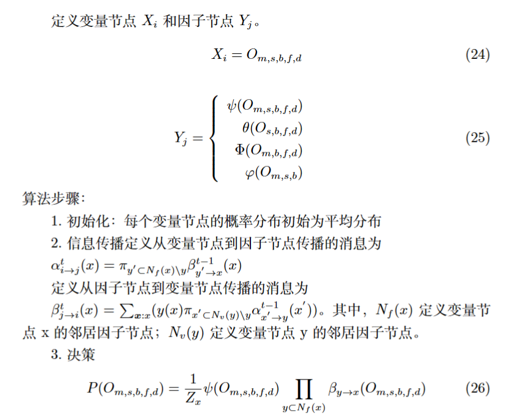

## 2023.3.22周报
### 本周任务汇报
+ 模型求解推导
    - 将原优化问题转化为Belief Propagation算法标准形式
       - 
       - 
       - 
    
    - 绘制因子图
    - 信念传播算法求解步骤
        - 
        - 
    
+ 求解算法学习

### 6G大会--天地融合智能组网技术
+ 
### 下周工作计划
