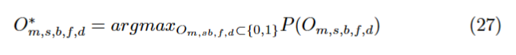

## 2023.3.22周报
### 本周任务汇报
+ 模型求解推导
    - 将原优化问题转化为Belief Propagation算法标准形式
       - 
       - 
       - 
    
    - 绘制因子图
    - 信念传播算法求解步骤
        - 
        - 
    
+ 求解算法学习
    - 学习了BP算法中因子相关运算的代码

```
class factor:
    def __init__(self, variables = None, distribution = None):
        if (distribution is None) and (variables is not None):
            self.__set_data(np.array(variables), None, None)
        elif (variables is None) or (len(variables) != len(distribution.shape)):
            raise Exception('Data is incorrect')
        else:
            self.__set_data(np.array(variables),
                            np.array(distribution),
                            np.array(distribution.shape))
    
    def __set_data(self, variables, distribution, shape):
        self.__variables    = variables
        self.__distribution = distribution
        self.__shape        = shape
    
    # ----------------------- Info --------------------------
    def is_none(self):
        return True if self.__distribution is None else False
        
    # ----------------------- Getters -----------------------
    def get_variables(self):
        return self.__variables
    
    def get_distribution(self):
        return self.__distribution
    
    def get_shape(self):
        return self.__shape
    
    # factor product
    def factor_product(x,y):
        if x.is_none() or y.is_none():
            raise Exception('One of the factor is None')    # raise语句引发一个异常，异常/错误对象必须有一个名字，且它们应该是Error 或者Exception的子类

        xy,xy_in_x_ind,xy_in_y_ind = np.intersect1d(x.get_variables(),y.get_variables(),return_indices=True) 
        # np.intersect1d 函数查找两个数组的交集，并返回两个输入数组中都有序的，唯一的值。
        
        if xy.size ==0 :
            raise Exception('Factor do not have common variables') 
         
        if not np.all(x.get_shape()[xy_in_x_ind]==y.get_shape()[xy_in_y_ind]):# 判断共同变量的取值可能数目是否一致
            raise Exception('Commen Variables have different order')
        
        x_not_in_y = np.setdiff1d(x.get_variables(),y.get_variables(),assume_unique=True)
        y_not_in_x = np.setdiff1d(y.get_variables(),x.get_variables(),assume_unique=True)

        x_mask = np.isin(x.get_variables(),xy,invert=True) # 
        y_mask = np.isin(y.get_variables(),xy,invert=True) #

        x_ind = np.array([-1]*len(x.get_variables()), dtype=int)
        y_ind = np.array([-1]*len(y.get_variables()), dtype=int)
    
        x_ind[x_mask] = np.arange(np.sum(x_mask))
        y_ind[y_mask] = np.arange(np.sum(y_mask)) + np.sum(np.invert(y_mask))
    
        x_ind[xy_in_x_ind] = np.arange(len(xy)) + np.sum(x_mask)
        y_ind[xy_in_y_ind] = np.arange(len(xy))
    
        x_distribution = np.moveaxis(x.get_distribution(), range(len(x_ind)), x_ind)
        y_distribution = np.moveaxis(y.get_distribution(), range(len(y_ind)), y_ind)
                
        res_distribution =   x_distribution[tuple([slice(None)]*len(x.get_variables())+[None]*len(y_not_in_x))] \
                       * y_distribution[tuple([None]*len(x_not_in_y)+[slice(None)])]
    
        return factor(list(x_not_in_y)+list(xy)+list(y_not_in_x), res_distribution)
    
    # 边缘概率
    def factor_marginalization(x, variables):
        variables = np.array(variables)
    
        if x.is_none():
            raise Exception('Factor is None')
    
        if not np.all(np.in1d(variables, x.get_variables())):
            raise Exception('Factor do not contain given variables')
    
        res_variables    = np.setdiff1d(x.get_variables(), variables, assume_unique=True)
        res_distribution = np.sum(x.get_distribution(),
                              tuple(np.where(np.isin(x.get_variables(), variables))[0]))
    
        return factor(res_variables, res_distribution)
    #Factor reduction
    def factor_reduction(x, variable, value):  #value值是你要保留变量的取值的索引值
        if x.is_none() or (variable is None) or (value is None):
            raise Exception('Input is None')
    
        if not np.any(variable == x.get_variables()):
            raise Exception('Factor do not contain given variable')
    
        if value >= x.get_shape()[np.where(variable==x.get_variables())[0]]:
            raise Exception('Incorrect value of given variable')
    
        res_variables    = np.setdiff1d(x.get_variables(), variable, assume_unique=True)
        res_distribution = np.take(x.get_distribution(),
                               value,
                               int(np.where(variable==x.get_variables())[0]))
    
        return factor(res_variables, res_distribution)

    # 联合概率分布
    def joint_distribution(ar):
        for element in ar:
            if element.is_none():
                raise Exception('Factor is None')
            
        res = ar[0]
        for element in ar[1:]:
            res = factor.factor_product(res,element)

        return res
```

### 6G大会--天地融合智能组网技术
+ 
### 下周工作计划
+ 尽快完成BP算法求解模型的仿真
