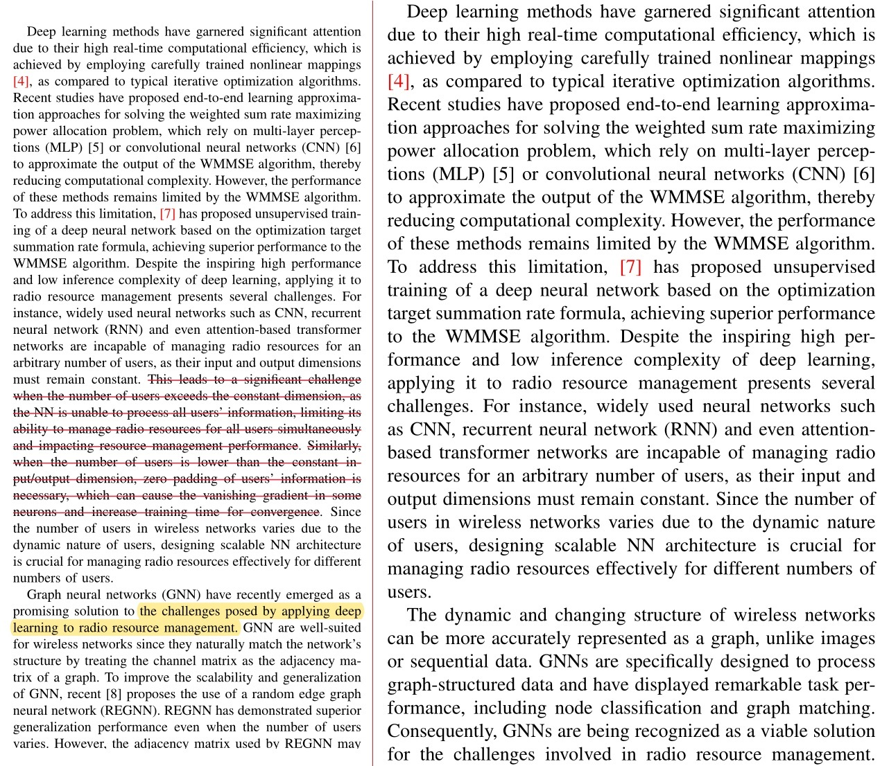
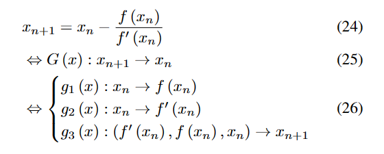
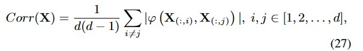
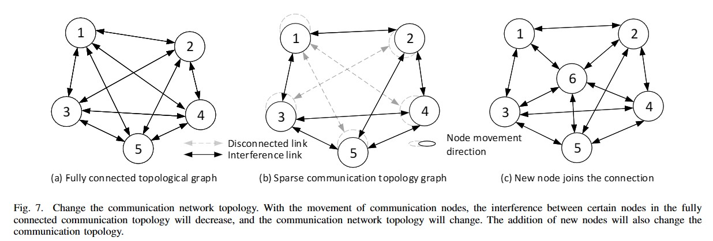
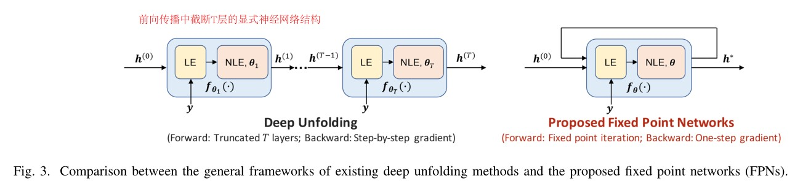

# 20230419周报

## 本周工作：

1. 修改论文，重画场景图，修改摘要 

> [论文链接](https://cn.overleaf.com/read/"Graph Neural Network based D2D Resources Management: An Unrolling-Driven Method")

2. 撰写知识驱动综述文献物理层部分

3. 整理[GPT Prompt Tips](https://github.com/UNIC-Lab/Weekly-Report/blob/main/Miscellaneous/GPT-Academic%20Writting/Prompt%20Tips.md) 
# 20230412周报
## 本周工作：

1. 修改论文全文细节

   (1)重写了WMMSE介绍，减少了中间问题公司，压缩文章篇幅。
   
   (2)撰写论文摘要

   版本1：The allocation of network resources in the future requires high timeliness, which the traditional iterative optimization algorithms do not satisfy due to latency constraints. The advent of neural networks presents a viable solution for the timely resolution of NP-hard wireless resource allocation problems. Nonetheless, current neural networks suffer from inadequate generalization and poor interpretability. Consequently, knowledge-driven neural networks represent a promising solution. By integrating domain expert knowledge, the inference ambiguity in neural networks and random exploration space are minimized, resulting in improved model generalization and interpretability. This paper proposes a novel architecture for graph neural networks (GNNs), referred to as the unrolling WMMSE algorithm graph neural networks (UWGNN), to address the power control problem in N-user interference channels. The UWGNN architecture is knowledge-driven by algorithmic unrolling of the iterative weighted minimum mean squared error (WMMSE) method. Specifically, each GNN module corresponds to a segment of the WMMSE algorithm formulation, enabling a single layer of the neural network to align with one iteration of the algorithm. The unrolling method is demonstrated to be effective, and a neural network model parameter migration method is proposed for the iterative optimization problem. Experimental results indicate that UWGNN effectively captures the WMMSE iterative structure, facilitating faster convergence, better scalability, and lower sample complexity. Furthermore, UWGNN exhibits excellent generalization performance when dealing with diverse data distributions and communication topologies without requiring retraining. Moreover, The proposed parameter migration method enables on-demand reduction of communication network resource allocation delay.
   
   版本2：This study investigates a novel approach for managing radio resources in Device-to-Device (D2D) networks using a Graph Neural Network (GNN) model architecture, inspired by the unrolling of the Weighted Minimum Mean Square Error (WMMSE) algorithm. Addressing the limitations of existing algorithms in meeting the millisecond-level timeliness and scalability required for emerging intelligent services, our proposed method incorporates the WMMSE algorithm’s structure and domain knowledge, thereby reducing computational delay and sample complexity while adapting to various data distributions. We present the UWMMSE-GGNN, a GNN architecture that employs the summation and power calculation components of the WMMSE algorithm to design the aggregation and update functions of the GNN, enhancing model generalization and interpretability. Theoretical analysis and simulation results demonstrate the robustness, scalability, and strong performance of the proposed architecture across diverse communication topologies without retraining. Our findings contribute to the development of efficient and scalable wireless resource management solutions for intelligent industries.
   
   版本3：In this paper, a novel graph neural network based on unrolling WMMSE algorithm (UWGNN) is proposed to address the problem of power control in wireless communication systems. Traditional iterative optimization algorithms cannot satisfy the millisecond-level execution time and scalability requirements. By incorporating the structure of the WMMSE algorithm and related domain knowledge into the neural network, model generalization and interpretability are improved. Each GNN module in the proposed network structure corresponds to a fragment of the WMMSE algorithm formula, thus enabling each layer of the network to correspond to one iteration of the algorithm. Experimental results demonstrate that the proposed algorithm effectively captures the WMMSE iteration structure, accelerates the convergence rate, improves scalability and reduces sample complexity, and can handle different data distributions and communication topologies. Moreover, the proposed algorithm exhibits excellent generalization and scalability, and enables instant reduction in communication network resource allocation latency.
   
2. 调研不动点网络论文
 
  
   
## 下周工作 

  撰写知识驱动综述文献物理层部分。
  
# 20230405周报
## 本周工作：

1. 修改论文全文逻辑

  （1）intro部分修改
  
   
  
    
  （2）修改实验部分：描述+结论
  
2. 整理知识驱动综述文献，按照孙老师要求，细化文献分类，补充部分章节文献

     
 
3. 修改gpt插件代码，新增功能模块

原文摘要： The use of terahertz (THz) frequencies has been recommended to achieve high-speed and ultra-low latency transmissions. Although there exist very large bandwidths in the THz frequency bands, THz channels are significantly dynamic and complicated, which is challenging for channel estimation. To improve the energy efficiency of wireless networks, THz channel power gains need to be precisely evaluated for determining optimal THz transmission frequencies and power control. Therefore, this work presents a novel conditional generative adversarial networks (GAN) based channel power gain estimation solution in the THz vehicle-to-infrastructure (V2I) networks with leakywave antennas, where the THz frequency has a big effect on the antenna gain, path loss and atmospheric attenuation. Simulation results confirm that our solution can accurately estimate the channel power gains versus the THz frequencies at a fast speed.

生成摘要： This article discusses the potential of using terahertz (THz) transmission for wireless communication and the challenges faced in implementing traditional antenna arrays in THz systems. The use of leaky-wave antennas is proposed for efficient channel estimation and power control. The article proposes a new GAN-based channel power gain estimation framework for THz vehicle-to-infrastructure (V2I) networks, which leverages received signal strengths (RSSs) as the conditional information. The proposed solution overcomes the drawbacks of Doppler shift and conventional methods that depend on state information in the prior time. The results confirm the accuracy and fast convergence speed of the proposed solution. The proposed solution has the potential to revolutionize the wireless communication industry and pave the way for the next-generation radio technology.
## 下周工作安排：

1. 撰写知识驱动综述文献第七章：物理层部分。

2. 根据不动点网络特性，寻找通信模型。

 
 # 20230329周报
## 本周工作：
1. 整理知识驱动综述文献，按照知识驱动方式对通信物理层的80篇文献进行了分类。
2. 修改论文第二、三章
3. 对智能wifi系统建模

   
  
5. 与本科生讨论，无人机网络计算卸载模型，思考不动点网络具体应用方式
## 下周工作安排：
1. 修改论文第五章实验部分，修改图片描述，扩充实验结论

# 20230322周报
## 本周工作：
1.修改论文

（1）修改第四章证明过程。

  学习端到端映射困难，unroll将一步映射展开为多步映射，降低模型学习难度
  

  unroll 收敛方向与算法一致，增加了特征相关性
  

（2）修改场景与网络拓扑结构图

（3）重画实验图

2. 阅读不动点网络相关文献

   [Yu W, Shen Y, He H, et al. An Adaptive and Robust Deep Learning Framework for THz Ultra-Massive MIMO Channel Estimation[J]. arXiv preprint arXiv:2211.15939, 2022.](https://arxiv.org/abs/2211.15939)
   
   本文将符合压缩感知理论的迭代算法，拆成线性部分与非线性部分，利用神经网络替换非线性部分，只需满足Lipschitz常数小于1，即可从数学上证明不动点网络的收敛性。
   
   
   
  ## 下周工作安排：
  
  1. 进一步完善论文
  2. 思考不动点网络的通信应用场景，构建数学模型。 
  
  ## 6G大会-论坛F:6G通感算架构及关键技术20230324
 
  1.未来通感算典型特征：

  一是多要素深度融合。多要素深层次融合以实现感知维度的拓展、通讯的效率提升、算力的泛在化

  二是多频段的协同。低、中、高多频段协同是实现我们宏观广覆盖、探测与微观重点感知相互补充与增强。

  三是网络协作的通感算。利用移动通讯网络中大量部署的节点来进行协作，可进一步扩大感知范围，实现连续覆盖，并可利用快速的联合处理来实现及时的感知精度提升。

  2.未来研究挑战：

  一是通感算融合理论的研究：
  如何以合适的指标来表征融合的效果，如何平衡通讯容量、感知性能、计算能力之间的关系，需要进一步的理论研究来支撑。

  二是通感算融合网络的架构设计：
  通感算融合网络系统架构涵盖了物理基础设施层、逻辑功能层和应用层三层，将受到网络统一的编排和管理。

  三是通感算空口融合的设计方面：
  空口设计关乎通感算网络的极致性能实现，在融合波形结构参考信号、波束赋形及波束管理等方面，需要结合多元化的应用场景、业务、优先级业务需业务量的需求来灵活设计。

  四是通感算组合的融合设计方面：
  需要综合考虑低、中、高、多频段衰落特性、通讯能力、感知能力等，构建各频段互补与增强的全谱融合的同感杆网络，实现广覆盖探测，以围观精准感知。对于目标、对于网络协作的通感算，还需要从系统性能、复杂度等角度出发，持续优化组网的资源配置，降低组网干扰的不利影响。

  五是通感算硬件结构的设计：
  当前通感算融合网络在采用单节点感知时仍面临自干扰的挑战，能否突破该技术对通感算融合网络下的基站形态将产生重要的影响。
  
 
  
