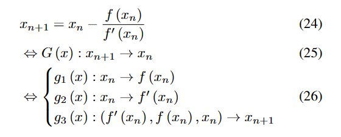
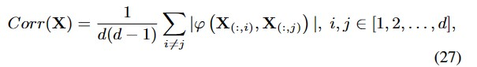
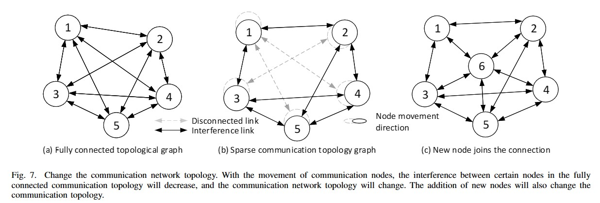
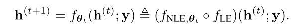
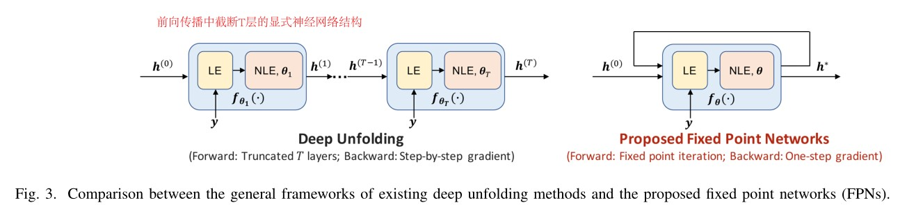

# 20230322周报
## 本周工作：
1.修改论文

（1）修改第四章证明过程。

  学习端到端映射困难，unroll将一步映射展开为多步映射，降低模型学习难度
  

  unroll 收敛方向与算法一致，增加了特征相关性
  

（2）修改场景与网络拓扑结构图

（3）重画实验图

2. 阅读不动点网络相关文献

   [Yu W, Shen Y, He H, et al. An Adaptive and Robust Deep Learning Framework for THz Ultra-Massive MIMO Channel Estimation[J]. arXiv preprint arXiv:2211.15939, 2022.](https://arxiv.org/abs/2211.15939)
   
   本文将符合压缩感知理论的迭代算法，拆成线性部分与非线性部分，利用神经网络替换非线性部分，只需满足Lipschitz常数小于1，即可从数学上证明不动点网络的收敛性。
   
   
   
  ## 下周工作安排：
  
  1. 进一步完善论文
  2. 思考不动点网络的通信应用场景，构建数学模型。 

