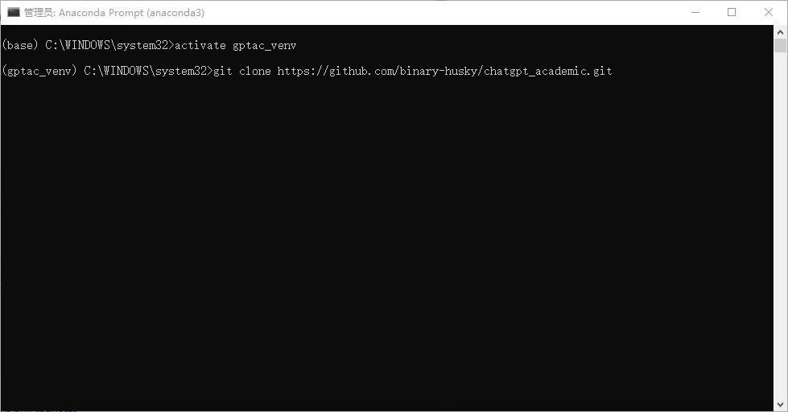
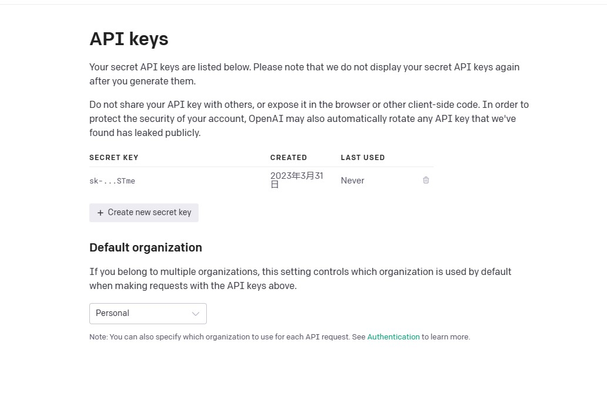
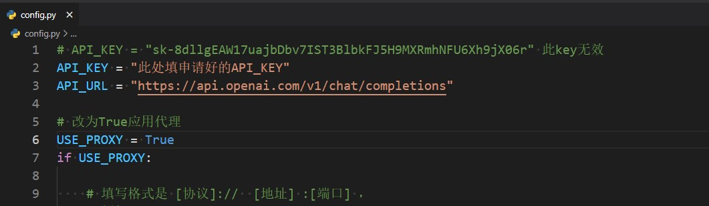
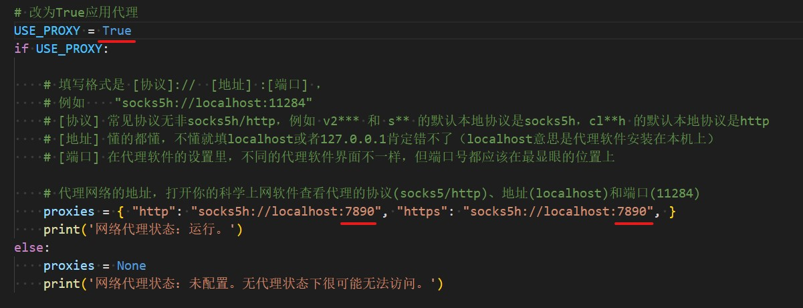
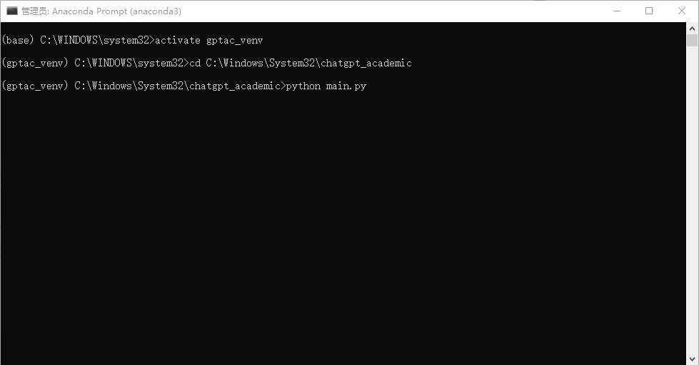
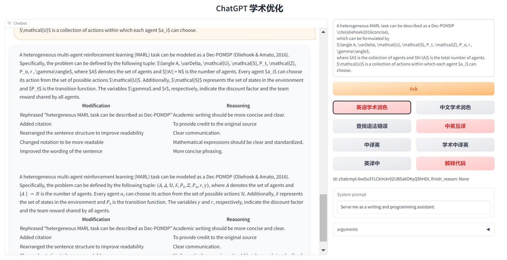

# chaptgpt注册

与[ChatGPT保姆级注册教程](https://mp.weixin.qq.com/s/Mf4MBpN761M8yI79aaRPeA)流程相同，补充一些细节：

1. 准备工具：(1)科学上网 (2)带邮箱的微软账号

2. 开启全局科学上网，建议选韩国或者美国点。打开chatgpt注册网站: [https://chat.openai.com/auth/login](https://chat.openai.com/auth/login) 点击 Sign up，进行账号注册

填选邮箱注册会因为相同ip注册过多报错，

绕过这一步选下面的微软账号注册，注册后的账号会和微软账号绑定。

 
3. 绑定手机号

（1）在[sms-activate.org](https://sms-activate.org/)注册一个账号，

（2）充值页面最下面选支付宝充2美元

（3）左上角选择激活，服务选择openai。就可以开始选择不同地区的手机号，亚洲地区可能会收不到验证码，建议选欧洲或者美洲，比如我选择的是巴西。

（4）购买完成后，激活区会出现已购买的虚拟号，在gpt注册页面找到对应国家，填写'）'后面的虚拟号，

（5）之后会在激活区收到验证码短信（验证码接收大概一分钟左右，如果几分钟都没有收到，可以点x取消这个虚拟号，没有收到验证码一般不会扣费，换一个区域即可），输入验证码即可完成注册。

4. 注册完成后，下次登录也是用微软账号登录。

# 中科院插件使用

插件地址：[https://github.com/binary-husky/chatgpt_academic](https://github.com/binary-husky/chatgpt_academic)

1. 准备工作： 安装python环境，python版本选3.11, 建议用 Anaconda 安装。

2. 安装git [连接](https://git-scm.com/downloads)

3. 激活环境，下载项目

     `git clone https://github.com/binary-husky/chatgpt_academic.git`
    
    `cd chatgpt_academic`
    
    
    
4. 安装依赖包

 `python -m pip install -r requirements.txt -i https://mirrors.aliyun.com/pypi/simple/`  

5. 配置API_KEY和代理设置

先登录chatgpt，再打开API生成[链接](https://platform.openai.com/account/api-keys)

将创建好的API_KEY复制到 工程文件夹 chatgpt_academic 的 config.py 中，如下：

代理设置：找到自己代理的端口，填入config.py文件，如下：

保存config.py

6.运行

用Anaconda Prompt 黑框运行。
先cd到工程文件夹 `cd ...自己的工程位置\chatgpt_academic`，再`python main.py`。

运行成功会打开一个网页, 如下即可。（Anaconda Prompt 黑框不要关闭，关了程序就终止了。）

