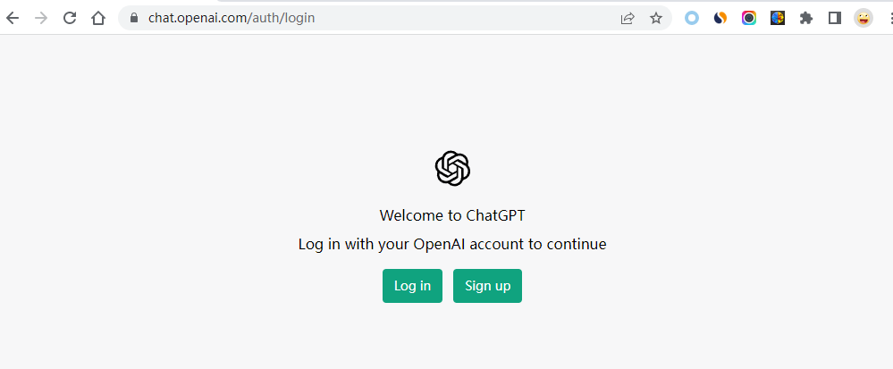
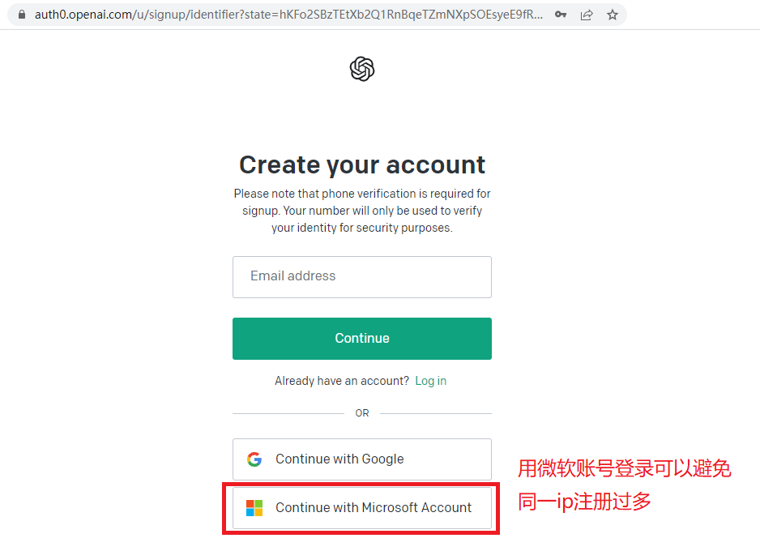
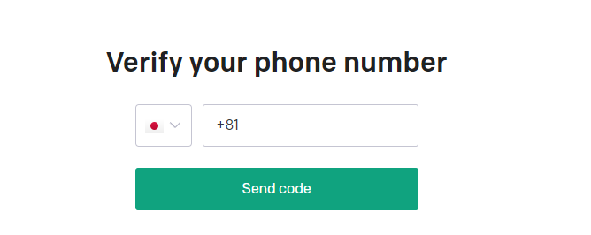
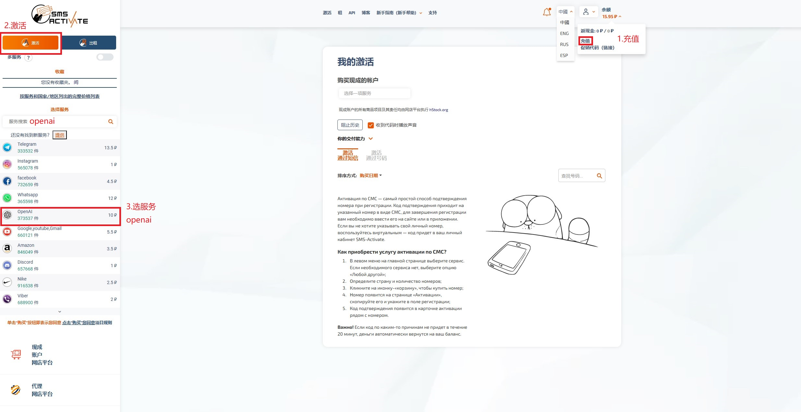
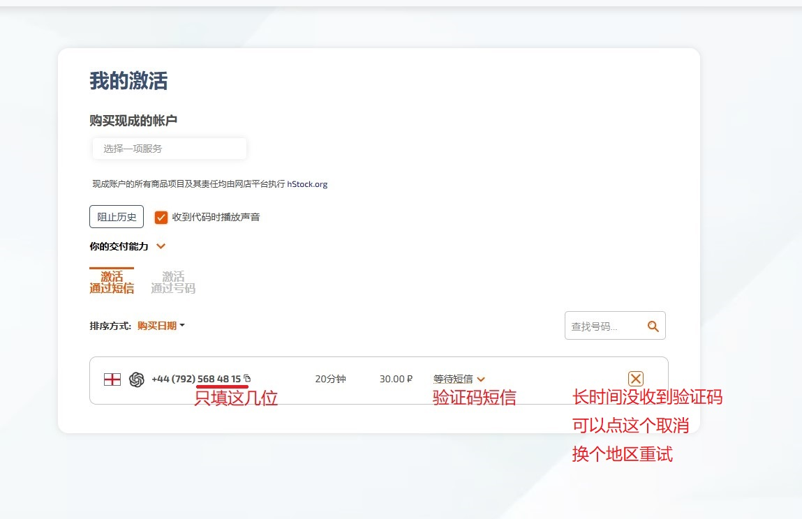
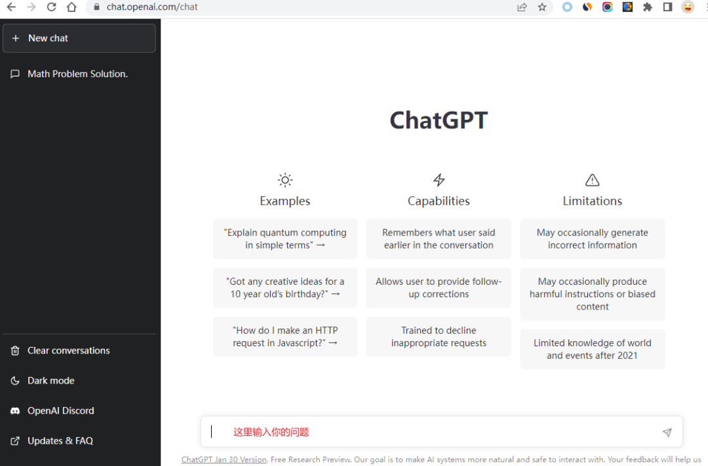

# chaptgpt注册

与[ChatGPT保姆级注册教程](https://mp.weixin.qq.com/s/Mf4MBpN761M8yI79aaRPeA)流程相同，补充一些细节：

1.准备工具：(1)科学上网 (2)带邮箱的微软账号

2.开启全局科学上网，建议选韩国或者美国点。打开chatgpt注册网站: [https://chat.openai.com/auth/login](https://chat.openai.com/auth/login) 点击 Sign up，进行账号注册

填选邮箱注册会因为相同ip注册过多报错，

绕过这一步选下面的微软账号注册，注册后的账号会和微软账号绑定。

3.绑定手机号

（1）在[sms-activate.org](https://sms-activate.org/)注册一个账号，

（2）充值页面最下面选支付宝充2美元

（3）左上角选择激活，服务选择openai。就可以开始选择不同地区的手机号，亚洲地区可能会收不到验证码，建议选欧洲或者美洲，比如我选择的是英格兰。

（4）购买完成后，激活区会出现已购买的虚拟号，在gpt注册页面找到对应国家，填写'）'后面的虚拟号，

（5）之后会在激活区收到验证码短信，输入验证码即可完成注册。（验证码接收大概一分钟左右，如果几分钟都没有收到，可以点x取消这个虚拟号，没有收到验证码一般不会扣费，换一个区域即可）

