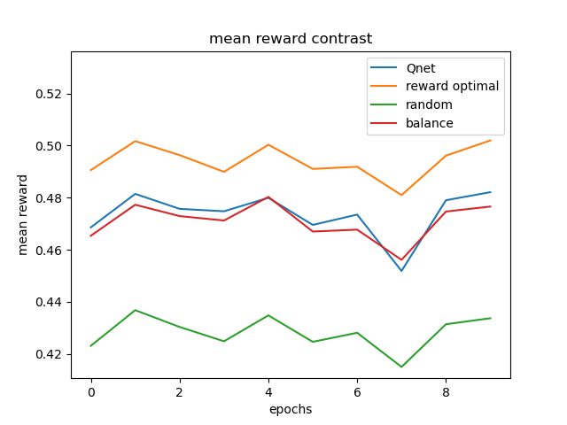
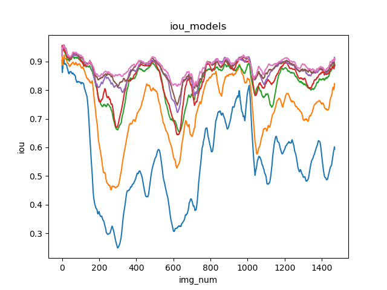
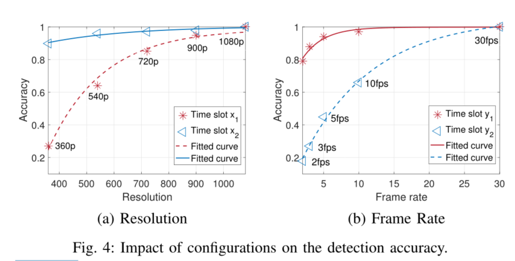
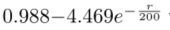
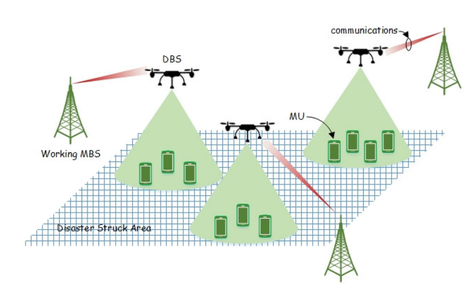

# 周报 - 20230607
## 本周工作小结

1、原模型存在的问题

每个用户需要将图像传输至控制器，由控制器决策后再传输至服务器，因此：
 
1️⃣存在通信成本，会产生通信时延

2️⃣用户数量改变后，强化学习模型需要重新训练

希望用户可以独立判断识别精度，仅需将预测的识别精度结果传输至控制器进行决策

2、考虑前后帧之间的联系，光流（optical flow）算法

光流

原图

光流与识别精度之间的关系

## 下一步工作安排

对光流算法的结果进行筛选，寻找其与识别精度之间的联系

 

---

 

# 周报 - 20230524
## 本周工作小结

1、数据分析

数据集目标识别精度分布

奖赏随时间变化对比

识别精度随时间变化对比

目标识别精度、传输数据量、时延与总带宽的关系

目标识别精度、传输数据量、时延与权衡参数ω的关系

## 下一步工作安排

继续调试运行，分析智能体在环境中的行为

 

---

 

# 周报 - 20230517
## 本周工作小结

1、系统模型

2、仿真

收敛曲线

收敛曲线（平滑）

性能对比（reward）

性能对比（accuracy）

3、现有问题（训练不稳定）：拟合精度函数；归一化奖赏；改变Q网络结构，提高其表征能力

## 下一步工作安排

继续调试运行，分析智能体在环境中的行为

 

---

 

# 周报 - 20230510
## 本周工作小结

1、改变训练方法

由于下一个状态与当前动作无关，改变Qnet的更新规则

2、部分仿真结果

收敛曲线

收敛曲线（平滑）

性能对比

性能对比（平滑）

共有动作：1470，相同动作：1320

不同模型的识别精度

不同模型的识别精度（平滑）

## 下一步工作安排

继续调试运行，分析智能体在环境中的行为

 

---

 

# 周报 - 20230503
## 本周工作小结

1、强化学习代码的编写

完成视频传输环境以及PPO算法的编写，程序可以跑通运行

2、不同分辨率下的识别精度

模型：yolov5s.pt 数据集：[UA-DETRAC](https://detrac-db.rit.albany.edu/DetRet)

**训练集**上的推理结果

| num | img_size | data_size(jpg) | Precision | Recall | mAP50 |
|:---:|:---:|:---:|:---:|:---:|:---:|
| 1 | 960 * 540 | 147.4kb | 0.975 | 0.981 | 0.993 |
| 2 | 800 * 480 | 133.0kb | 0.963 | 0.969 | 0.991 |
| 3 | 640 * 384 | 95.5kb | 0.968 | 0.975 | 0.992 |
| 4 | 480 * 288 | 58.2kb | 0.959 | 0.963 | 0.989 |
| 5 | 400 * 240 | 45.6kb | 0.947 | 0.945 | 0.983 |
| 6 | 320 * 192 | 33.0kb | 0.950 | 0.928 | 0.976 |
| 7 | 240 * 144 | 19.4kb | 0.928 | 0.900 | 0.954 |
| 8 | 160 * 96 | 9.9kb | 0.909 | 0.806 | 0.882 |
| 9 | 80 * 48 | 3.3kb | 0.844 | 0.631 | 0.707 |

**测试集**上的推理结果

| num | img_size | data_size(jpg) | Precision | Recall | mAP50 |
|:---:|:---:|:---:|:---:|:---:|:---:|
| 1 | 960 * 540 | 147.4kb | 0.757 | 0.748 | 0.795 |
| 2 | 800 * 480 | 133.0kb | 0.778 | 0.741 | 0.802 |
| 3 | 640 * 384 | 95.5kb | 0.780 | 0.734 | 0.802 |
| 4 | 480 * 288 | 58.2kb | 0.794 | 0.683 | 0.775 |
| 5 | 400 * 240 | 45.6kb | 0.771 | 0.679 | 0.755 |
| 6 | 320 * 192 | 33.0kb | 0.788 | 0.646 | 0.738 |
| 7 | 240 * 144 | 19.4kb | 0.770 | 0.633 | 0.718 |
| 8 | 160 * 96 | 9.9kb | 0.733 | 0.515 | 0.582 |
| 9 | 80 * 48 | 3.3kb | 0.614 | 0.373 | 0.386 |

## 下一步工作安排

继续调试运行，得到仿真结果，分析智能体在环境中的行为

 

---

 

# 周报 - 20230418
## 本周工作小结
1、建模与实现

2、数据集选择以及yolov5模型选择

数据集：UA-DETRAC，车辆检测和跟踪的大规模数据集，由Cannon EOS 550D相机在中国北京和天津的24个不同地点拍摄的10小时视频组成，类别包括car, bus, van, others

Fig：使用yolov5s.pt预训练模型（在coco数据集上训练），在UA-DETRAC数据集上的训练效果。

## 下一步工作安排

继续完善问题建模细节以及目标识别模型yolov5的实现

 

---

 

# 周报 - 20230412
## 本周工作小结
1、视频分析系统中的一些动机与结论

Fig4(a)：识别精度关于分辨率的曲线，x1为小目标，x2为行人靠近的过程

Fig4(b)：识别精度关于帧率的曲线，y1为车辆快速移动，y2为交通拥堵场景

凹函数形式：

Wang, Can, et al. **"Joint configuration adaptation and bandwidth allocation for edge-based real-time video analytics."** IEEE INFOCOM 2020-IEEE Conference on Computer Communications. IEEE, 2020.

2、问题转化与建模

3、yolov5源码学习

[官方源码测试](https://www.bilibili.com/video/BV1Gv4y1H7aY)

## 下一步工作安排

继续完善模型细节以及识别模型的实现

 

---

 

# 周报 - 20230405
## 本周工作小结
1、文献阅读

1️⃣Jiang, Xiantao, et al. **"A survey on multi-access edge computing applied to video streaming: Some research issues and challenges."** IEEE Communications Surveys & Tutorials 23.2 (2021): 871-903.

**优化指标**：Energy Consumption，Throughput，QoE，Service Latency，Cost，Fairness，Cache Hit Ratio，Revenue

**MEC场景下视频分析系统（video analytics system）**：object detection, object tracking, and semantic segmentation

2️⃣Kim, Woo-Joong, and Chan-Hyun Youn. **"Lightweight online profiling-based configuration adaptation for video analytics system in edge computing."** IEEE Access 8 (2020): 116881-116899.

**决定因素**：图像帧分辨率和速率（frame resolution and sampling rate）

**矛盾**：计算资源（如GPU）的有限性，需要在保证精度的前提下，对视频流进行合理配置，即resource-accuracy tradeoff。

**思路**：依据目标在视频流中的位置和大小的变化（velocity of objects on location and size）设计配置控制器（configuration controller），而不是凭借经验值（empirically measured value）。

3️⃣Wu, Kun, et al. **"Soudain: Online adaptive profile configuration for real-time video analytics."** 2021 IEEE/ACM 29th International Symposium on Quality of Service (IWQOS). IEEE, 2021.

4️⃣Zhou, Tian, Fubao Wu, and Lixin Gao. **"Profiling-free Configuration Adaptation and Latency-Aware Resource Scheduling for Video Analytics."** 2022 IEEE International Conference on Big Data (Big Data). IEEE, 2022.

2、系统设计和实现

场景：用户端（传感器设备）的计算资源有限，无法运行目标任务，或无法满足时延指标，需要卸载到远程云（计算中心）。但是通信资源不能满足任务整体的传输，因此，需要对其进行配置，或者部分取舍。

业务：任务卸载

模型：YOLO系列

3、审稿：Energy-Efficient Cellular-Connected UAV Swarm Control Optimization

## 下一步工作安排

继续完善和落实实现方案和模型选择

 

---

 

# 周报 - 20230329
## 本周工作小结
1、无人机基站资源分配

存在问题：PSO算法性能仍不如贪心算法，差距大概在8％-10％，且每次执行时不够稳定，导致算法无法顺利迭代； 
在使用搜索能力更强的冯诺依曼局部拓扑之后，并没有明显的改善。

2、视频流数据的信息价值评估

Zhao, Lindong, Dan Wu, and Liang Zhou. **"Quality-of-Decision-Driven Machine-Type Communication."** IEEE Internet of Things Journal 9.17 (2022): 16631-16642. 
保留视频流中关键帧的图片信息，舍弃无用帧中的内容，实现减少传输数据量、缓解通信信道负担的目的，同时对决策效果（QoE）的影响微乎其微

Yeung, Serena, et al. **"End-to-end learning of action detection from frame glimpses in videos."** Proceedings of the IEEE conference on computer vision and pattern recognition. 2016. 
该任务为动作识别，需要判断动作的开始和结束时间。该工作在观测网络（observation network）的基础上，训练循环网络（recurrent Network）：判断候选帧、预测决策以及时序位置。极大地减少了动作识别任务所需的帧数量。

联系：该机制类似于信息价值评估器的功能，对视频帧进行筛选。

## 下一步工作安排
1、继续调整PSO算法的参数，可能需要重新选择合适算法； 
2、确定视频流数据的信息价值评估部分的具体实现方案。

 

---

 

# 周报 - 20230322
## 本周工作小结
1、算法流程图

**优化目标**：使得用户传输的信息价值最大 
**输入**：UE坐标、UE数据量 
**优化变量**：UE连接状态（associations、bandwidth）、DBS坐标（coordinates_xyz） 
1️⃣**系统初始化** 
2️⃣&emsp;DBS坐标初始化 
3️⃣&emsp;用户连接（频谱分配）初始化 
4️⃣**两步迭代** 
5️⃣while：传输的信息价值（数据量）增大 
6️⃣&emsp;优化DBS坐标：（水平_xy）位置加权k-means、（垂直_z）搜索 
7️⃣&emsp;优化用户连接（频谱分配）：PSO算法，拓扑结构（全局互联、环状拓扑、冯诺依曼拓扑） 
8️⃣算法结束

2、部分仿真结果

PSO算法收敛曲线图： 

说明：在固定用户UE数量=30，无人机基站DBS数量=3的情况下，PSO算法优化用户UE连接以分配频谱资源。 
问题及可能的解决方法：PSO算法其收敛速度介于暴力搜索和贪心算法之间，但其效果相比贪心并没有优势，在尝试不同的拓扑结构之后也并无改善；可能是因为优化变量为离散整数，导致其难以继续搜索解空间，后续可尝试进一步调整算法的各参数。 

## 下一步工作安排

（1）继续改进和完善仿真过程，使得算法性能表现超过贪心算法； 
（2）接口：基于抽帧的视频数据的信息价值表征方法，明确应用信息价值机制后的数据尺度。 

系统模型示意图 

粒子群算法的拓扑结构 

位置加权k-means算法 

