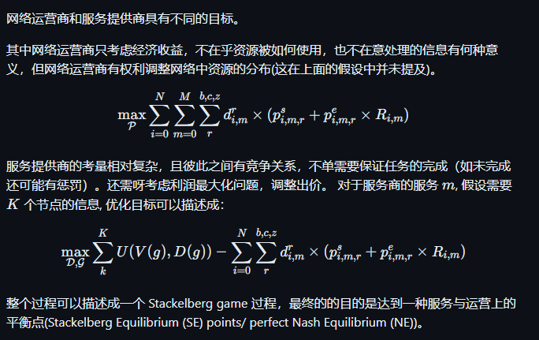
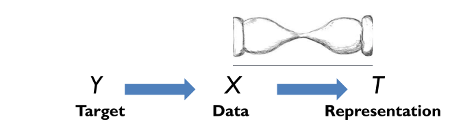
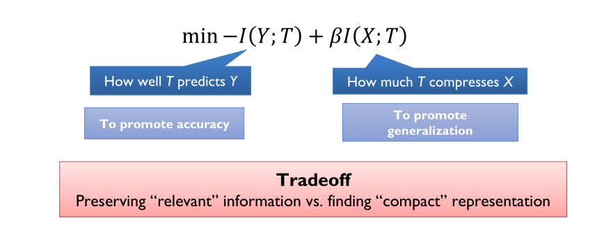
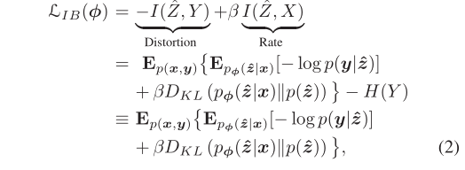
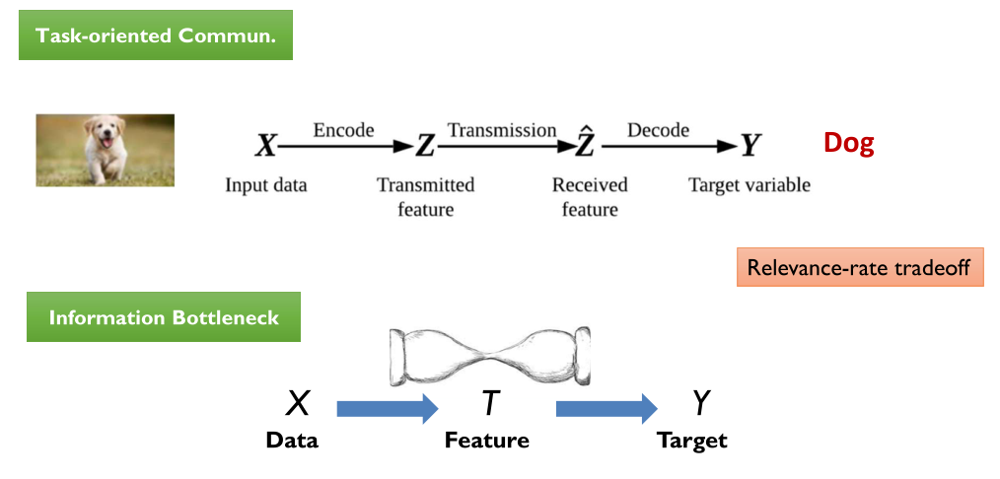
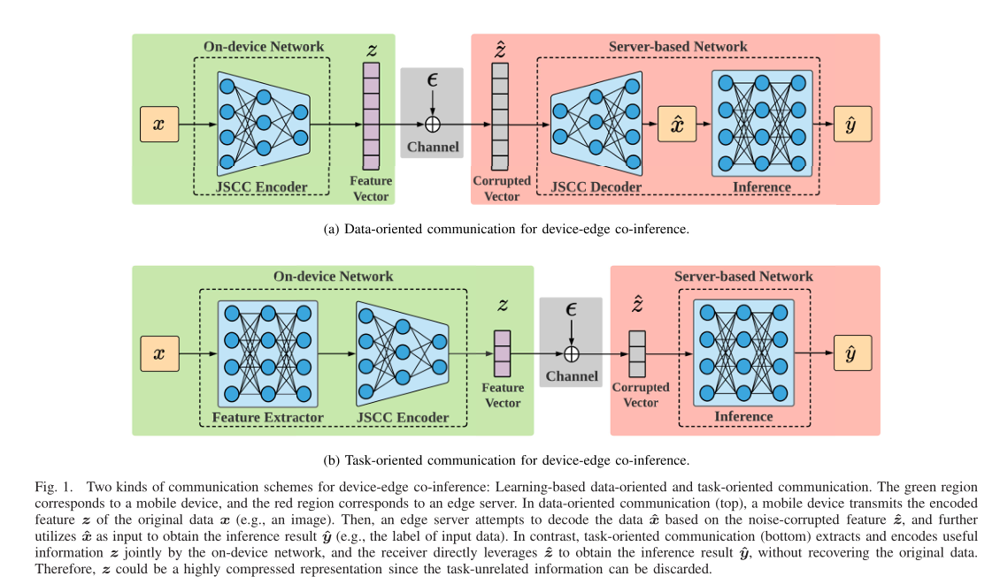
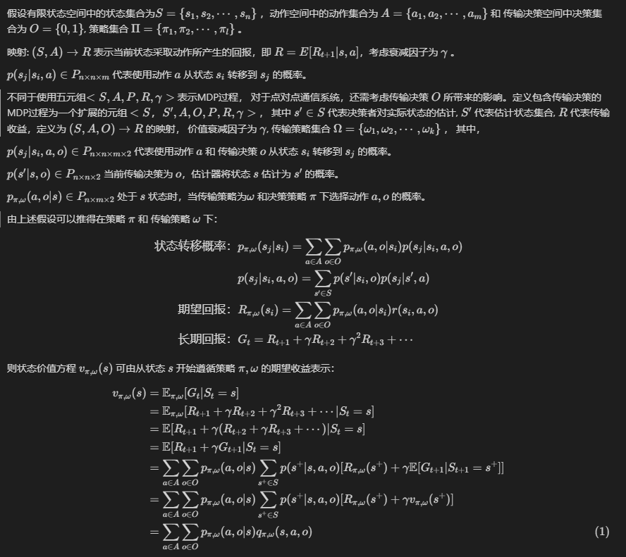
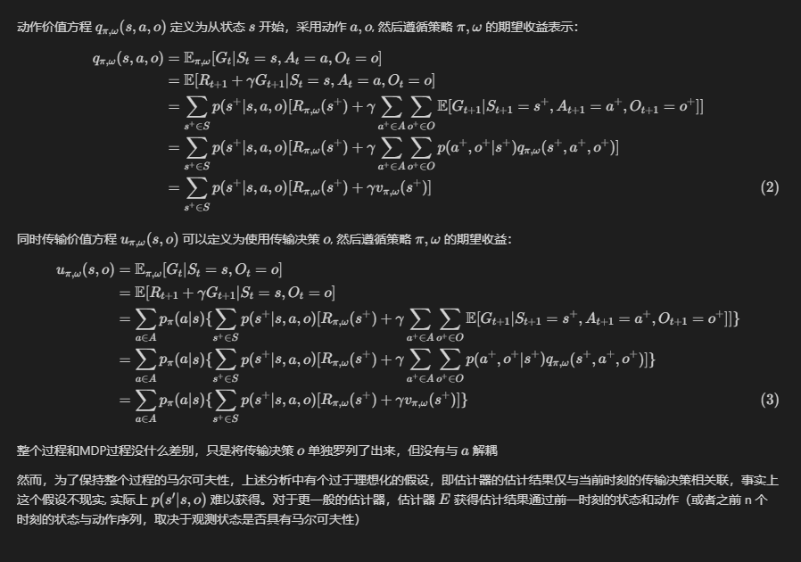

### Date: 2023/6/14

[](https://unic.xidian.edu.cn/ "西安电子科技大学泛在网络与智能计算研究组")

------------------------------------------------

## 1.多维网络资源分配思路

### 目标



### 信息价值

对于服务商，假设其服务生成的信息的初始价值服从某种分布（这里具体的分布如何获得还没确定），节点参与的某种服务的概率服从特定分布（比如zipf 分布 [1]）。信息价值可以对应收益函数和策略的收益矩阵，应用于混合策略博弈过程。

> [1] Li J, Chen H, Chen Y, et al. Pricing and resource allocation via game theory for a small-cell video caching system[J]. IEEE Journal on Selected Areas in Communications, 2016, 34(8): 2115-2129.
### 服务类型

服务商的服务类型可以设置成以下三种[2]:

- 数据位于MEC/云服务器节点，需要传输给某些用户，对应的典型业务是视频网址为用户提供视频服务。
- 数据位于User 节点，需要收集到某个/某几个节点完成对应的计算任务。典型的业务是交通流量监控以及工业环境下的一些应用。
- MEC/云服务器/User 节点都有数据需要传输和计算，典型业务是网络游戏，VR等应用。
> [2] Chen Z, Yin B, Zhu H, et al. Mobile Communications, Computing, and Caching Resources Allocation for Diverse Services via Multi-Objetive Proximal Policy Optimization[J]. IEEE Transactions on Communications, 2022, 70(7): 4498-4512.

### 协商思路

> step 1 Nsp (Network service prodiver) 初始化 3C（communicaton, compputing, cache）资源定价 P；
> 
> step 2 Sp (service prodiver) 基于 Nsp 定价 P 和 其他 Sp 的策略 $\pi$ 却定服务所需资源，并给出期望的资源配置方案A。
> 
> step 3 Sp 和 Nsp 基于自身资源配置方案 A 和定价 P 对系统资源进行拍卖，如果 Sp 没有买到所需的资源，则返回 step 2 选择新的资源配置方案， 直到所有 Sp 的资源配置方案。
> 
> step 4 Nsp 基于本轮拍卖收益调整 3C 资源的定价 P 。

### 目前存在的问题

- 如何体现信息价值在其中的作用。
- step 2 中的定价博弈过程还没有具体确定。

## 2.仿真实验

- 正在编写系统环境相关的仿真代码。


### Date: 2023/6/7

[](https://unic.xidian.edu.cn/ "西安电子科技大学泛在网络与智能计算研究组")

------------------------------------------------

## 1.关于信息价值在资源分配中应用的想法。

- 想法大纲
## 模型

### 网络与资源模型

考虑具有云服务器，边缘节点，用户节点的三级网络架构。假设网络中具有三种资源，即每个节点都具有计算资源和存储资源，节点之间具有共用的通信资源。

网络参与者包括两级：

运营商

对于网络整体而言，假设具有一个可以集中调度/分配资源（包括所有的通信资源，除用户节点之外的所有节点的计算存储资源）的运营商，运营商会基于收益最大化的原则，向用户售卖网络资源。为了防止运营商无线提高售价，运营商还需要承担按时间收费的资源成本。

服务商

服务商借助部分网络节点提供特定服务，服务过程需要完成特定数量的任务。服务过程需要网络节点中的资源协助才能完成。服务成功后会向获得一定经济收益或者免于惩罚，服务商的目标同样是最大化自身收益。

网络中的节点包括三种：

云服务器节点

云服务器具有最大的计算能力和存储能力，但是相应的与用户的传输距离也最长。

MEC服务器节点

边缘云服务器是一个折中的选择，既有次于云服务器的计算能力和存储能力，但相应的与用户的传输距离可能会小（如果MEC服务器靠近USER）

USER节点

用户端的计算以及存储能力最差。

通信

仅User与MEC，MEC与MEC，MEC与云服务器之间存在通信链路。

### 服务/任务模型

假设网络中存在 M 种服务/任务，其完成需要网络中的2个或者更多节点参与。我们假设某种服务/任务需要 i 个节点参与，这些节点中有些是固定的负责提供/采集数据，还有些节点负责提供计算或存储资源。

对于某种服务/任务 $m$ 具有以下属性：

节点集合 $N_{m}$, 其中 $N_{m}= \lbrace n_{0},\cdots ,n_{i} \rbrace$。

出价：即该任务/服务会为每种资源一个报价，该报价由两部分组成，即资源预定费用和单位资源费用。该报价在每个节点不一定相同，在一个较大的时间尺度（或者任务/服务完成）之后会重新调整。$P_{m}= \lbrace p_{s}, p_{e} \rbrace$

服务/任务持续/容忍时间： 即服务的预计持续时间或者任务最大容忍时间，假设为 $T_{m}$。

效能评估函数：任务/服务完成后所能获得的经济收益，可能和多种因素有关，例如完成用时相关，任务完成度或者设置为固定值，假设为 $U_{m}(\cdot)$。

对于服务$m$, 我们可以使用元组 $S$ 表示， $S=(N_{m}, P_{m}, T_{m}, U_{m})$

对于任意服务提供者，其目标是最大化服务产生的效能同时最小化出价，即最大化利润。

### 信息（数据）模型

某种服务下的信息（数据），具有如下属性：

每个服务/任务，有特定数据量的信息需要被处理，这些信息可能被分散在几个节点之间，假定所有信息会被需要被汇聚到某些节点进行处理。

对于服务 $m$，假设节点 $i$ 上的信息 $X$ 需要被传输到 节点 $i‘$ 上处理。对于信息 $X$， 其原始数据量为 $R$ 比特，我们假使其具有一个固有的信息价值 $V(X)$ ，通过信息对任务效能函数的影响进行评估。

对于信息 $X$ 同样使用元组 $I = (R, V)$ 表示。

对于任意信息 $X$ ，假设节点为信息提供4种处理方式：

1. 传输信息 $X$ 到临近节点，这个过程中假使 $R, X$ 均不发生变化，需要通信资源 $B_{i}$ 支持，产生的费用为 $R \times P_{m,i}^{b}$, 所需要的时间是 $\frac{R}{B_{i}}$。
2. 提取信息 $X$ 的特征，需要计算资源 $f_{m,i}$ 的支持, 假设计算量为 $C_{m,i}$。其中提取特征后的信息为 $X'$, 其数据量为 $R(X’| X, C_{m,i}) \leq R$ 比特，信息价值 $V(X’| X, C_{m,i}) \leq V(X)$ 。产生的费用为 $C_{m,i} \times P_{m,i}^{c}$, 所需要的时间是 $\frac{C_{m,i}}{f_{m,i}}$。
3. 储存信息 $X$ 到本地， 这个过程中假使 $R, X$ 均不发生变化，需要存储资源 $Z_{m,i}$ 的支持。 存储产生的费用由 $R \times P_{m,i}^{z} \times T$ 计算, 其中$T$ 是存储的时长。
4. 使用信息 $X$ 完成任务\服务 $m$， 这个过程不涉及 $R, X$ 变化， 需要计算资源 $C_{n}$ , 费用 $C_{n}(R) \times p_{n}^{c}$, 花费时间 $\frac{C_{n}(R)}{f_{m}}$, 产生的能效 $U_{n}(V(X), D)$, 其中 D 是任务完成的总用时。

上数的4种处理方式，可以在任意节点内以任意排列方式进行组合，只要不超出最大容忍时延和节点自身能力。

### 决策

对于服务 $m$ 若使用节点 $i$ 中的的资源 ($b,c,z$), 则有决策向量 $\mathcal{D} = \lbrace d_{i,m}^{b}, d_{i,m}^{c}, d_{i,m}^{z} \rbrace, \mathcal{P} = \lbrace p_{i,m}^{b}, p_{i,m}^{c}, p_{i,m}^{z} \rbrace, \mathcal{G} = \lbrace g_{i,m}^{b}, g_{i,m}^{c}, g_{i,m}^{z} \rbrace$, 其中           
$d_{i,m}^{r}$ 表示服务是否被允许使用该节点的资源，该决策是运营商做出，$ p_{i,m}^{r} = \lbrace p^{s}_{i,m, r}, p^{e}_{i,m, r} \rbrace$ 表示对某种资源的出价，该决策由服务商做出。

### 目标

网络运营商和服务提供商具有不同的目标。

其中网络运营商只考虑经济收益，不在乎资源被如何使用，也不在意处理的信息有何种意义，但网络运营商有权利调整网络中资源的分布(这在上面的假设中并未提及)。

```
$$
\begin{align}
 \max_{\mathcal{D}} \sum_{i=0}^{N} \sum_{m=0}^{M} \sum_{r}^{b,c,z} d_{i,m}^{r} \times (p^{s}_{i,m, r} + p^{e}_{i,m, r}\times R_{i,m})    
\end{align}
$$
```

服务提供商的考量相对复杂，且彼此之间有竞争关系，不单需要保证任务的完成（如未完成还可能有惩罚）。还需呀考虑利润最大化问题，调整出价。 对于服务商的服务 $m$, 假设需要 $K$ 个节点的信息, 优化目标可以描述成：

```
$$
\begin{align}
 \max_{\mathcal{P, G}} \sum_{k}^{K} U(V(\mathcal{g}), D(\mathcal{g})) - \sum_{i=0}^{N}\sum_{r}^{b,c,z} d_{i,m}^{r} \times (p^{s}_{i,m, r} + p^{e}_{i,m, r}\times R_{i,m})    
\end{align}
$$
```

整个过程可以描述成一个 Stackelberg game 过程，最终的的目的是达到一种服务与运营上的平衡点(Stackelberg Equilibrium (SE) points/ perfect Nash Equilibrium (NE))。

### 信息函数 和 能效函数

效能函数 $U$直接和收益相关，由服务商提供；一般来说希望效能函数与收集信息的价值以及任务完成使用的时间相关，与具体任务相关。

信息函数 $V$也需要服务商提供，表示的是信息转递过程中隐含的有用信息的变化。

效能函数和有用信息函数的区别在于效能直接和经济收益相关，而信息函数表示的是有用信息的损失。


### Date: 2023/5/24

[](https://unic.xidian.edu.cn/ "西安电子科技大学泛在网络与智能计算研究组")

------------------------------------------------

## 1.论文进展

### 论文修改；

- 作者信息和引用已经调整完毕。

> [论文链接](https://cn.overleaf.com/read/hcqfjvdbjdck "Communication Resource Scheduling for CAVs: A Value of Information Based Approach")


## 2.关于信息价值在资源分配中应用的想法。

### 网络与资源模型

考虑具有云服务器，边缘节点，用户节点的三级网络架构。假设网络中具有三种资源，即每个节点都具有计算资源和存储资源，节点之间具有共用的通信资源。

运营商

对于网络整体而言，假设具有一个可以集中调度/分配资源（包括所有的通信资源，除用户节点之外的所有节点的计算存储资源）的运营商，运营商会基于收益最大化的原则，向用户售卖网络资源。为了防止运营商无线提高售价，运营商还需要承担按时间收费的资源成本。


云服务器

云服务器具有最大的计算能力和存储能力，但是相应的传输距离也最长。

MEC服务器

边缘云服务器是一个折中的选择，既有次于云服务器的计算能力和存储能力，但相应的传输距离可能会小（如果MEC服务器靠近USER）

USER

用户端的计算以及存储能力最差，相应的传输距离可以很小。

通信

仅用户与MEC，MEC与MEC，MEC与云服务器之间存在通信链路。

### 服务/任务模型

假设网络中存在 M 种服务/任务，其完成需要网络中的2个或者更多节点参与。我们假设某种服务/任务需要 m 个节点参与，这些节点中有些是固定的负责提供/采集数据，还有些节点负责提供计算或存储资源。

对于某种服务/任务具有以下属性：

出价：即该任务/服务会为每种资源一个报价，该报价由两部分组成，即资源预定费用和单位资源费用。该报价在一个较大的时间尺度（或者任务/服务完成）之后会重新调整。

服务/任务持续/容忍时间： 即服务的预计持续时间或者任务最大容忍时间。

效能评估函数：任务/服务完成后所能获得的经济收益，可能和多种因素有关，例如完成用时相关，任务完成度或者设置为固定值。

对于任意服务提供者，其目标是最大化服务产生的效能同时最小化出价，即最大化利润。

### 信息（数据）模型

某种服务下的信息（数据），具有如下属性：

每个服务/任务，有特定数据量的信息需要被处理，这些信息可能被分散在几个节点之间，假定所有信息会被需要被汇聚到某些节点进行处理。

对于服务n，假设节点 m 上的信息 X 需要被传输到 节点 m‘ 上处理。对于信息 X， 其数据量为S(X) 比特，我们假使其具有一个固有的信息价值 V(X) ，通过信息对任务效能函数的影响进行评估。

对于任意信息 X ，假设节点为信息提供4种处理方式：

1. 传输信息 X 到临近节点，这个过程中假使 S(X), V(X) 均不发生变化，需要通信资源 $B_{n}$ 支持，产生的费用为 $S(X) \times P_{n}^{b}$, 所需要的时间是 $\frac{S(X)}{B_{n}} $。
2. 提取信息 X 的特征，需要计算资源$C_{n}$的支持。其中提取特征后的信息为 X', 其数据量为 $S(X’| X, C_{n}) \leq S(X)$ 比特，信息价值 $V(X’| X, C_{n}) \leq V(X)$ 。产生的费用为 $C_{n} \times P_{n}^{c}$, 所需要的时间是 $\frac{C_{n}}{f_{m}}$。
3. 储存信息 X 到本地， 这个过程中假使 S(X), V(X) 均不发生变化，需要存储资源 $Z_{n}$ 的支持。 存储产生的费用由 $S(X) \times P_{n}^{z} \times T$ 计算, 其中 $T$ 是存储的时长。
4. 使用信息 X 完成任务\服务 n， 这个过程不涉及 S(X), V(X) 变化， 需要计算资源 $C_{n}(S(X))$ , 费用 $C_{n}(S(X)) \times p_{n}^{c}$, 花费时间 $\frac{C_{n}(S(X))}{f_{m}}$, 产生的能效 $U_{n}(V(X), D)$, 其中 D 是任务完成的总用时。

上数的4种处理方式，可以在任意节点内以任意排列方式进行组合，只要不超出最大容忍时延和节点自身能力。


### 目标

网络运营商和服务提供商具有不同的目标。

其中网络运营商只考虑经济收益，不在乎资源被如何使用，也不在意处理的信息有何种意义，但网络运营商有权利调整网络中资源的分布(这在上面的假设中并未提及，也许会在未来考虑)。

服务提供商的考量相对复杂，且彼此之间有竞争关系，不单需要保证任务的完成（如未完成还可能有惩罚）。还需呀考虑利润最大化问题，调整出价。

最终的的目的是达到一种价格平衡。


### Date: 2023/5/18

[](https://unic.xidian.edu.cn/ "西安电子科技大学泛在网络与智能计算研究组")

------------------------------------------------

## 1.论文进展

### 论文修改；

-本周主要修改了论文中仿真结果部分，重写了描述不清晰的部分，添加了对仿真场景的更详细描述，并且更详细的分析了仿真结果。

-基本完成了上次讨论中出现的问题的修改。

> [论文链接](https://cn.overleaf.com/read/hcqfjvdbjdck "Communication Resource Scheduling for CAVs: A Value of Information Based Approach")


### Date: 2023/5/10

[](https://unic.xidian.edu.cn/ "西安电子科技大学泛在网络与智能计算研究组")

------------------------------------------------

## 1.论文进展

### 本周工作主要修改了论文的 4、5、6，节；
- 第4节主要增加了一些描述逻辑的问题，并且补充了之前省略的一些公式和推导。
- 第5节删除了关于AoI性能不收敛的的分析，把篇幅转移到对改进后的CSMA/CA协议更详细的表述上。
- 第6节主要调整了一些结构，并补充了一些仿真结果的分析。

> [论文链接](https://cn.overleaf.com/read/hcqfjvdbjdck "Communication Resource Scheduling for CAVs: A Value of Information Based Approach")


### Date: 2023/5/4

[](https://unic.xidian.edu.cn/ "西安电子科技大学泛在网络与智能计算研究组")

------------------------------------------------
## [1.Learning Task-Oriented Communication for Edge Inference: An Information Bottleneck Approach](https://ieeexplore.ieee.org/abstract/document/9606667)

### Edge Inference

边缘推理的描述：

<!-- To provide immersive user experience,DNN-based mobile applications need to be performed within the edge of wireless networks, which eliminates the excessive latency incurred by routing data to the Cloud, and is referred to as edge inference [13], [14]. Edge inference can be implemented by deploying DNNs at an edge server located in close proximity to mobile devices, known as edge-only inference.  -->

为了提供身临其境的用户体验，基于DNN的移动应用需要在无线网络的边缘内进行，这消除了将数据路由到云端所产生的过度延迟，被称为边缘推理[13], [14]。边缘推理可以通过在靠近移动设备的边缘服务器上部署DNN来实现，被称为纯边缘推理。

> [13] Y . Shi, K. Y ang, T. Jiang, J. Zhang, and K. B. Letaief, “Communication-
efficient edge AI: Algorithms and systems,” IEEE Commun. Surveys
Tuts., vol. 22, no. 4, pp. 2167–2191, 4th Quart., 2020.

> [14] E. Li, Z. Zhou, and X. Chen, “Edge intelligence: On-demand deep learn-
ing model co-inference with device-edge synergy,” in Proc. Workshop
Mobile Edge Commun., Budapest, Hungary, Aug. 2018, pp. 31–36.

### Information Bottleneck

<!-- A typical example is that of speech compression. One can consider lossless compression, but in any compression beyond the entropy of speech some components of the signal cannot be reconstructed. On the other hand, a transcript of the spoken words
has much lower entropy (by orders of magnitude) than the acoustic waveform,
which means that it is possible to compress (much) further without losing
any information about the words and their meaning. -->



“信息瓶颈”的描述：

> Obviously lossy compression cannot convey more information than the original data. As with rate and distortion, there is a tradeoff between compressing the representation and preserving meaningful information, and there is no single right solution for the tradeoff. The assignment we are looking for is the one that keeps a fixed amount of meaningful information about the relevant signal Y while minimizing the number of bits from the original signal X (maximizing the compression). In effect we pass the information that X provides about Y through a “bottleneck” formed by the compact summaries in ˜X.



上述定义的目标是最小化任务所需的X信息量，并保留信息以解决任务（推断Y）。上述论文中信息瓶颈的定义为：



一个典型的例子是语音压缩。考虑无损压缩，但在任何超过语音熵的压缩中，信号的一些成分无法被重建。另一方面，口语的文字记录比声音波形的熵低得多（几个数量级），这意味着有可能进一步压缩（很多）而不丢失任何关于文字及其意义的信息。

“信息瓶颈”的原论文：

> [20] N. Tishby, F. C. Pereira, and W. Bialek, “The information bottleneck
method,” in Proc. Annu. Allerton Conf. Commun. Control Comput.,
Monticello, IL, USA, Oct. 1999, pp. 368–377.

### Variational Information Bottleneck

The variational method is a natural way to approximate
intractable computations based on some adjustable parameters
(e.g., weights in DNNs), and it has been widely applied in
machine learning, e.g., the variational autoencoder [39]. In the
VIB framework, the central idea is to introduce a set of
approximating densities to the intractable distribution.


> [1]. Wainwright, M. J. and Jordan, M. I. (2008). Graphical models, exponential families, and variational inference. Foundations and Trends in Machine Learning, 1(1-2):1–305.

### Key point

<!-- A mobile device first extracts a compact feature vector
from the raw input data using an affordable neural network
and then uploads it for server-based processing.

The line of research on “learning to communicate” stems from the introductory article on deep learning for the physical layer design in [7], where information transmission was viewed as a data reconstruction task, and a communication system can thus be modeled by a DNN-based autoencoder with the wireless channel simulated by a non-trainable layer. 

Nevertheless, the shifted objective of feature transmissions for accurate edge inference with low latency is not aligned with that of data-oriented communication, as it regards a part of the raw input data (e.g., nuisance, task-irrelevant information) as meaningless. Thus, recovering the original data sample with high fidelity at the edge server results in redundant communication overhead, which leaves room for further compression. This insight is also supported by a basic principle from representation learning [22]: A good representation should be insensitive (or invariant) to nuisances such as translations, rotations, occlusions. Thus, we advocate for task-oriented communication for applications such as edge inference, to improve the efficiency by transmitting sufficient but minimal information for the downstream task. -->





该篇工作的大致思路是，使用一个动态神经网络设计一个动态特征编码器(joint source-channel coding, JSCC)，其中特征编码器可以根据信道状态动态改变编码后特征向量的维度（实际上通过评估所有特征向量的重要性并设置一个阈值实现），其中动态神经网络的 loss function 有信息瓶颈公式通过蒙特卡洛，变分方法和数据抽样近似其上界。特征向量的重要性是输出层特征矩阵的行比例因子。

与“信息瓶颈”相关的近期论文：

> [32] Z. Goldfeld and Y . Polyanskiy, “The information bottleneck problem
and its applications in machine learning,” IEEE J. Sel. Areas Inf. Theory,
vol. 1, no. 1, pp. 19–38, May 2020.

> [33] A. Zaidi, I. Estella-Aguerri, and S. S. Shitz, “On the information
bottleneck problems: Models, connections, applications and information
theoretic views,” Entropy, vol. 22, no. 2, p. 151, Jan. 2020.

> [34] A. Achille and S. Soatto, “Information dropout: Learning optimal
representations through noisy computation,” IEEE Trans. Pattern Anal.
Mach. Intell., vol. 40, no. 12, pp. 2897–2905, Dec. 2018.

> [35] A. A. Alemi, I. Fischer, J. V . Dillon, and K. Murphy, “Deep variational
information bottleneck,” in Proc. Int. Conf. Learn. Represent., Toulon,
France, Apr. 2017, pp. 1–19.

## 2.论文进展

### 根据反馈进行了修改。

> [论文链接](https://cn.overleaf.com/read/hcqfjvdbjdck "Communication Resource Scheduling for CAVs: A Value of Information Based Approach")

### Date: 2023/4/19

[](https://unic.xidian.edu.cn/ "西安电子科技大学泛在网络与智能计算研究组")

------------------------------------------------
# 周工作汇报

## 1.基于MDP过程的 VoI 理论探究

> 

> 

## 2.论文进展

### 根据反馈正在修改。

> [论文链接](https://cn.overleaf.com/read/hcqfjvdbjdck "Communication Resource Scheduling for CAVs: A Value of Information Based Approach")

### Date: 2023/4/12

[](https://unic.xidian.edu.cn/ "西安电子科技大学泛在网络与智能计算研究组")

------------------------------------------------
# 周工作汇报

## 1.论文进展

### 重写了逻辑有问题的部分，主要是第一节的第3，4，5段的、第二节的2，3段。3，4，5节整体进行了语言润色。

> [论文链接](https://cn.overleaf.com/read/hcqfjvdbjdck "Communication Resource Scheduling for CAVs: A Value of Information Based Approach")


### Date: 2023/4/5

[](https://unic.xidian.edu.cn/ "西安电子科技大学泛在网络与智能计算研究组")

------------------------------------------------
# 周工作汇报

## 1.论文进展

### 更正了部分错误，变更了仿真图 8 的表现形式。

> [论文链接](https://cn.overleaf.com/read/hcqfjvdbjdck "Communication Resource Scheduling for CAVs: A Value of Information Based Approach")

## 2.DRL-VoI 理论探究

### 考虑点对点通信系统如下：

### 基本思路如下：
- 系统可以视作为一个状态更新-决策系统（MDP）。
- 通过训练两个网络MLP1, MLP2 减少通信数据量。其中MLP1使用强化学习训练，动作设置为源端数据传输决策，MLP2作为状态更新系统的求解器，两个MLP的训练迭代进行。
### 上述通信系统的一个简单的例子是信号抽样与还原：
- 如图所示，假设被抽样的信号连续且二阶可微，则采样频率可以通过估计信号的二阶微分调整。


- 然而对于通信系统而言，信息的状态转移是随机的（如下图），可以考虑建模为马尔科夫链。此时，采样频率的选择还与转移概率相关。


### 
- 相关的论文：
>[*[1] Kaul S, Yates R, Gruteser M. Real-time status: How often should one update?[C]//2012 Proceedings IEEE INFOCOM. IEEE, 2012: 2731-2735.*](https://ieeexplore.ieee.org/abstract/document/6195689)
>
>[*[2] Konda V, Tsitsiklis J. Actor-critic algorithms[J]. Advances in neural information processing systems, 1999, 12.*](https://proceedings.neurips.cc/paper/1999/hash/6449f44a102fde848669bdd9eb6b76fa-Abstract.html)
>
>[*[3] P. Marbach and J. N. Tsitsiklis, "Simulation-based optimization of Markov reward processes," in IEEE Transactions on Automatic Control, vol. 46, no. 2, pp. 191-209, Feb. 2001, doi: 10.1109/9.905687.*](https://ieeexplore.ieee.org/abstract/document/905687)

>[*[4] Zou P, Subramaniam S. On the value of information in status update systems[J]. Entropy, 2022, 24(4): 449.*](https://www.mdpi.com/1099-4300/24/4/449)

### Date: 2023/3/29

[](https://unic.xidian.edu.cn/ "西安电子科技大学泛在网络与智能计算研究组")

------------------------------------------------
# 周工作汇报

## 1.论文进展

### 更正了部分公式中的错误，重新绘制了系统图，补充了系统模型中的疏漏。

> [论文链接](https://cn.overleaf.com/read/hcqfjvdbjdck "Communication Resource Scheduling for CAVs: A Value of Information Based Approach")

## 2.LSTM-DRL 评估长期 VoI 尝试

### 根据论文[1]中的思路，尝试使用LSTM-DRL的框架估计长期VoI


- 代码目前正在调试

下图为初步的验证结果，其中蓝色线为随机生成的的队列，橙色为LSTM输出的预测结果。


>[*[1] M. Li, J. Gao, L. Zhao and X. Shen, "Adaptive Computing Scheduling for Edge-Assisted Autonomous Driving," in IEEE Transactions on Vehicular Technology, vol. 70, no. 6, pp. 5318-5331, June 2021, doi: 10.1109/TVT.2021.3062653.*](https://ieeexplore.ieee.org/abstract/document/9366426)

>[*[2] Code*](https://github.com/WANGWW775/LSTM-DRL/tree/main)


### Date: 2023/3/23

[](https://unic.xidian.edu.cn/ "西安电子科技大学泛在网络与智能计算研究组")


------------------------------------------------
# 周工作汇报

## 1.论文进展

### 重写了 Introducation, 缩减了篇幅，重新梳理了段落之间的逻辑关系 ， 更正了格式上的错误和语法错误。

> [论文链接](https://www.overleaf.com/project/64053faeaf027e3f68bd00eb "Communication Resource Scheduling for CAVs: A Value of Information Based Approach")

## 2.LSTM-DRL 评估长期 VoI 尝试

### 根据论文[1]中的思路，尝试使用LSTM-DRL的框架估计长期VoI


- 代码目前正在调试，预计随后会有复现结果。 

>[*[1] M. Li, J. Gao, L. Zhao and X. Shen, "Adaptive Computing Scheduling for Edge-Assisted Autonomous Driving," in IEEE Transactions on Vehicular Technology, vol. 70, no. 6, pp. 5318-5331, June 2021, doi: 10.1109/TVT.2021.3062653.*](https://ieeexplore.ieee.org/abstract/document/9366426)

>[*[2] Code*](https://github.com/WANGWW775/LSTM-DRL/tree/main)


<!-- ### Formula

$$
C=B\log_2(1+\cfrac{S}{N})
$$ -->


<!-- ### Table

|姓名|年龄|性别|
|:---:|:---:|:---:|
|`张三`|18|男|
|`李四`|20|女|

### Ordered List

1. item1
2. item2

### Unordered List

- itme1
- item2 -->

