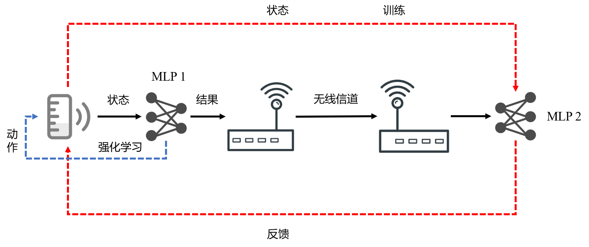
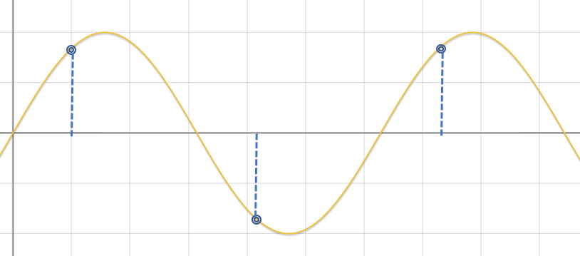
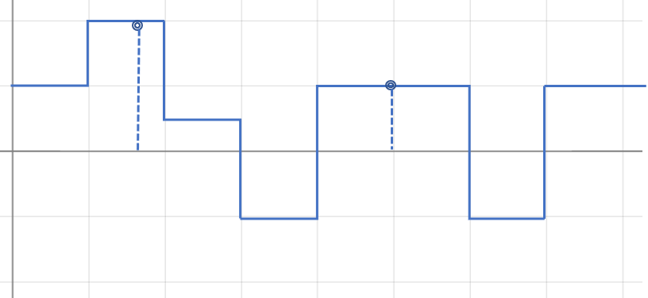
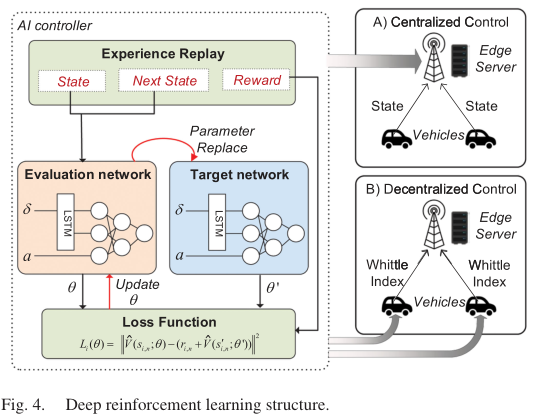
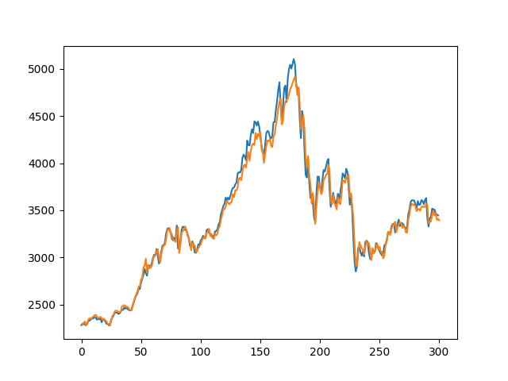

### Date: 2023/4/19

------------------------------------------------
# 周工作汇报

## 1.基于MDP过程的 VoI 理论探究

RA@K%J`4RUJ9CD2~VFWKS{C.png

### Date: 2023/4/12

------------------------------------------------
# 周工作汇报

## 1.论文进展

### 重写了逻辑有问题的部分，主要是第一节的第3，4，5段的、第二节的2，3段。3，4，5节整体进行了语言润色。

> [论文链接](https://cn.overleaf.com/read/hcqfjvdbjdck "Communication Resource Scheduling for CAVs: A Value of Information Based Approach")

### Date: 2023/4/5

------------------------------------------------
# 周工作汇报

## 1.论文进展

### 更正了部分错误，变更了仿真图 8 的表现形式。

> [论文链接](https://cn.overleaf.com/read/hcqfjvdbjdck "Communication Resource Scheduling for CAVs: A Value of Information Based Approach")

## 2.DRL-VoI 理论探究

### 考虑点对点通信系统如下：

### 基本思路如下：
- 系统可以视作为一个状态更新-决策系统（MDP）。
- 通过训练两个网络MLP1, MLP2 减少通信数据量。其中MLP1使用强化学习训练，动作设置为源端数据传输决策，MLP2作为状态更新系统的求解器，两个MLP的训练迭代进行。
### 上述通信系统的一个简单的例子是信号抽样与还原：
- 如图所示，假设被抽样的信号连续且二阶可微，则采样频率可以通过估计信号的二阶微分调整。

- 然而对于通信系统而言，信息的状态转移是随机的（如下图），可以考虑建模为马尔科夫链。此时，采样频率的选择还与转移概率相关。

### 
- 相关的论文：
>[*[1] Kaul S, Yates R, Gruteser M. Real-time status: How often should one update?[C]//2012 Proceedings IEEE INFOCOM. IEEE, 2012: 2731-2735.*](https://ieeexplore.ieee.org/abstract/document/6195689)
>
>[*[2] Konda V, Tsitsiklis J. Actor-critic algorithms[J]. Advances in neural information processing systems, 1999, 12.*](https://proceedings.neurips.cc/paper/1999/hash/6449f44a102fde848669bdd9eb6b76fa-Abstract.html)
>
>[*[3] P. Marbach and J. N. Tsitsiklis, "Simulation-based optimization of Markov reward processes," in IEEE Transactions on Automatic Control, vol. 46, no. 2, pp. 191-209, Feb. 2001, doi: 10.1109/9.905687.*](https://ieeexplore.ieee.org/abstract/document/905687)

>[*[4] Zou P, Subramaniam S. On the value of information in status update systems[J]. Entropy, 2022, 24(4): 449.*](https://www.mdpi.com/1099-4300/24/4/449)

### Date: 2023/3/29

------------------------------------------------
# 周工作汇报

## 1.论文进展

### 更正了部分公式中的错误，重新绘制了系统图，补充了系统模型中的疏漏。

> [论文链接](https://cn.overleaf.com/read/hcqfjvdbjdck "Communication Resource Scheduling for CAVs: A Value of Information Based Approach")

## 2.LSTM-DRL 评估长期 VoI 尝试

### 根据论文[1]中的思路，尝试使用LSTM-DRL的框架估计长期VoI

- 代码目前正在调试

下图为初步的验证结果，其中蓝色线为随机生成的的队列，橙色为LSTM输出的预测结果。

>[*[1] M. Li, J. Gao, L. Zhao and X. Shen, "Adaptive Computing Scheduling for Edge-Assisted Autonomous Driving," in IEEE Transactions on Vehicular Technology, vol. 70, no. 6, pp. 5318-5331, June 2021, doi: 10.1109/TVT.2021.3062653.*](https://ieeexplore.ieee.org/abstract/document/9366426)

>[*[2] Code*](https://github.com/WANGWW775/LSTM-DRL/tree/main)

### Date: 2023/3/23

------------------------------------------------
# 周工作汇报

## 1.论文进展

### 重写了 Introducation, 缩减了篇幅，重新梳理了段落之间的逻辑关系 ， 更正了格式上的错误和语法错误。

> [论文链接](https://www.overleaf.com/project/64053faeaf027e3f68bd00eb "Communication Resource Scheduling for CAVs: A Value of Information Based Approach")

## 2.LSTM-DRL 评估长期 VoI 尝试

### 根据论文[1]中的思路，尝试使用LSTM-DRL的框架估计长期VoI

- 代码目前正在调试，预计随后会有复现结果。 

>[*[1] M. Li, J. Gao, L. Zhao and X. Shen, "Adaptive Computing Scheduling for Edge-Assisted Autonomous Driving," in IEEE Transactions on Vehicular Technology, vol. 70, no. 6, pp. 5318-5331, June 2021, doi: 10.1109/TVT.2021.3062653.*](https://ieeexplore.ieee.org/abstract/document/9366426)

>[*[2] Code*](https://github.com/WANGWW775/LSTM-DRL/tree/main)

<!-- ### Formula

$$
C=B\log_2(1+\cfrac{S}{N})
$$ -->

<!-- ### Table

|姓名|年龄|性别|
|:---:|:---:|:---:|
|`张三`|18|男|
|`李四`|20|女|

### Ordered List

1. item1
2. item2

### Unordered List

- itme1
- item2 -->

