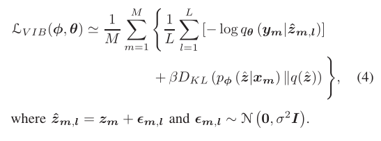

### Date: 2023/5/10

------------------------------------------------

## 1.论文进展

### 根据反馈进行了修改。

> [论文链接](https://cn.overleaf.com/read/hcqfjvdbjdck "Communication Resource Scheduling for CAVs: A Value of Information Based Approach")

### Date: 2023/5/4

------------------------------------------------
## [1.Learning Task-Oriented Communication for Edge Inference: An Information Bottleneck Approach](https://ieeexplore.ieee.org/abstract/document/9606667)

### Edge Inference

边缘推理的描述：

<!-- To provide immersive user experience,DNN-based mobile applications need to be performed within the edge of wireless networks, which eliminates the excessive latency incurred by routing data to the Cloud, and is referred to as edge inference [13], [14]. Edge inference can be implemented by deploying DNNs at an edge server located in close proximity to mobile devices, known as edge-only inference.  -->

为了提供身临其境的用户体验，基于DNN的移动应用需要在无线网络的边缘内进行，这消除了将数据路由到云端所产生的过度延迟，被称为边缘推理[13], [14]。边缘推理可以通过在靠近移动设备的边缘服务器上部署DNN来实现，被称为纯边缘推理。

> [13] Y . Shi, K. Y ang, T. Jiang, J. Zhang, and K. B. Letaief, “Communication-
efficient edge AI: Algorithms and systems,” IEEE Commun. Surveys
Tuts., vol. 22, no. 4, pp. 2167–2191, 4th Quart., 2020.

> [14] E. Li, Z. Zhou, and X. Chen, “Edge intelligence: On-demand deep learn-
ing model co-inference with device-edge synergy,” in Proc. Workshop
Mobile Edge Commun., Budapest, Hungary, Aug. 2018, pp. 31–36.

### Information Bottleneck

<!-- A typical example is that of speech compression. One can consider lossless compression, but in any compression beyond the entropy of speech some components of the signal cannot be reconstructed. On the other hand, a transcript of the spoken words
has much lower entropy (by orders of magnitude) than the acoustic waveform,
which means that it is possible to compress (much) further without losing
any information about the words and their meaning. -->

“信息瓶颈”的描述：

> Obviously lossy compression cannot convey more information than the original data. As with rate and distortion, there is a tradeoff between compressing the representation and preserving meaningful information, and there is no single right solution for the tradeoff. The assignment we are looking for is the one that keeps a fixed amount of meaningful information about the relevant signal Y while minimizing the number of bits from the original signal X (maximizing the compression). In effect we pass the information that X provides about Y through a “bottleneck” formed by the compact summaries in ˜X.

上述定义的目标是最小化任务所需的X信息量，并保留信息以解决任务（推断Y）。上述论文中信息瓶颈的定义为：

一个典型的例子是语音压缩。考虑无损压缩，但在任何超过语音熵的压缩中，信号的一些成分无法被重建。另一方面，口语的文字记录比声音波形的熵低得多（几个数量级），这意味着有可能进一步压缩（很多）而不丢失任何关于文字及其意义的信息。

“信息瓶颈”的原论文：

> [20] N. Tishby, F. C. Pereira, and W. Bialek, “The information bottleneck
method,” in Proc. Annu. Allerton Conf. Commun. Control Comput.,
Monticello, IL, USA, Oct. 1999, pp. 368–377.

### Variational Information Bottleneck

The variational method is a natural way to approximate
intractable computations based on some adjustable parameters
(e.g., weights in DNNs), and it has been widely applied in
machine learning, e.g., the variational autoencoder [39]. In the
VIB framework, the central idea is to introduce a set of
approximating densities to the intractable distribution.

> [1]. Wainwright, M. J. and Jordan, M. I. (2008). Graphical models, exponential families, and variational inference. Foundations and Trends in Machine Learning, 1(1-2):1–305.

### Key point

<!-- A mobile device first extracts a compact feature vector
from the raw input data using an affordable neural network
and then uploads it for server-based processing.

The line of research on “learning to communicate” stems from the introductory article on deep learning for the physical layer design in [7], where information transmission was viewed as a data reconstruction task, and a communication system can thus be modeled by a DNN-based autoencoder with the wireless channel simulated by a non-trainable layer. 

Nevertheless, the shifted objective of feature transmissions for accurate edge inference with low latency is not aligned with that of data-oriented communication, as it regards a part of the raw input data (e.g., nuisance, task-irrelevant information) as meaningless. Thus, recovering the original data sample with high fidelity at the edge server results in redundant communication overhead, which leaves room for further compression. This insight is also supported by a basic principle from representation learning [22]: A good representation should be insensitive (or invariant) to nuisances such as translations, rotations, occlusions. Thus, we advocate for task-oriented communication for applications such as edge inference, to improve the efficiency by transmitting sufficient but minimal information for the downstream task. -->

该篇工作的大致思路是，使用一个动态神经网络设计一个动态特征编码器(joint source-channel coding, JSCC)，其中特征编码器可以根据信道状态动态改变编码后特征向量的维度（实际上通过评估所有特征向量的重要性并设置一个阈值实现），其中动态神经网络的 loss function 有信息瓶颈公式通过蒙特卡洛，变分方法和数据抽样近似其上界。特征向量的重要性是输出层特征矩阵的行比例因子。

与“信息瓶颈”相关的近期论文：

> [32] Z. Goldfeld and Y . Polyanskiy, “The information bottleneck problem
and its applications in machine learning,” IEEE J. Sel. Areas Inf. Theory,
vol. 1, no. 1, pp. 19–38, May 2020.

> [33] A. Zaidi, I. Estella-Aguerri, and S. S. Shitz, “On the information
bottleneck problems: Models, connections, applications and information
theoretic views,” Entropy, vol. 22, no. 2, p. 151, Jan. 2020.

> [34] A. Achille and S. Soatto, “Information dropout: Learning optimal
representations through noisy computation,” IEEE Trans. Pattern Anal.
Mach. Intell., vol. 40, no. 12, pp. 2897–2905, Dec. 2018.

> [35] A. A. Alemi, I. Fischer, J. V . Dillon, and K. Murphy, “Deep variational
information bottleneck,” in Proc. Int. Conf. Learn. Represent., Toulon,
France, Apr. 2017, pp. 1–19.

## 2.论文进展

### 根据反馈进行了修改。

> [论文链接](https://cn.overleaf.com/read/hcqfjvdbjdck "Communication Resource Scheduling for CAVs: A Value of Information Based Approach")

### Date: 2023/4/19

------------------------------------------------
# 周工作汇报

## 1.基于MDP过程的 VoI 理论探究

> 

> 

## 2.论文进展

### 根据反馈正在修改。

> [论文链接](https://cn.overleaf.com/read/hcqfjvdbjdck "Communication Resource Scheduling for CAVs: A Value of Information Based Approach")

### Date: 2023/4/12

------------------------------------------------
# 周工作汇报

## 1.论文进展

### 重写了逻辑有问题的部分，主要是第一节的第3，4，5段的、第二节的2，3段。3，4，5节整体进行了语言润色。

> [论文链接](https://cn.overleaf.com/read/hcqfjvdbjdck "Communication Resource Scheduling for CAVs: A Value of Information Based Approach")

### Date: 2023/4/5

------------------------------------------------
# 周工作汇报

## 1.论文进展

### 更正了部分错误，变更了仿真图 8 的表现形式。

> [论文链接](https://cn.overleaf.com/read/hcqfjvdbjdck "Communication Resource Scheduling for CAVs: A Value of Information Based Approach")

## 2.DRL-VoI 理论探究

### 考虑点对点通信系统如下：

### 基本思路如下：
- 系统可以视作为一个状态更新-决策系统（MDP）。
- 通过训练两个网络MLP1, MLP2 减少通信数据量。其中MLP1使用强化学习训练，动作设置为源端数据传输决策，MLP2作为状态更新系统的求解器，两个MLP的训练迭代进行。
### 上述通信系统的一个简单的例子是信号抽样与还原：
- 如图所示，假设被抽样的信号连续且二阶可微，则采样频率可以通过估计信号的二阶微分调整。

- 然而对于通信系统而言，信息的状态转移是随机的（如下图），可以考虑建模为马尔科夫链。此时，采样频率的选择还与转移概率相关。

### 
- 相关的论文：
>[*[1] Kaul S, Yates R, Gruteser M. Real-time status: How often should one update?[C]//2012 Proceedings IEEE INFOCOM. IEEE, 2012: 2731-2735.*](https://ieeexplore.ieee.org/abstract/document/6195689)
>
>[*[2] Konda V, Tsitsiklis J. Actor-critic algorithms[J]. Advances in neural information processing systems, 1999, 12.*](https://proceedings.neurips.cc/paper/1999/hash/6449f44a102fde848669bdd9eb6b76fa-Abstract.html)
>
>[*[3] P. Marbach and J. N. Tsitsiklis, "Simulation-based optimization of Markov reward processes," in IEEE Transactions on Automatic Control, vol. 46, no. 2, pp. 191-209, Feb. 2001, doi: 10.1109/9.905687.*](https://ieeexplore.ieee.org/abstract/document/905687)

>[*[4] Zou P, Subramaniam S. On the value of information in status update systems[J]. Entropy, 2022, 24(4): 449.*](https://www.mdpi.com/1099-4300/24/4/449)

### Date: 2023/3/29

------------------------------------------------
# 周工作汇报

## 1.论文进展

### 更正了部分公式中的错误，重新绘制了系统图，补充了系统模型中的疏漏。

> [论文链接](https://cn.overleaf.com/read/hcqfjvdbjdck "Communication Resource Scheduling for CAVs: A Value of Information Based Approach")

## 2.LSTM-DRL 评估长期 VoI 尝试

### 根据论文[1]中的思路，尝试使用LSTM-DRL的框架估计长期VoI

- 代码目前正在调试

下图为初步的验证结果，其中蓝色线为随机生成的的队列，橙色为LSTM输出的预测结果。

>[*[1] M. Li, J. Gao, L. Zhao and X. Shen, "Adaptive Computing Scheduling for Edge-Assisted Autonomous Driving," in IEEE Transactions on Vehicular Technology, vol. 70, no. 6, pp. 5318-5331, June 2021, doi: 10.1109/TVT.2021.3062653.*](https://ieeexplore.ieee.org/abstract/document/9366426)

>[*[2] Code*](https://github.com/WANGWW775/LSTM-DRL/tree/main)

### Date: 2023/3/23

------------------------------------------------
# 周工作汇报

## 1.论文进展

### 重写了 Introducation, 缩减了篇幅，重新梳理了段落之间的逻辑关系 ， 更正了格式上的错误和语法错误。

> [论文链接](https://www.overleaf.com/project/64053faeaf027e3f68bd00eb "Communication Resource Scheduling for CAVs: A Value of Information Based Approach")

## 2.LSTM-DRL 评估长期 VoI 尝试

### 根据论文[1]中的思路，尝试使用LSTM-DRL的框架估计长期VoI

- 代码目前正在调试，预计随后会有复现结果。 

>[*[1] M. Li, J. Gao, L. Zhao and X. Shen, "Adaptive Computing Scheduling for Edge-Assisted Autonomous Driving," in IEEE Transactions on Vehicular Technology, vol. 70, no. 6, pp. 5318-5331, June 2021, doi: 10.1109/TVT.2021.3062653.*](https://ieeexplore.ieee.org/abstract/document/9366426)

>[*[2] Code*](https://github.com/WANGWW775/LSTM-DRL/tree/main)

<!-- ### Formula

$$
C=B\log_2(1+\cfrac{S}{N})
$$ -->

<!-- ### Table

|姓名|年龄|性别|
|:---:|:---:|:---:|
|`张三`|18|男|
|`李四`|20|女|

### Ordered List

1. item1
2. item2

### Unordered List

- itme1
- item2 -->

