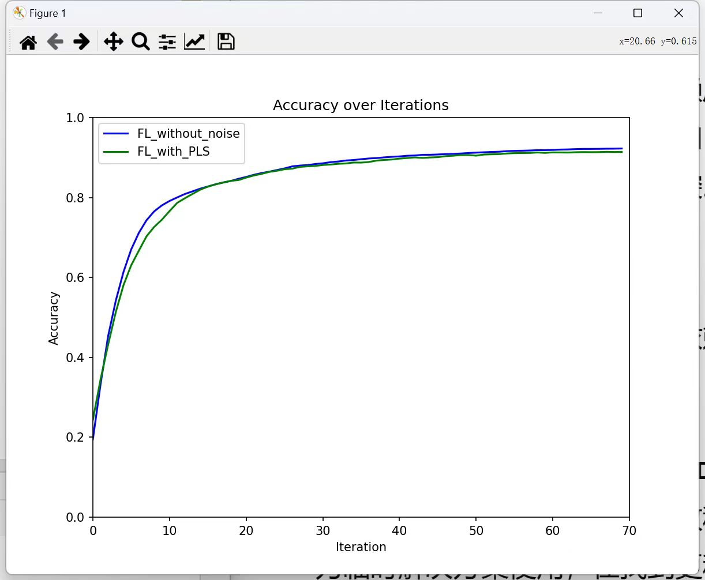
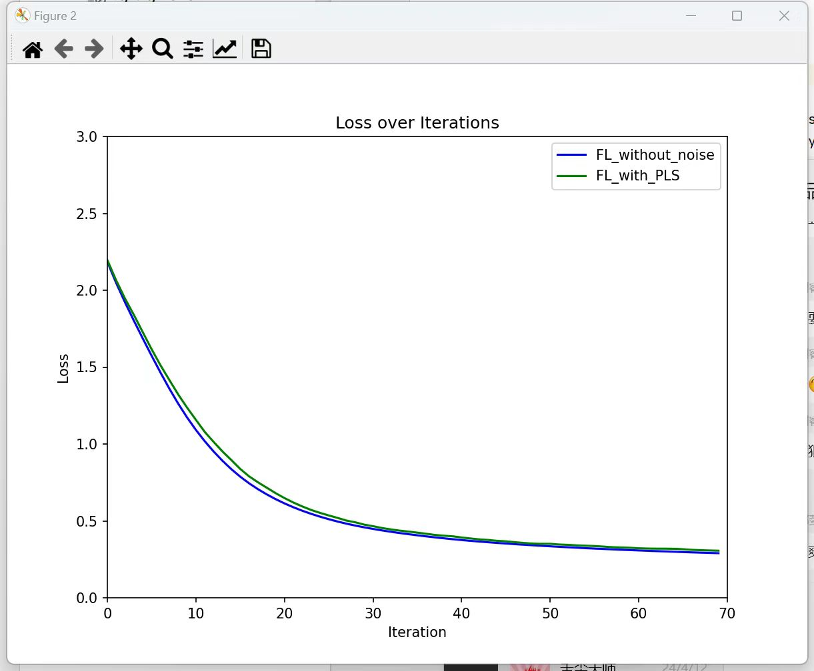

# 2024.4.28
## 本周进展

1. 完成Rs和PL相关性能图

2. 尝试MRT方法对比Rs性能。对比效果很差，可能是MRT为增强主信道的方法，而模型中是各client上行链路，不存在主次信道

3. ZF方法对比，Rs在0.1-0.5范围内变化。同时用ZF方案结合FL，训练结果不收敛，因为ZF方法中SINR值较小，导致最后对w加噪幅值大，数据失真度高，训练效果差。

# 2024.4.21
## 本周进展

1. 得到考虑传输噪声，使用PLS方案的FL训练性能和不考虑噪声，完美传输的FL训练性能：

   

   

2. 调整Rs受总功率影响的PLS性能图

## 下周安排

1. 得到PLS性能图

2. 固定功率和固定波束赋形方案对比PLS性能

# 2024.3.31
## 本周进展

阅读大组会要分享的论文：

[1] H. Zhang, C. Yang and B. Dai, "When Wireless Federated Learning Meets Physical Layer Security: The Fundamental Limits," IEEE INFOCOM 2022 - IEEE Conference on Computer Communications Workshops (INFOCOM WKSHPS), New York, NY, USA, 2022, pp. 1-6.

[2] H. Zhang, C. Yang and B. Dai, "A Finite Blocklength Approach for Wireless Hierarchical Federated Learning in the Presence of Physical Layer Security," IEEE INFOCOM 2023 - IEEE Conference on Computer Communications Workshops (INFOCOM WKSHPS), Hoboken, NJ, USA, 2023, pp. 1-6

# 2024.3.24
## 本周进展

调研分布式协同中有关算法和GNN相关的内容
   

# 2024.3.17
## 本周进展
1. FL和PLS结合后无法运行出结果，求解器求解不精确，提示warning，程序运行不出结果。
  
   将PLS部分的代码独立出来运行，显示出SINR值和功率分配方案出现了明显的误差，不符合设置的功率非负约束。

   

   将matlab代码修改后进行对比，matlab代码优化给出的功率分配方案符合约束，因此考虑cvxpy中SCS求解器不支持的原因，更换了自带的多个求解器，但改善效果不大。
   
## 下周安排
1. 检查核对python文件中的PLS代码逻辑和Matlab代码无误
   
2. 安装SDPT3等非自带的求解器，尝试和SeduMi相似的求解器求解该问题。
