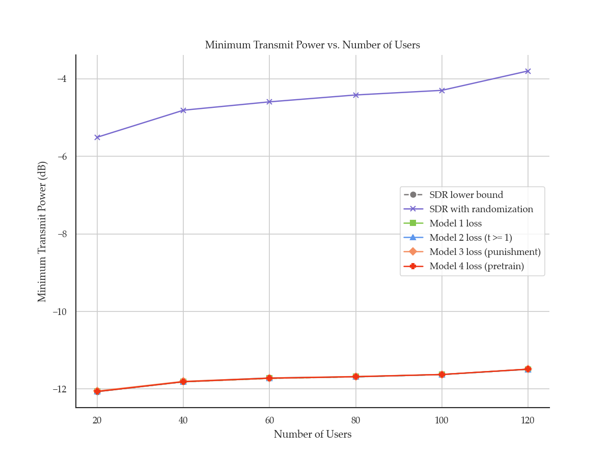
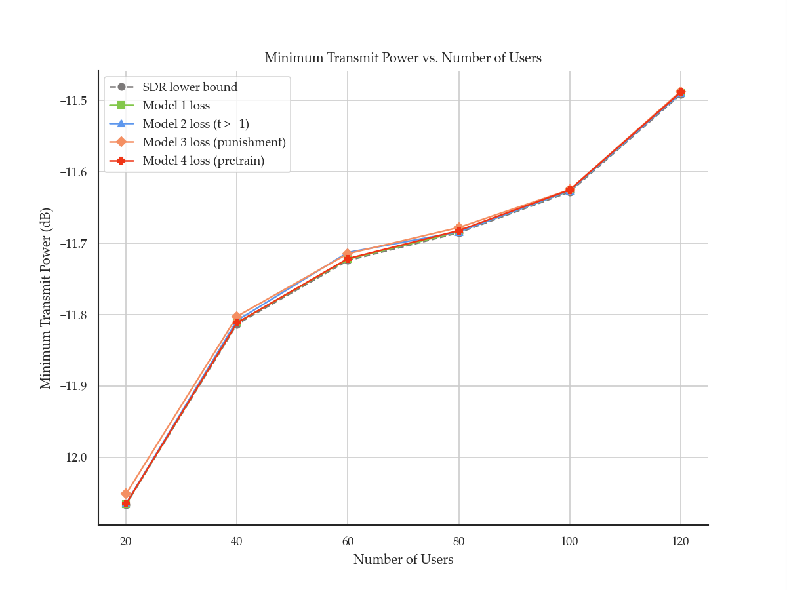
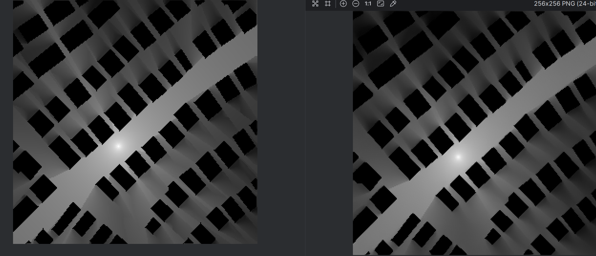
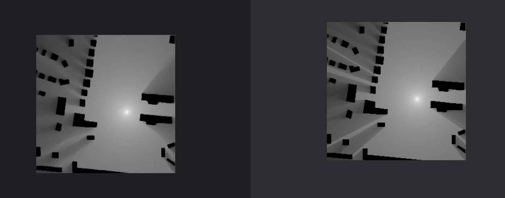

## Table of Contents

- <a href="#1"> Week 1 (2024.03.01 – 2024.03.17)
- <a href="#2"> Week 2 (2024.03.17 – 2024.04.01)
- <a href="#3"> Week 3 (2024.04.02 – 2024.04.22)
 

------

 

# <a href="#table">Week 1 (2024.03.01 – 2024.03.17)</a>

## DyNN Magazine
前两个section已经写完

## Constrained MISO Beamforming

## Diffusion Radio Map
#### SOTA NMSE：0.004
#### Diffusion NMSE：0.002

#### GT与Prediction

#### SOTA与Diffusion

#### SOTA局部放大

#### Diffusion局部放大

 

# <a href="#table">Week 2 (2024.03.17 – 2024.04.01)</a>

## DyNN Magazine
基本写完

## Constrained MISO Beamforming

 

# <a href="#table">Week 3 (2024.04.02 – 2024.04.22)

写论文
